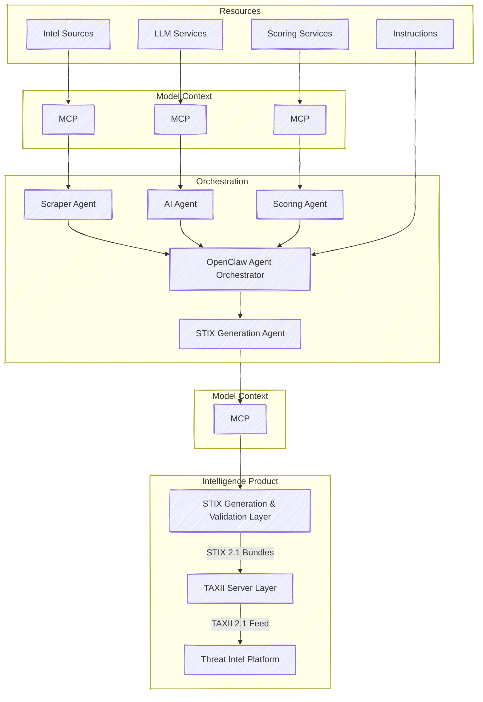

# NEWMARK COLLECTIVE

**NEWMARK COLLECTIVE** is an intelligence engineering project focused on the structured collection, curation and distribution of high-quality cyber threat intelligence.

The platform aggregates threat data from relevant open and proprietary sources, applies structured curation and scoring methodologies and transforms raw intelligence into standardized, machine-consumable formats - orchestrated through OpenClaw.

---

## Overview

**NEWMARK COLLECTIVE** bridges the gap between unstructured threat reporting and operational security tooling. It enables:

- Collection of cyber threat intelligence from relevant sources
- Normalization and enrichment of gathered data  
- Reduction of noise and increase of signal quality  
- Confidence scoring and prioritization of indicators and reports
- Curation with respect to targeted geographic location, industries etc.
- Automated generation of **STIX 2.x** bundles  
- Distribution through **TAXII 2.x** feeds  

---

## Architecture Approach

The platform leverages **OpenClaw orchestration** to manage:

- Task planning and workflow coordination  
- Tool chaining and data transformation pipelines  
- Structured intelligence processing  
- Validation and scoring workflows  
- Automated STIX bundle generation  
- TAXII feed publication  

This orchestration layer ensures modularity, scalability and repeatable intelligence processing pipelines.

---

## Core Capabilities

### Threat Intelligence Collection

Aggregates intelligence from APIs, feeds, research publications and other relevant sources.

### Curation & Validation

Applies structured validation and schema enforcement to ensure data consistency and reliability.

### Scoring & Confidence Modeling

Implements scoring mechanisms to assess credibility, relevance and operational value.

### STIX/TAXII Feed Generation

Outputs standardized intelligence in:

- **STIX (Structured Threat Information eXpression)**
- **TAXII (Trusted Automated eXchange of Intelligence Information)**

Ensuring seamless interoperability with platforms such as MISP, OpenCTI, SIEMs and other security tooling.

---

## Architecture

https://mermaid.js.org/

## TO DO

### Requirements
- GITLab
  - Platform code
  - CTI product
- AWS
- List of Resources
  - Feeds
  - other
  - API
- LLMs
- Terraform

- OpenCTI as TIP

### Domain
| TLD | Price |
|----|----|
| .dev | CHF 29.90 / Jahr |
| .net | CHF 24.90 / Jahr | 
| .org | CHF 24.90 / Jahr | 
| .systems | CHF 49.90 / Jahr | 
| .team | CHF 59.90 / Jahr |
| .io | CHF 79.90 / Jahr |

Domain Name suggestions
- nmk.io
- nmark.dev
- nmco.dev
