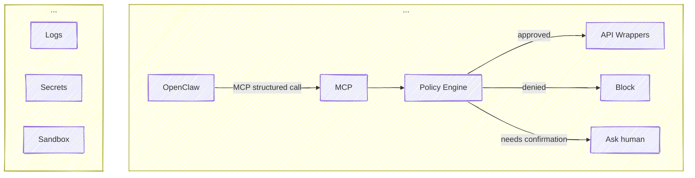

# NEWMARK INTEL

**NEWMARK INTEL** is an intelligence engineering project focused on the structured collection, curation and distribution of high-quality cyber threat intelligence.

The platform aggregates threat data from relevant open and proprietary sources, applies structured curation and scoring methodologies and transforms raw intelligence into standardized, machine-consumable formats - orchestrated through OpenClaw.

> :bulb: The name **NEWMARK** is inspired by a character in William Gibson’s novel Count Zero

---

## Overview

**NEWMARK INTEL** bridges the gap between unstructured threat reporting and operational security tooling. It enables:

- Collection of cyber threat intelligence from relevant sources
- Normalization and enrichment of gathered data  
- Reduction of noise and increase of signal quality  
- Confidence scoring and prioritization of indicators and reports
- Curation with respect to targeted geographic location, industries etc.
- Automated generation of **STIX 2.x** bundles  
- Distribution through **TAXII 2.x** feeds  

---

## Architecture Approach

### Reasoning & Orchestration
The platform leverages **OpenClaw orchestration** to manage:

- Analyze
- Plan
- Propose actions
- Generate structured tool calls

### Structured Tool Interface
- Explicit tool registry
- Exposes a structured interface for each tool
- Enforces typed arguments

### Policy Layer
Before executing a tool, policy is checked
- Is this tool allowed in this mode?
- Is the user authorized?
- Is this within rate limits?
- Is it within cost budget?
- Is it high-risk?
- Is it repetitive?
- Is it outside time window?
- Has it exceeded usage today?

The check returns
- APPROVE
- REQUIRES_CONFIRMATION
- DENY

### Scoped Tool Wrappers
Each tool
- Has its own API key
- Has least privilege permissions
- Has rate limits
- Has logging
- Has timeouts

## Tool chain

|Layer|Tool|
|---|---|   
| Reasoning & Orchestration| OpenClaw |
| Structured Tool Interface| FastMCP |
| Policy Engine| Open Policy Agent, Keto, Casbin |
| Credential & Secret Management| HashiCorp Vault |

https://mermaid.js.org/

## Security

### Premises
- OpenClaw never directly executes anything
- Each tools capability is explicitly defined
- Every action passes through a policy gate
- Every tool has minimal scoped authority
- High-impact actions require friction.

### Risk Tiers

#### 1 Low Risk (Auto-Execute)
- Read-only queries
- Simulations
- Report generation

#### Medium Risk (Soft Confirmation)
- Expensive actions
- 

#### High Risk (Hard Gate)
- Deleting data
- Moving money
- External communications
- Production changes
- Highly expensive actions

High risk always requires:
- Human confirmation

## Core Capabilities

### Threat Intelligence Collection

Aggregates intelligence from APIs, feeds, research publications and other relevant sources.

### Curation & Validation

Applies structured validation and schema enforcement to ensure data consistency and reliability.

### Scoring & Confidence Modeling

Implements scoring mechanisms to assess credibility, relevance and operational value.

### STIX/TAXII Feed Generation

Outputs standardized intelligence in:

- **STIX (Structured Threat Information eXpression)**
- **TAXII (Trusted Automated eXchange of Intelligence Information)**

Ensuring seamless interoperability with platforms such as MISP, OpenCTI, SIEMs and other security tooling.

---

## TO DO

### Requirements
- tbd

### Domain
| TLD | Price |
|----|----|
| .dev | CHF 29.90 / Jahr |
| .net | CHF 24.90 / Jahr | 
| .org | CHF 24.90 / Jahr | 
| .systems | CHF 49.90 / Jahr | 
| .team | CHF 59.90 / Jahr |
| .io | CHF 79.90 / Jahr |

Domain Name suggestions
- nmk.io
- nmark.dev
- nmco.dev

NEWMARK COLLECTIVE
|__ NEWMARK INTEL
|__ NEWMARK ...
|__ NEWMARK ...