> :bulb: Private Cloud"

# Architecture

```mermaid
architecture-beta
    group management(cloud)[MGMT]
    group privatecloud(cloud)[CLOUD]

    service proxmox(server)[Proxmox] in privatecloud
    service git(pajamas:git)[Git] in management
    service terraform(disk)[Git] in management
    
    terraform:R --> L:proxmox
```



## Physical Layer (Bare Metal)

### Server

High-performance x86_64 machine with AMD-V hardware virtualization 

**MINISFORUM UM890 Pro**

Processor: AMD Ryzen 9 8945HS Processor, 8 Cores/16 Threads
(16M Cache, up to 5.3 GHz)
GPU: AMD Radeon 780M
Memory: 64 GB DDR5 Dual channel (SODIMM 2 Slots, Up to 5600MHz, Max 96GB)
Storage: 1TB M.2 2280 PCIe4.0 2 SSD Oculink

### Network

Dedicated private LAN

### Storage

Local SSD

### Host OS

Proxmox VE

## Virtualization Platform Proxmox VE

- KVM for virtual machines
- LXC for lightweight containers (optional)
- Built-in cluster management for multiple Proxmox nodes
- ZFS support for snapshotting, replication
- Software-defined networking OVS or Linux bridges

## Infrastructure as Code & Configuration Management

### Terraform (Infrastructure as Code)
- Terraform Proxmox provider
- Manage:
    - Virtual machines (VMs)
    - Networks
    - Storage pools
    - Proxmox users, roles, and permissions
- Terraform state stored locally or remotely (e.g., git or S3-compatible service)

Example:

```
provider "proxmox" {
  pm_api_url = "https://proxmox.local:8006/api2/json"
  pm_user    = "root@pam"
  pm_password = var.pm_password
  pm_tls_insecure = true
}

resource "proxmox_vm_qemu" "web_vm" {
  name = "web01"
  target_node = "proxmox1"
  ...
}
``` 
### Ansible (Configuration Management)
- Provision base configuration on VMs (e.g., packages, users, ssh)
- Set up services (e.g., web servers, databases, internal DNS)
- Manage updates, hardening, firewall rules (ufw/iptables), and monitoring agents
- Can be triggered post-Terraform deployment or via cloud-init

Example Ansible roles:
- common/: basic packages, timezone, users
- application/: nginx, certbot, firewall
- monitoring/: Prometheus node exporter, logging

## Network Design
- Internal VLANs:
    - mgmt: for Proxmox API, SSH, monitoring
    - infra: for internal services (DNS, NTP, etc.)
    - vm-net: for VM traffic
- Optional external interface for NAT/gateway access
- Use Linux bridges (vmbr0, vmbr1) or Open vSwitch for Proxmox networking

## Storage Design
- Local ZFS on SSD/NVMe for fast VMs and snapshots
- Ceph cluster for distributed block storage
- NFS for shared data volumes.

## Secrets Management
- HashiCorp Vault for secrets management.

## Monitoring & Maintenance
- ELK stack for logging
- Grafana dashboards
- Zabbix for monitoring
- Prometheus + Node Exporter for metrics.

## GitOps Automation

### Git repo
Terraform modules and state
Ansible roles/playbooks
CI pipeline for validation/linting

### Automation Workflow
- Update Git (infra or config)
- Trigger Terraform plan
- Run Ansible playbook on updated VMs

# Setup

## Preparation

### Requirements
- Number of physical servers
- VM types and workloads
- Storage needs (ZFS, Ceph, NFS?)
- Network layout (VLANs, bridges)
- Security requirements (VPN, firewall, 2FA)

### Prepare Your Network
- Set static IPs for servers
- Configure VLANs
- Plan for management and VM networks (e.g., vmbr0, vmbr1)

## Installation

### Base System
- Install Proxmox VE (https://www.proxmox.com/en/downloads)
- Configure Proxmox VE
- Set up web UI access

Configure:
- Storage (ZFS if desired)
- Linux bridges for networking
- Enable Proxmox API access and generate credentials for Terraform

### Infrastructure Provisioning with Terraform

#### Set Up Terraform
- Install Terraform CLI
- Add the Proxmox provider

#### Create Terraform Modules
Define modules for:
- VM creation (proxmox_vm_qemu)
- Storage config
- Networking (bridge assignments)

#### Terraform Project Layout

```
terraform/
|-- main.tf
|-- variables.tf
|-- outputs.tf
|-- modules/
|   |-- vm/
|   '-- network/
```
#### Deploy VMs

```bash
terraform init
terraform plan
terraform apply
```

### VM Configuration with Ansible

#### Prepare Ansible
- Install Ansible
- Create roles for:
    - Base system setup (users, ssh, updates)
    - Services (e.g., Nginx, Docker, apps)
- Inventory can be dynamic or static from Terraform outputs

#### Use Cloud-Init or Ansible for Initial Bootstrapping
- Add cloud-init templates in Terraform

#### Run Ansible Playbooks

Example:

```bash
ansible-playbook -i inventory.ini site.yml
```

### Automate & Maintain
- Set up Git repo (IaC and Ansible)
- Use GitHub Actions/GitLab CI to run Terraform & Ansible


# Resources
| What | URL | Description |
| ----------- | ----------- | ----------- |
| Proxmox VE ISO Download | https://www.proxmox.com/en/downloads |  |
| Proxmox VE Documentation | https://pve.proxmox.com/wiki/Main_Page |  |
| Official Proxmox Wiki | https://pve.proxmox.com/wiki/Main_Page |  |
| Terraform Download | https://developer.hashicorp.com/terraform/downloads |  |
| Terraform Documentation | https://developer.hashicorp.com/terraform/docs |  |
| Terraform Proxmox Provider Download | https://github.com/Telmate/terraform-provider-proxmox |  |
| Terraform Proxmox Provider Docs | https://registry.terraform.io/providers/Telmate/proxmox/latest/docs |  |
| Ansible Installation Instructions | https://docs.ansible.com/ansible/latest/installation_guide/intro_installation.html |  |
| HashiCorp Vault Lookup Plugin for Ansible | https://galaxy.ansible.com/community/hashi_vault |  |
| HashiCorp Vault Download | https://developer.hashicorp.com/vault/downloads |  |
| HashiCorp Vault Documentation | https://developer.hashicorp.com/vault/docs |  |
| Ubuntu Cloud-Init Images (for VM templates) | https://cloud-images.ubuntu.com/ |  |
| Terraform mit Proxmox VE Tutorial | https://www.thomas-krenn.com/de/wiki/Terraform_mit_Proxmox_VE_Tutorial |  |
| Proxmox VE Administration Course | https://www.udemy.com/course/proxmox-ve-administration-course |  |
| HashiCorp Learn | https://developer.hashicorp.com/terraform/learn |  |
| Ansible for the Absolute Beginner | https://www.udemy.com/course/learn-ansible |  |
| HashiCorp Vault Learn Portal | https://developer.hashicorp.com/vault/learn |  |
| xxx | https |  |
| xxx | https |  |

