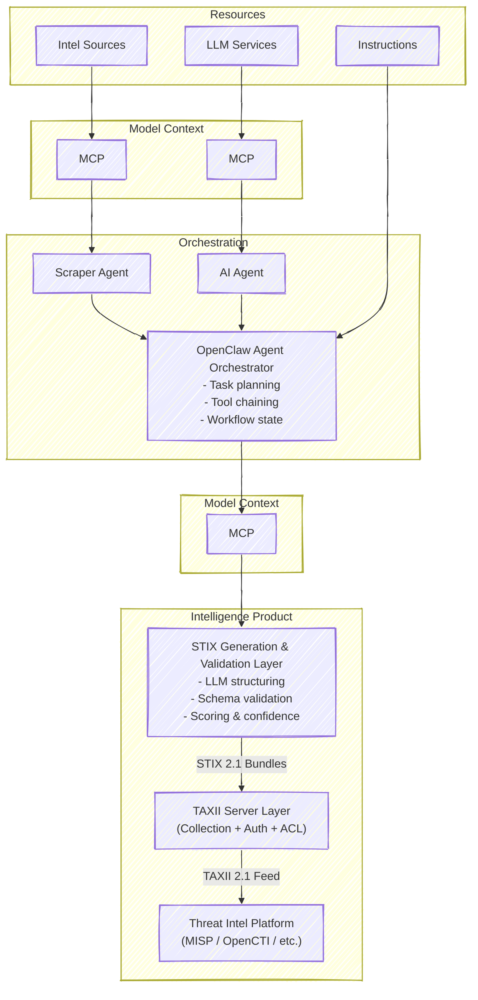

# NEWMARK COLLECTIVE

## Description

## TO DO

### Domain
| TLD | Price |
|----|----|
| .dev | CHF 29.90 / Jahr |
| .net | CHF 24.90 / Jahr | 
| .org | CHF 24.90 / Jahr | 
| .systems | CHF 49.90 / Jahr | 
| .team | CHF 59.90 / Jahr |
| .io | CHF 79.90 / Jahr |

Domain Name suggestions
- nmk.io
- nmark.dev
- nmco.dev

## Architecture

https://mermaid.js.org/

                        ┌─────────────────────────────┐
                        │      Threat Intel Platform   │
                        │  (MISP / OpenCTI / etc.)     │
                        └──────────────▲───────────────┘
                                       │ TAXII 2.1 Feed
                         ┌─────────────┴─────────────┐
                         │     TAXII Server Layer    │
                         │ (Collection + Auth + ACL) │
                         └─────────────▲─────────────┘
                                       │ STIX 2.1 Bundles
                 ┌─────────────────────┴─────────────────────┐
                 │      STIX Generation & Validation Layer   │
                 │  - LLM structuring                        │
                 │  - Schema validation                      │
                 │  - Scoring & confidence                   │
                 └─────────────────────▲─────────────────────┘
                                       │ Structured Intel
               ┌───────────────────────┴────────────────────────┐
               │          OpenClaw Agent Orchestrator           │
               │  - Task planning                               │
               │  - Tool chaining                               │
               │  - Workflow state                              │
               └───────────────────────▲────────────────────────┘
                                       │ MCP Tool Calls
        ┌──────────────────────────────┼──────────────────────────────┐
        │                              │                              │
┌───────────────┐             ┌────────────────┐             ┌────────────────┐
│ Instruction    │             │ Web Intel       │             │ LLM Services   │
│ Files / SOPs   │             │ Sources         │             │ (Structuring,  │
│ (Playbooks)    │             │ APIs, Scrapers  │             │ Validation,    │
└───────────────┘             └────────────────┘             │ Scoring)       │
                                                              └────────────────┘