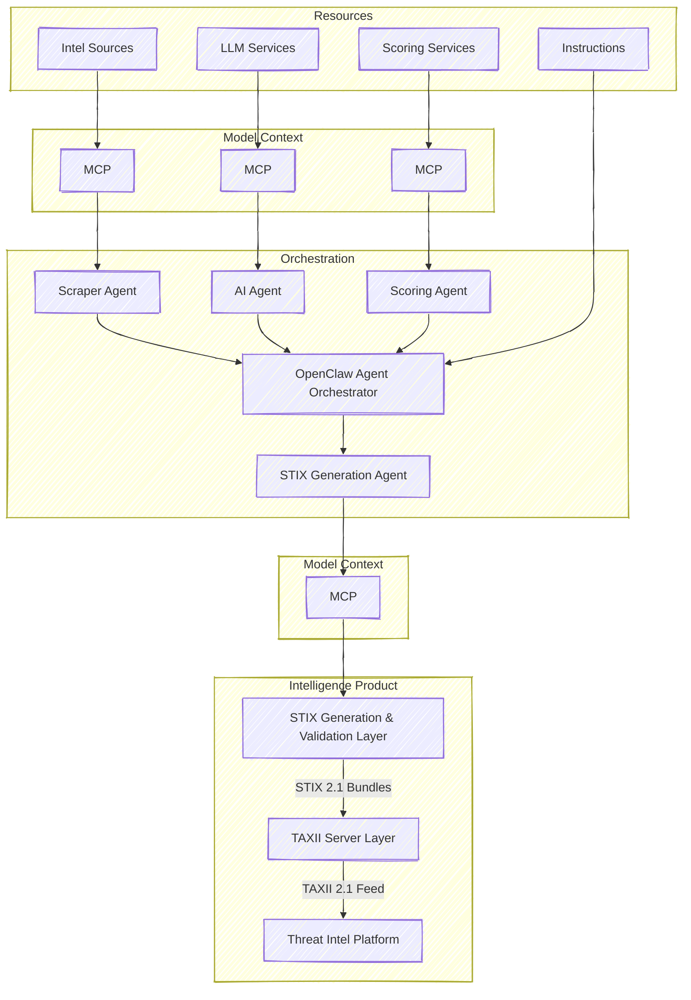

# NEWMARK COLLECTIVE

## Description

## TO DO

### Domain
| TLD | Price |
|----|----|
| .dev | CHF 29.90 / Jahr |
| .net | CHF 24.90 / Jahr | 
| .org | CHF 24.90 / Jahr | 
| .systems | CHF 49.90 / Jahr | 
| .team | CHF 59.90 / Jahr |
| .io | CHF 79.90 / Jahr |

Domain Name suggestions
- nmk.io
- nmark.dev
- nmco.dev

## Architecture

https://mermaid.js.org/

