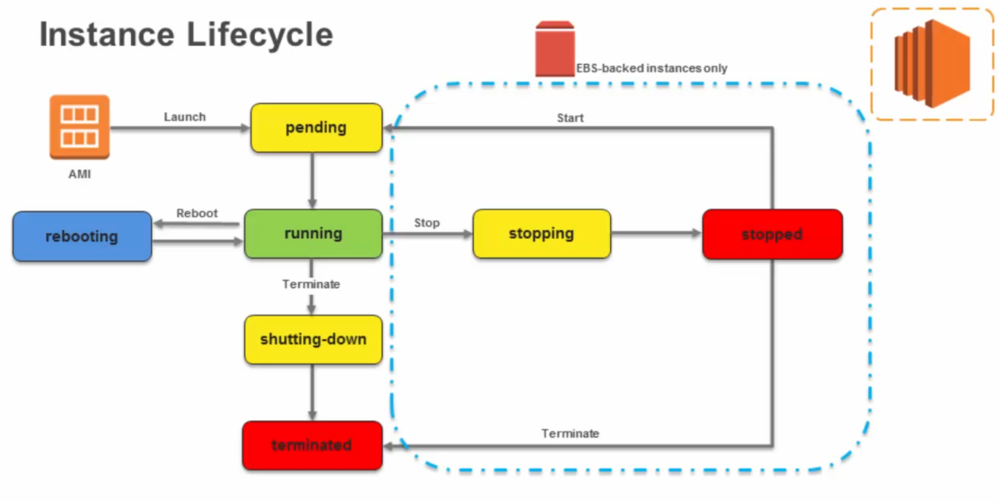
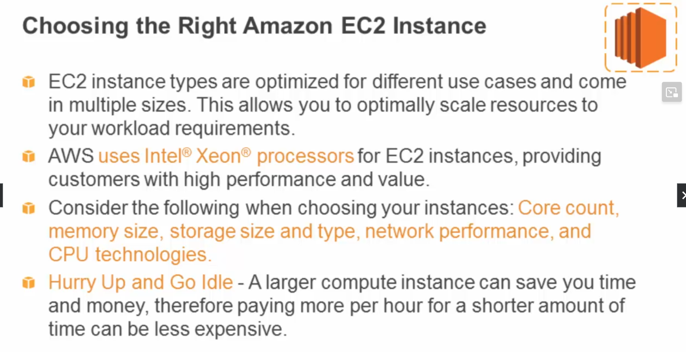
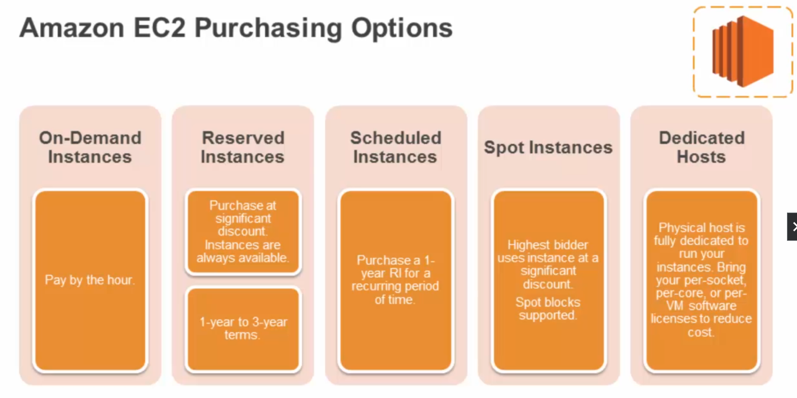
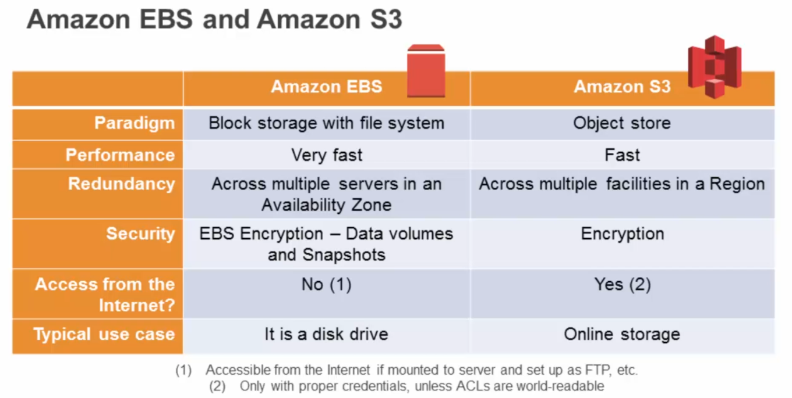
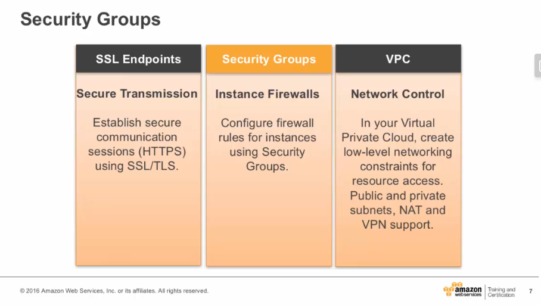

> :bulb: Notes on "AWS Essentials"

# AWS Essentials

## AWS cloud computing

### AWS platform

### Global infrastructure

## AWS Foundational Services

### Compute Services
Amazon Elastic Compute Cloud (EC2)
- virtualized server
- resizable compute capacity
- complete control of computing resources
- Linux or Windows
- global infrastructure (regions/availability zones)

Launching an Amazon EC2 instance
1. Determin the AWS region
2. Launch an Amazon EC2 instance from pre-configured Amazon Machine Image (AMI)
3. Choose instance type based on CPU, memory, storage, network
4. configure network, IP address, security groups, storage, tags, key pair

### AMI and Instances
AMI includes:
- template for the root volume of the instance (os, app server, apps)
- launch permissions (AWS accounts that can use the AMI to launch instances)
- block device mapping (volumes to attach to the instance)

Select an AMI based on:
- Region
- OS
- Architecture
- Launch permissions
- Storage for the root device

### Instance store and EBS

### Choosing the right Amazon EC2 Instance

### Instance meta data and user data

### Amazon EC2 purchase options

### Amazon storage services
- Simple Storage Service (S3)
- Amazon Elastic Blockstorage Service (EBS)

#### Amazon S3

#### S3 security

#### S3 versioning

#### S3 storage classes

#### S3 object lifecycle

### Amazon EBS

#### EBS pricing and volumes

#### EBS and S3

### Amazon EC2 Instance store and reboot

