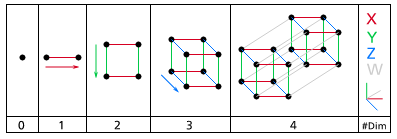
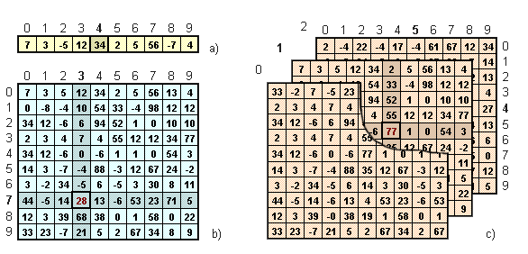
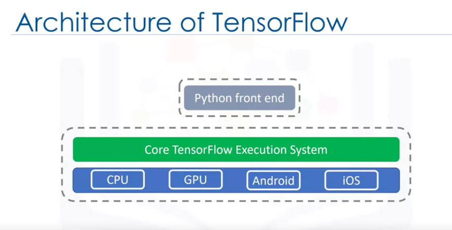
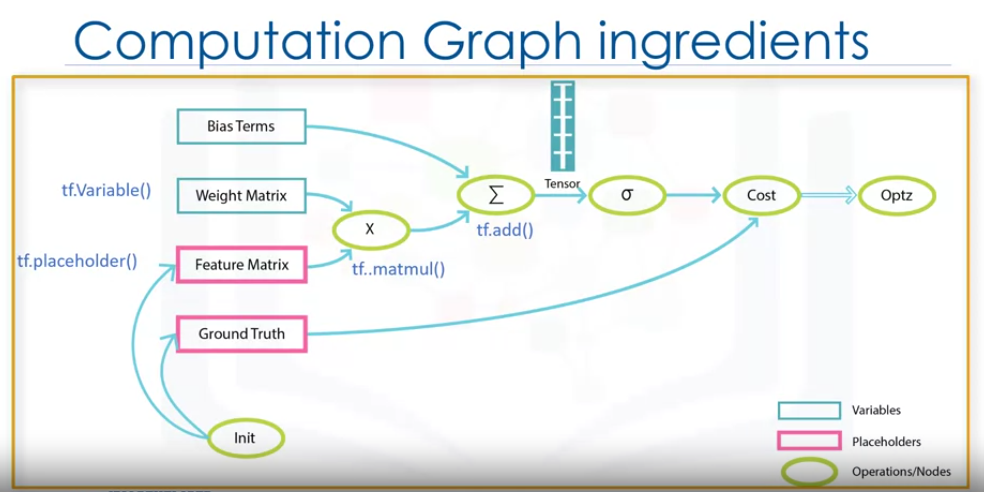
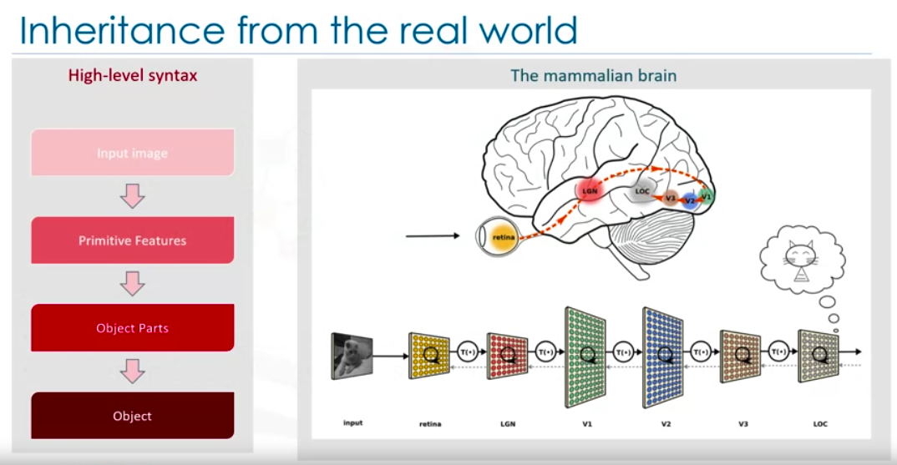
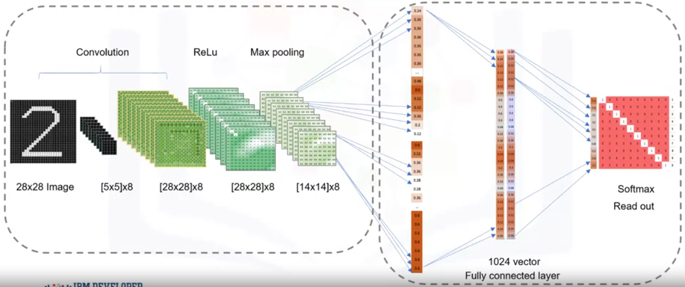
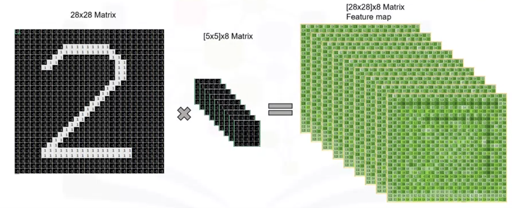
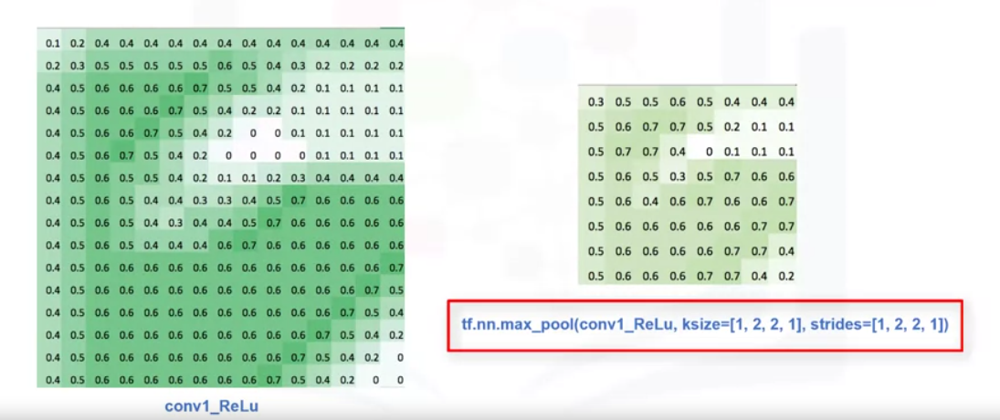
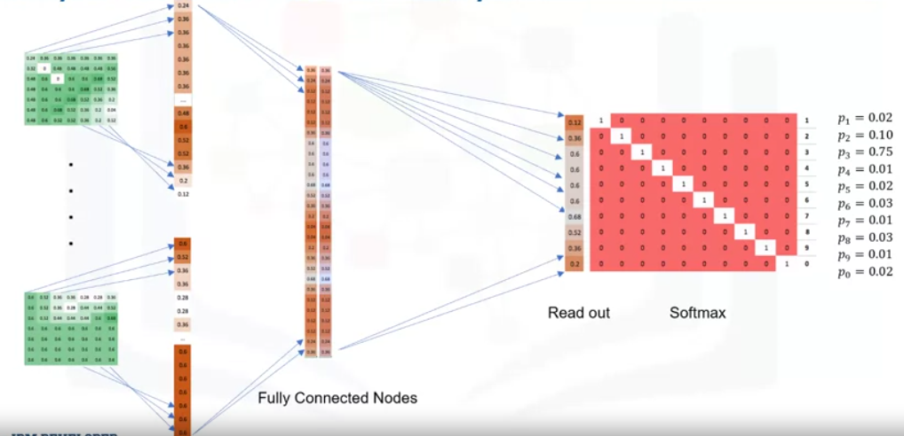

> :bulb: Notes on "Building Deep Learning Models with TensorFlow"

# Neural Networks, Depp Learning with Tensor flow

## Introduction to Tensor Flow
- TensorFlow is an open-source library developed by the Google Brain Team for tasks that require heavy numerical computations, particularly in machine learning and deep neural networks.
- TensorFlow offers both a Python and a C++ API, with the Python API being more complete and easier to use.
- It has great compilation times compared to other deep learning libraries and supports CPUs, GPUs, and distributed processing in a cluster.
- TensorFlow uses a data flow graph structure, which consists of nodes representing mathematical operations and edges representing tensors (multi-dimensional arrays).
- Tensors are the data passed between operations and can be zero-dimensional (scalar values), one-dimensional (vectors), two-dimensional (matrices), and so on.
- Placeholders are used to pass data into the graph, while variables are used to share and persist values manipulated by the program.
- TensorFlow's flexible architecture allows computation to be deployed on different devices, such as CPUs, GPUs, servers, or even mobile devices.
- TensorFlow is well-suited for deep learning applications due to its built-in support for neural networks, trainable mathematical functions, auto-differentiation, and optimizers.

### Meaning of tensor
In TensorFlow all data is passed between operations in a computation graph, and these are passed in the form of Tensors, hence the name of TensorFlow
The word tensor from new latin means "that which stretches". It is a mathematical object that is named "tensor" because an early application of tensors was the study of materials stretching under tension. The contemporary meaning of tensors can be taken as multidimensional arrays. 

Multidimensional arrays? 

Going back a little bit to physics to understand the concept of dimensions:

The zero dimension can be seen as a point, a single object or a single item.

The first dimension can be seen as a line, a one-dimensional array can be seen as numbers along this line, or as points along the line. One dimension can contain infinite zero dimension/points elements.

The second dimension can be seen as a surface, a two-dimensional array can be seen as an infinite series of lines along an infinite line. 

The third dimension can be seen as volume, a three-dimensional array can be seen as an infinite series of surfaces along an infinite line.

The Fourth dimension can be seen as the hyperspace or spacetime, a volume varying through time, or an infinite series of volumes along an infinite line. And so forth on...

As mathematical objects:

### Architecture:

The ingredients of a computation graph in TensorFlow include:
- Nodes: Nodes represent mathematical operations or computations. Each node performs a specific operation on the input data and produces an output.
- Edges: Edges represent the flow of data between nodes. They connect the output of one node to the input of another node. The data flowing through the edges are multi-dimensional arrays called tensors.
- Tensors: Tensors are the data structures that flow through the computation graph. They are multi-dimensional arrays that can be zero-dimensional (scalar values), one-dimensional (vectors), two-dimensional (matrices), or higher-dimensional.
- Placeholders: Placeholders are special nodes in the graph that act as "holes" where data can be fed into the graph during execution. They allow you to define the structure of the graph without providing the actual data. Placeholders need to be initialized with data before executing the graph.
- Variables: Variables are nodes that hold values that can be manipulated by the program. They are used to share and persist values across different executions of the graph. Variables are typically used to store the parameters of a model that are updated during the training process.
- Operations: Operations are the mathematical computations performed by the nodes in the graph. They can include basic arithmetic operations like addition and multiplication, as well as more complex operations like matrix multiplication or convolution.
- Sessions: A session is an environment for executing the computation graph. It encapsulates the state of the graph and allows you to run the computations and retrieve the results. Sessions can be run on different devices like CPUs, GPUs, or even distributed systems.

TensorFlow's data flow graph structure is beneficial for visualizing and organizing computations in several ways:
- Visualization: The data flow graph provides a visual representation of the computational flow, making it easier to understand and debug complex models. It allows you to see the connections between different operations and how data flows through the graph.
- Modularity: The graph structure allows you to break down complex computations into smaller, modular units represented by nodes (operations). This modularity makes it easier to manage and organize the code, as you can focus on individual operations and their inputs and outputs.
- Parallelism: The data flow graph structure is a common programming model for parallel computing. It enables TensorFlow to automatically parallelize the execution of operations, taking advantage of multi-core CPUs, GPUs, or distributed computing environments. This parallelism can significantly speed up the computation of large-scale models.
- Optimization: TensorFlow's graph structure allows for automatic optimization of computations. The graph can be optimized by rearranging operations, eliminating redundant calculations, and applying other optimization techniques. This optimization process helps improve the efficiency and performance of the computations.

Advantages of using TensorFlow's Python API over the C++ API are:
- Completeness and Ease of Use: The Python API is more comprehensive and easier to use compared to the C++ API. It provides a higher-level interface that simplifies the process of building and training deep learning models. Python is known for its simplicity and readability, making it more accessible for beginners and researchers.
- Rich Ecosystem: TensorFlow's Python API benefits from a vast ecosystem of libraries and tools that are built around Python. This includes popular libraries like NumPy, Pandas, and Matplotlib, which seamlessly integrate with TensorFlow and provide additional functionality for data manipulation, visualization, and analysis.
- Rapid Prototyping: Python's dynamic nature and interactive development environment make it ideal for rapid prototyping and experimentation. With the Python API, you can quickly iterate on your models, try different architectures, and experiment with various hyperparameters. This agility is crucial in the fast-paced field of deep learning.
- Community Support: Python has a large and active community of developers and researchers, which means there is extensive community support available for TensorFlow's Python API. You can find numerous tutorials, code examples, and forums where you can seek help and collaborate with others working on similar problems.
- Integration with Data Science Workflow: Python is widely used in the data science community, and many data science tools and frameworks are built around it. TensorFlow's Python API seamlessly integrates with these tools, allowing you to incorporate deep learning models into your existing data science workflow.

TensorFlow is commonly used for image-related tasks. Here are some ways TensorFlow can be used with images:
- Image Classification: TensorFlow can be used to build image classification models that can classify images into different categories or classes. You can train models to recognize objects, animals, or even specific features within images.
- Object Detection: TensorFlow provides tools and pre-trained models for object detection, which involves identifying and localizing multiple objects within an image. This is useful for applications like self-driving cars, surveillance systems, or image-based search engines.
- Image Segmentation: TensorFlow can be used for image segmentation, where the goal is to classify each pixel in an image into different categories. This technique is useful for tasks like medical image analysis, where you want to identify and segment specific structures or regions within an image.
- Style Transfer: TensorFlow can be used to apply artistic styles to images using deep learning techniques. Style transfer models can transform images to mimic the style of famous paintings or other artistic styles.
- Image Generation: TensorFlow can generate new images using generative models like Generative Adversarial Networks (GANs) or Variational Autoencoders (VAEs). These models can learn to generate realistic images based on training data.
- Image Super-Resolution: TensorFlow can be used to enhance the resolution and quality of low-resolution images. Super-resolution models can generate high-resolution versions of images, which is useful in applications like medical imaging or enhancing low-quality images.

### Usage
Simple TensorFlow example using numpy:

    import tensorflow as tf
    import numpy as np

    # Create numpy arrays
    x = np.array([1, 2, 3])
    y = np.array([4, 5, 6])

    # Create TensorFlow constants from numpy arrays
    x_tf = tf.constant(x)
    y_tf = tf.constant(y)

    # Perform element-wise multiplication
    result = tf.multiply(x_tf, y_tf)

    # Create a TensorFlow session and run the computation
    with tf.Session() as sess:
        output = sess.run(result)
        print(output)

In this example, we create two numpy arrays x and y. We then convert them into TensorFlow constants x_tf and y_tf. We use the tf.multiply() function to perform element-wise multiplication between the two arrays. Finally, we create a TensorFlow session, run the computation using sess.run(), and print the output.

## Tensor Flow 2.x and Eager Execution
### Advantages
Eager Execution mode in TensorFlow offers several benefits that make it a powerful tool for deep learning development. Here are the benefits of using Eager Execution mode:
- Immediate Execution: With Eager Execution, TensorFlow code is executed immediately, line by line, just like ordinary Python code. This allows for instant feedback and makes it easier to debug and understand the behavior of the code.
- Improved Debugging: Eager Execution provides access to intermediate results at any point during the execution. This makes it easier to inspect and debug the code, as you can directly print or visualize the values of tensors and variables.
- Dynamic Computation: Eager Execution allows for dynamic computation graphs. This means that the control flow statements, such as loops and conditionals, can be used directly in TensorFlow code. This flexibility enables more complex and dynamic models to be built.
- Natural Control Flow: Eager Execution mode allows for the use of Python control flow statements like if-else conditions and for-loops directly in TensorFlow code. This makes the code more readable and easier to write, especially for complex models.
- Easy Transition: Eager Execution is the default mode in TensorFlow 2.x, making it easier for developers to transition from TensorFlow 1.x to the latest version. The code written in TensorFlow 1.x can be executed in Eager Execution mode without any modifications.
- Interactive Development: Eager Execution mode enables interactive development and experimentation. You can run TensorFlow operations and immediately see the results, which facilitates rapid prototyping and exploration of different model architectures.
- Compatibility: Eager Execution mode is compatible with other Python libraries and tools, making it easier to integrate TensorFlow with existing workflows and frameworks.

### V 2.x
The major changes in TensorFlow 2.x include:
- Integration with Keras: Keras has become the official high-level API for TensorFlow. It offers user-friendly abstractions for developing deep learning models and is now tightly integrated with TensorFlow.
- Performance optimizations: TensorFlow 2.x includes performance improvements, making it faster and more efficient. It also provides better support for GPU acceleration, allowing for faster training and inference on GPUs.
- Eager Execution: TensorFlow 2.x introduces Eager Execution as the default mode. Eager Execution allows code to be executed immediately, line by line, making TensorFlow code look like ordinary Python code. It enables easier debugging and provides instant access to intermediate results.
- Improved APIs: TensorFlow 2.x offers improved APIs for better usability. It simplifies the process of building and training models, making it more intuitive and user-friendly.

Eager Execution mode in TensorFlow 2.x allows code to be executed immediately, line by line, making TensorFlow code look like ordinary Python code. Here's how Eager Execution mode works:
- By default, Eager Execution mode is enabled in TensorFlow 2.x, so you don't need to make any changes to your code when transitioning between TensorFlow versions.
- In TensorFlow 1.x, when you define a computation graph, the actual computation doesn't happen until you run the graph within a TensorFlow session. Intermediate results are not accessible until then, making it difficult to debug and inspect values during development.
- With Eager Execution mode, as soon as you define and execute operations, the computations are immediately performed and the results are available. This allows you to access intermediate results at any point during the execution, making it easier to debug and understand the behavior of your code.
- Eager Execution mode makes TensorFlow code more intuitive and easier to work with, as it eliminates the need for a separate session and allows for immediate feedback on the results of each operation.
- The data type of tensors also changes in Eager Execution mode. In TensorFlow 1.x, tensors are of type tensorflow.python.framework.ops.Tensor, while in TensorFlow 2.x with Eager Execution enabled, tensors are of type EagerTensor. Eager tensors have additional functionality, allowing you to obtain intermediate results at any time.

### Keras integration
In TensorFlow 2.x, Keras has become the official high-level API for TensorFlow. Here's an explanation of the integration of Keras in TensorFlow:
- Keras is a popular Deep Learning API written in Python. It is known for its user-friendliness and offers abstractions that make it easy to develop deep learning models.
- In TensorFlow 1.x, Keras was a separate library that could be used with TensorFlow as a backend. However, in TensorFlow 2.x, Keras has been integrated as the default high-level API for TensorFlow.
- This integration means that TensorFlow users, especially Python developers, can now develop models more easily using Keras interfaces while leveraging the powerful capabilities of TensorFlow in the backend.
- With the integration, TensorFlow provides a unified and consistent interface for building and training deep learning models. This makes it easier for developers to work with TensorFlow and Keras together.
- The integration also brings several benefits. First, it simplifies the development process by providing a high-level API that abstracts away many low-level details. This allows developers to focus more on the model architecture and less on the implementation details.
- Second, the integration enables seamless interoperability between TensorFlow and Keras. You can use Keras layers, models, and utilities directly within TensorFlow code, making it easier to build complex deep learning models.
- Additionally, TensorFlow 2.x with Keras integration provides improved performance optimizations, multi-GPU support, and improved APIs for better usability for GPU acceleration.

### Usage
TensorFlow example that demonstrates the usage of eager execution with numpy:

    import tensorflow as tf
    import numpy as np

    # Enable eager execution
    tf.enable_eager_execution()

    # Create numpy arrays
    x = np.array([1, 2, 3])
    y = np.array([4, 5, 6])

    # Perform element-wise multiplication using TensorFlow operations
    result = tf.multiply(x, y)

    # Print the result
    print(result.numpy())

In this example, we first enable eager execution using tf.enable_eager_execution(). This allows TensorFlow operations to be executed immediately and returns numpy arrays as results.

In TensorFlow 1.x each tensor is of type tensorflow.python.framework.ops.Tensor. With eager execution enabled, the type changes to EagerTensor.
While having programmatically similar behavior, eager tensors have additional functionality. This way intermediate results can be obtained at any time.

We then create two numpy arrays x and y. Using TensorFlow's tf.multiply() function, we perform element-wise multiplication between the two arrays. The result is a TensorFlow eager tensor.

Finally, we print the result using result.numpy(), which converts the TensorFlow eager tensor back to a numpy array for easy printing.

Eager execution allows you to interactively work with TensorFlow operations just like regular Python code, making it easier to debug and experiment with your models.

## Deep learning
Deep Learning is a series of supervised, semi-supervised and unsupervised methods that try to solve some machine learning problems using deep neural networks. A deep neural network is a neural network which often has more than two layers, and uses specific mathematical modeling in each layer to process data.

The three key factors contributing to the growth of deep learning are:
- Advances in Computer Processing Capabilities: Deep learning has benefited from the dramatic increases in computer processing capabilities, particularly with the availability of powerful hardware like GPUs (Graphics Processing Units). These advancements have made it possible to train complex deep neural networks efficiently, enabling the widespread adoption of deep learning techniques.
- Availability of Massive Amounts of Data: Deep learning models require large amounts of data for training. The growth of the internet, social media, and digital technologies has generated vast amounts of data that can be used to train deep neural networks. This availability of massive datasets has played a crucial role in the success of deep learning, allowing models to learn from diverse and representative data.
- Advances in Machine Learning Algorithms and Research: Deep learning has benefited from significant advancements in machine learning algorithms and research. Researchers have developed novel techniques and architectures that have improved the performance and efficiency of deep neural networks. These advancements include innovations like convolutional neural networks (CNNs) for image processing, recurrent neural networks (RNNs) for sequential data, and transformer models for natural language processing. Ongoing research and developments in the field continue to push the boundaries of deep learning.

Researchers are actively working on addressing several challenges and limitations of deep learning. Some of these include:
- Data Requirements: Deep learning models typically require large amounts of labeled data for training. However, in many domains, obtaining labeled data can be expensive, time-consuming, or even impractical. Researchers are exploring techniques like transfer learning, semi-supervised learning, and active learning to mitigate the data requirements and make deep learning more accessible in data-scarce scenarios.
- Interpretability and Explainability: Deep learning models are often considered black boxes, making it challenging to understand how they arrive at their predictions. Researchers are focusing on developing methods to interpret and explain the decisions made by deep learning models. This includes techniques like attention mechanisms, saliency maps, and model-agnostic interpretability methods.
- Robustness and Generalization: Deep learning models can be sensitive to adversarial attacks, where small perturbations to the input can lead to incorrect predictions. Researchers are working on improving the robustness of deep learning models against such attacks. Additionally, deep learning models sometimes struggle to generalize well to unseen data or different domains. Techniques like regularization, data augmentation, and domain adaptation are being explored to enhance generalization capabilities.
- Computational Efficiency: Deep learning models can be computationally expensive and require significant computational resources, limiting their deployment on resource-constrained devices or in real-time applications. Researchers are developing techniques to optimize and compress deep neural networks, such as model quantization, pruning, and knowledge distillation, to make them more computationally efficient without sacrificing performance.
- Ethical and Fairness Considerations: Deep learning models can inherit biases present in the training data, leading to unfair or discriminatory outcomes. Researchers are actively working on developing methods to address bias and ensure fairness in deep learning models. This includes techniques like bias detection, bias mitigation, and fairness-aware training.

## Deep neural networks
Deep neural network models and their applications:
- Convolutional Neural Networks (CNNs): These networks are used for image classification tasks, such as distinguishing between photos of cats and dogs. CNNs automatically find the best features for classification, making them more effective than traditional neural networks.
- Recurrent Neural Networks (RNNs): RNNs are used for modeling sequential data, such as stock market prices or sentiment analysis. They maintain the context of the data and learn patterns within it.
- Restricted Boltzmann Machines (RBMs): RBMs are shallow neural nets used for unsupervised learning tasks, such as feature extraction, dimensionality reduction, and pattern recognition.
- Deep Belief Networks (DBNs): DBNs are built on top of RBMs and are used for classification tasks, particularly image recognition. They are accurate discriminative classifiers and can work well with small labeled datasets.
- Autoencoders: Autoencoders are used for unsupervised tasks and can compress data into short codes for dimensionality reduction. They are employed in feature extraction and image recognition.

### Convolutional Neural Networks (CNNs)
Convolutional Neural Networks (CNNs) automatically find the best features for classification through multiple specific layers of sophisticated mathematical operations. These layers, such as convolutional layers and pooling layers, learn multiple levels of feature sets at different levels of abstraction.

Here's a simplified explanation of how CNNs work:
- Convolutional layers: These layers apply filters to the input image, which helps in detecting various features like edges, textures, and shapes. The filters are learned during the training process, and they automatically identify the most relevant features for classification.
- Pooling layers: These layers downsample the output of the convolutional layers, reducing the spatial dimensions of the features. Pooling helps in retaining the most important information while reducing the computational complexity. It also helps in making the network more robust to variations in the input.
- Fully connected layers: These layers take the features extracted by the convolutional and pooling layers and perform the final classification. They learn to combine the features and make predictions based on them.

By stacking multiple convolutional layers, CNNs can learn increasingly complex and abstract features. This hierarchical learning allows them to capture intricate patterns and structures in the data, making them highly effective for image classification tasks.

### Recurrent Neural Networks (RNNs)
Recurrent Neural Networks (RNNs) can be used for sentiment analysis and language modeling due to their ability to model sequential data. Here's how RNNs are applied in these tasks:
- Sentiment Analysis: RNNs are effective in analyzing sentiment because they can capture the contextual information and dependencies between words in a sentence. By training an RNN on a large dataset of labeled reviews or comments, it can learn to classify the sentiment of new, unseen text. The RNN takes the sequential input of words and maintains the context of the data, allowing it to learn patterns and determine if the sentiment within the text is positive or negative.
- Language Modeling: RNNs are also used for language modeling, which involves predicting the next word in a sentence or generating new text. By training an RNN on a large corpus of text, it learns the statistical patterns and relationships between words. Given a sequence of words, the RNN can predict the most likely next word based on the context and the patterns it has learned. This is useful in applications like auto-completion, machine translation, and speech recognition.

In both sentiment analysis and language modeling, RNNs excel at capturing the sequential nature of the data and understanding the dependencies between words. They can effectively model the context and generate meaningful predictions based on the learned patterns.

### Restricted Boltzmann Machines (RBMs)
Restricted Boltzmann Machines (RBMs) are used for feature extraction and dimensionality reduction in an unsupervised manner. Here's how RBMs are applied in these tasks:
- Feature Extraction: RBMs are shallow neural networks that can automatically extract meaningful features from a given input without the need for labeled data. They learn to reconstruct the input data by themselves, capturing the underlying patterns and structures. By training an RBM on a dataset, it learns to encode the input into a compressed representation called a "code" or "hidden layer." This code represents the most valuable information or features of the input data. RBMs are particularly useful when dealing with high-dimensional data, such as images or text, where extracting relevant features manually can be challenging and time-consuming.
- Dimensionality Reduction: RBMs can also be used for dimensionality reduction tasks. Dimensionality reduction aims to reduce the number of input features while preserving the most important information. RBMs achieve this by compressing the input data into a lower-dimensional representation. The hidden layer of the RBM serves as this compressed representation, capturing the essential features of the input. By reducing the dimensionality of the data, RBMs can help in simplifying subsequent analysis tasks, improving computational efficiency, and reducing the risk of overfitting.

In both feature extraction and dimensionality reduction, RBMs leverage unsupervised learning, meaning they don't require labeled data for training. They learn directly from the input data, capturing the underlying patterns and structures. RBMs have been successfully applied in various domains, including image recognition, recommender systems, pattern recognition, and topic modeling, where extracting meaningful features or reducing the dimensionality of the data is crucial for effective analysis and decision-making.

### Deep Belief Networks (DBNs)
Deep Belief Networks (DBNs) are a type of neural network that consists of multiple layers of Restricted Boltzmann Machines (RBMs). RBMs are unsupervised learning models that learn to reconstruct data by themselves. DBNs were developed to address the problem of the back-propagation algorithm, which can sometimes cause issues in the learning process.

DBNs are built by stacking multiple RBMs on top of each other. The RBMs in the lower layers learn to extract low-level features from the input data, while the RBMs in the higher layers learn to extract more abstract and high-level features. This hierarchical structure allows DBNs to learn multiple levels of representation at different levels of abstraction.

DBNs are primarily used for classification tasks, similar to traditional Multi-Layer Perceptrons (MLPs). However, DBNs have an advantage in that they can learn from a small set of labeled data because the feature extraction is unsupervised by the stack of RBMs. This makes DBNs particularly useful in image recognition tasks, where they have shown high accuracy in classifying images.

### Autoencoders
An autoencoder is a type of neural network that is used for unsupervised learning tasks, particularly in the field of deep learning. It is designed to learn a compressed representation or encoding of the input data and then reconstruct the original input from this compressed representation.

The architecture of an autoencoder consists of two main parts: an encoder and a decoder. The encoder takes the input data and maps it to a lower-dimensional representation, often referred to as a "code" or "latent space." This code captures the most important features or information of the input data. The decoder then takes this code and reconstructs the original input data from it.

During training, the autoencoder aims to minimize the difference between the original input and the reconstructed output. By doing so, it learns to capture the essential features of the input data in the code and generate a meaningful reconstruction. The process of learning this compressed representation helps in extracting valuable features and reducing the dimensionality of the data.

# Building Deep Learning Models with TensorFlow

## Convolutional Neural Networks (CNNs)

Key points covered:
- CNNs have gained popularity in the machine learning community due to their ability to excel in tasks like object detection and speech recognition.
- The goal of CNNs is to form the best possible representation of our visual world to support recognition tasks.
- CNNs have two key features: detecting objects in images and placing them into appropriate categories, and being robust against differences in pose, scale, illumination, confirmation, and clutter.
- The solution to the object recognition issue was inspired by examining the way our own visual cortex operates.
- CNNs start with an input image, extract primitive features, combine those features to form parts of the object, and then pull together all the parts to form the object itself.
- CNNs learn to recognize objects by receiving many images of the same object during the training phase and automatically finding the best primitive features for that object.
- CNNs can make decisions about new input images based on the persistence of the various features they have stored.

### Feature extraction
A convolutional neural network (CNN) extracts primitive features from an image through a process called convolution. Here's how it works:
- Convolutional Filters: CNNs use small filters or kernels (typically 3x3 or 5x5) that slide over the input image. Each filter is responsible for detecting a specific feature, such as edges, corners, or textures.
- Convolution Operation: The filter convolves or slides over the image by performing element-wise multiplication between the filter weights and the corresponding pixel values in the image patch covered by the filter. The results are summed up to produce a single value, which represents the presence or absence of the feature in that location.
- Feature Maps: The convolution operation is repeated across the entire image, resulting in a feature map. Each element in the feature map represents the response of the filter at a specific location in the image.
- Non-linear Activation: After the convolution operation, a non-linear activation function (such as ReLU) is applied element-wise to introduce non-linearity and enhance the network's ability to learn complex patterns.
- Pooling: To reduce the spatial dimensions and extract the most important features, CNNs often apply pooling operations (such as max pooling) to the feature maps. Pooling aggregates the values within a local neighborhood, reducing the size of the feature maps while preserving the most salient features.
- Multiple Layers: CNNs typically have multiple convolutional layers, where each layer learns to detect more complex features by combining the lower-level features learned in previous layers. This hierarchical feature extraction allows the network to capture increasingly abstract representations of the image.

By repeatedly applying convolution, activation, and pooling operations, CNNs can extract primitive features from an image. These features are then combined and processed in subsequent layers to recognize and categorize objects in the image. The network learns to automatically adjust the filter weights during training to optimize the feature extraction process for the given task.

## CNNs for classification
A convolutional neural network (CNN) detects and categorizes objects in an image through a hierarchical process. Here is a step-by-step explanation:
- Input Image: The CNN starts with an input image.
- Primitive Feature Extraction: The CNN extracts primitive features from the image, such as edges, corners, and textures. These features are detected by the first layer of the CNN.
- Feature Combination: The CNN combines the primitive features to form more complex features. For example, lines may be combined to form shapes, and shapes may be combined to form parts of an object.
- Object Formation: The CNN pulls together all the parts to form the complete object. It learns to recognize the object by combining the higher-level abstract components.
- Categorization: Once the object is formed, the CNN categorizes it into the appropriate class or category. This is done based on the features and patterns learned during the training phase.
- Robustness: CNNs are designed to be robust against variations in pose, scale, illumination, confirmation, and clutter. This means they can still recognize objects even if they appear in different orientations, sizes, lighting conditions, or with occlusions.
- Training Phase: During the training phase, CNNs receive many images of the same object. They automatically learn and find the best primitive features for that object. This learning process involves adjusting the weights and biases of the network to minimize the error between predicted and actual outputs.
- Decision Making: When presented with a new input image, the CNN makes decisions based on the persistence of the various features it has stored. It compares the features extracted from the new image with the learned features to determine the object's presence and category.

In summary, CNNs detect and categorize objects in an image by extracting primitive features, combining them to form object parts, and then forming the complete object. The network learns to recognize objects through training and makes decisions based on the learned features.

### Limitation of shallow networks
Traditional shallow neural networks have certain limitations when it comes to image classification tasks. Here are some of the key limitations:
- Feature Extraction: In traditional shallow neural networks, the process of feature extraction is manual and time-consuming. It requires domain expertise to select and engineer relevant features from the images. This manual feature engineering can be challenging and may not capture all the necessary information present in the images.
- Scalability: Shallow neural networks may struggle to handle complex and high-dimensional image data. As the number of features or pixels in an image increases, the computational complexity of the network also increases. This can lead to performance degradation and longer training times.
- Translation Invariance: Shallow neural networks lack the ability to capture translation invariance, meaning they are sensitive to the position or location of objects in an image. This can limit their ability to generalize and classify images accurately, especially when dealing with variations in object position or orientation.
- Hierarchical Representation: Shallow networks may struggle to learn hierarchical representations of images. They often fail to capture the hierarchical structure of visual information, such as edges, textures, and shapes, which are crucial for accurate image classification.
- Limited Receptive Field: Shallow networks typically have a limited receptive field, meaning they can only capture local information from a small region of the input image. This limitation makes it difficult for them to capture global context and long-range dependencies in images.

Convolutional Neural Networks (CNNs) address these limitations by automatically learning hierarchical representations, capturing translation invariance, and efficiently handling high-dimensional image data. They have become the go-to choice for image classification tasks due to their ability to overcome these limitations and achieve state-of-the-art performance.

### Deep learning process
Pipeline:
- Pre-processing of input data: This phase involves converting the input data, such as images, into a readable and proper format for the deep learning model. It may include tasks like resizing, normalizing, and augmenting the data to improve the model's performance.
- Training the deep learning model: In this phase, an untrained deep neural network is fed with a large dataset of images or other types of data. The network learns from this training data by adjusting its internal parameters through a process called backpropagation. The goal is to optimize the model's performance and accuracy by minimizing the loss function.
- Inference and deployment of the model: Once the deep learning model is trained, it can be used for inference. In this phase, the trained model is applied to new, unseen data to make predictions or classifications. The model's performance is evaluated based on its ability to accurately classify or predict the target variable. The trained model can also be deployed and used in real-world applications to solve specific problems.

### Image classification
In a Convolutional Neural Network (CNN) for image classification, several layers are involved to extract features and make predictions. Here are the different layers commonly used in a CNN:
- Convolutional Layer: This layer applies a set of learnable filters (also known as kernels) to the input image. Each filter convolves across the image, performing element-wise multiplication and summing the results to produce a feature map. These feature maps capture different patterns and features present in the image.
- Activation Layer: After the convolutional layer, an activation function is applied element-wise to introduce non-linearity into the network. Common activation functions include ReLU (Rectified Linear Unit), sigmoid, and tanh.
- Pooling Layer: This layer reduces the spatial dimensions (width and height) of the feature maps while retaining the most important information. It achieves this by downsampling the feature maps using operations like max pooling or average pooling. Pooling helps in reducing the computational complexity and making the network more robust to variations in object position or orientation.
- Fully Connected Layer: Also known as the dense layer, this layer connects every neuron from the previous layer to every neuron in the next layer. It takes the high-level features extracted by the convolutional and pooling layers and learns to classify the image based on these features. The output of the fully connected layer is fed into a softmax activation function to produce class probabilities.
- Dropout Layer: Dropout is a regularization technique used to prevent overfitting. It randomly sets a fraction of the input units to zero during training, which helps in reducing the interdependencies between neurons and encourages the network to learn more robust features.

These layers are typically stacked together to form the architecture of a CNN. The number and arrangement of these layers can vary depending on the specific CNN architecture and the complexity of the image classification task.

### Convolutional Neural Networks (CNNs) Architecture
The CNN is a type of neural network that is used for image recognition and classification. The different layers of a CNN include
- convolutional layer
- pooling layer
- fully connected layer

#### Convolutional layer
The purpose of the convolutional layer in a Convolutional Neural Network (CNN) is to detect different patterns or features from an input image. It applies a filter, also known as a kernel, to the image and calculates the dot product of the filter with the image pixels. This process results in a new image that highlights specific features or patterns, such as edges, curves, or textures. The output of the convolutional layer is a feature map, which serves as the input for subsequent layers in the CNN. The convolutional layer plays a crucial role in feature learning and extraction, allowing the network to identify meaningful patterns in the input data.

#### Pooling layer
The max pooling layer helps in reducing the dimensionality of the activated neurons by downsampling the output images from the ReLU activation function. It achieves this by selecting the maximum value within a defined window (e.g., a 2x2 window) and discarding the other values. This process simplifies the inputs and reduces the number of parameters within the model. By selecting the maximum value, the max pooling layer retains the most prominent features or patterns from the previous layer while discarding less important details. This downsampling operation effectively reduces the height and width of the individual images, resulting in lower-dimensional feature maps. The reduced dimensionality helps in reducing computational complexity and memory requirements while still preserving the essential information needed for subsequent layers in the network.

#### Fully connected layer
The fully connected layer in a Convolutional Neural Network (CNN) plays a crucial role in the classification task. It takes the high-level filtered images from the previous layer and converts them into a vector. Here's how it works:
- Input Transformation: Each previous layer matrix, which represents a filtered image, is converted into a one-dimensional vector. This transformation allows us to treat the image as a sequence of values rather than a 2D structure.
- Connection: The one-dimensional vectors from the previous layer are fully connected to the next hidden layer. This means that each node in the fully connected layer is connected to all the nodes of the previous layer.
- Weighted Connections: The connections between the layers are represented by a weight matrix. Each connection has a weight associated with it, which determines the strength of the connection. These weights are learned during the training phase of the network.
- Activation: Similar to other layers in the CNN, the fully connected layer also applies an activation function to the output of each node. The commonly used activation function in this layer is ReLU (Rectified Linear Unit), which introduces non-linearity to the decision function.

By converting the high-level filtered images into a vector and connecting them through weighted connections, the fully connected layer enables the network to learn complex relationships and patterns in the data. It captures the learned features from the previous layers and combines them to make predictions or classifications based on the input data.

