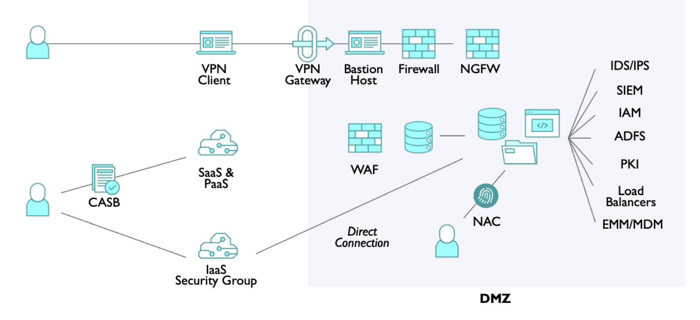
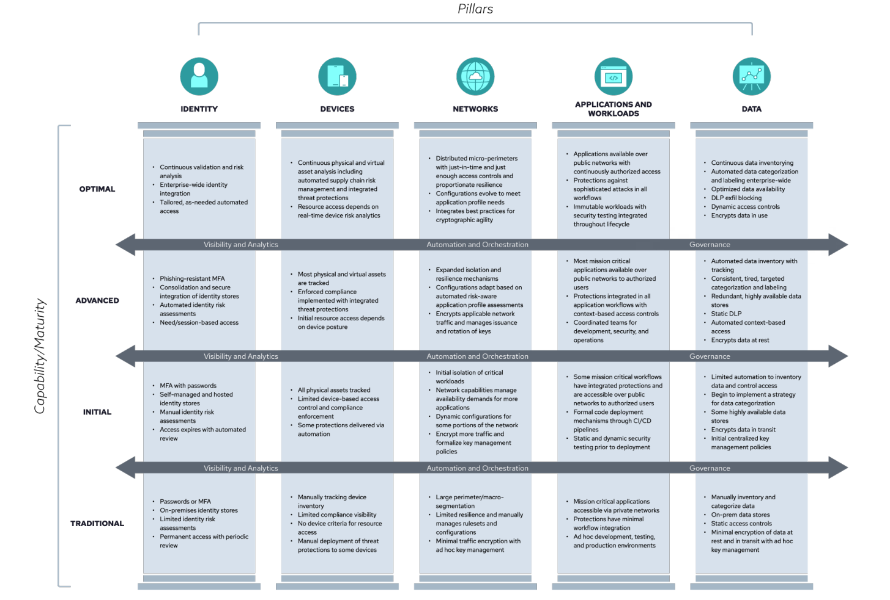
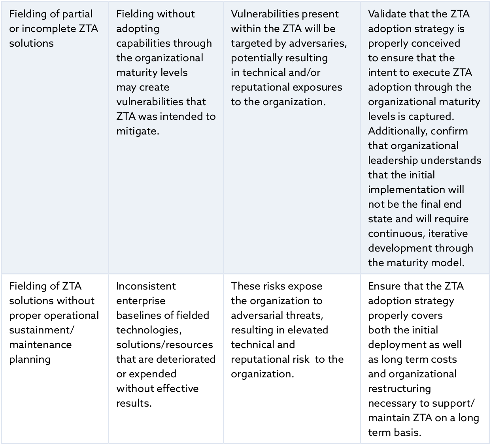
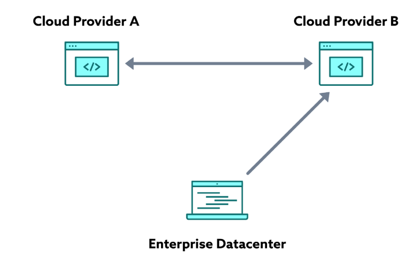
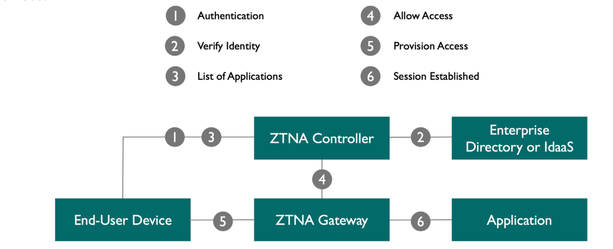
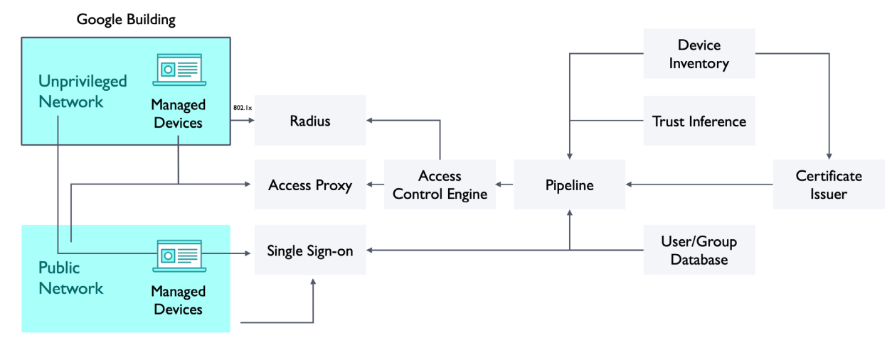
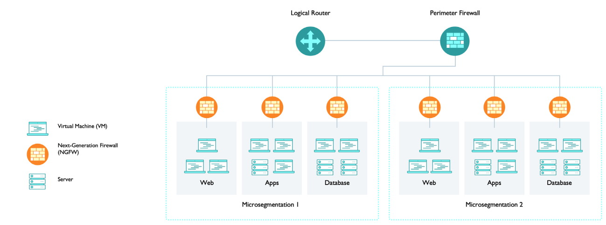

")

> :bulb: Notes on "Certificate of Competence in Zero Trust (CCZT)"

# Certificate of Competence in Zero Trust (CCZT)

# Resources
https://globalcybersecuritynetwork.com/education/csa-certificate-zero-trust/
https://cloudsecurityalliance.org/artifacts/cczt-prep-kit
https://www.udemy.com/course/certificate-of-competence-in-zero-trust-cczt-exam-tests/
https://www.pass4future.com/questions/csa/cczt

https://knowledge.cloudsecurityalliance.org/certificate-of-competence-in-zero-trust-cczt
https://exams.cloudsecurityalliance.org/en

# Zero Trust History

# Zero Trust Concepts

## Architecture
CSA defines the ZT concept as a cybersecurity approach that requires the following:
- Making no assumptions about an entity’s trustworthiness when it requests access to a resource
- Starting with no pre-established entitlements, then relying on a construct that adds entitlements, as needed
- Verifying all users, devices, workloads, network and data access, regardless of where, who, or to what resource, with the assumption that breaches are impending or have already occurred

## Tenets
A tenet is defined as a principle generally held to be true. According to the USA DOD, ZT has five
major tenets.
1. Assume a hostile environment: Malicious actors reside both inside and outside the network. All users, devices, and networks/environments should be untrusted, by default.
2. Assume breach: Most large enterprises experience a barrage of attempted cybersecurity attacks against their networks every day and many have already been compromised. Create, manage, and defend resources with vigilance, assuming that an adversary already has a foothold in your environment. Access and authorization decisions should be scrutinized more closely to improve response outcomes.
3. Never trust, always verify: Deny access by default. Every device, user, application/workload, and data flow should be authenticated and explicitly authorized using least privilege, multiple attributes, and dynamic cybersecurity policies. 
4. Scrutinize explicitly: All resources should be consistently accessed in a secure manner using multiple attributes - both dynamic and static - to derive confidence levels for determining contextual access to resources. Access is conditional and can change based on the action and resulting confidence levels.
5. Apply unified analytics: Apply unified analytics and behavioristics to data, applications, assets, and services (DAAS), and log each transaction.

## Design Principles
Several design principles can be used to guide the creation of a ZTA. These design principles include
the following:
- Denying access until the requestor has been thoroughly authenticated and authorized withholding access until a user, device, or even an individual packet has been thoroughly inspected, authenticated, and authorized. The access to resources is temporary and reverification is required. The timespan of the access is defined by policies
- Allowing access to the network changes with ZT; requesters (users, machines, processes) aren’t allowed access to anything until they authenticate who they are
- Allowing access to resources only after the requesting entity has been authorized
- Enforcing least privilege, specifically, granting the least amount of access required
- Requiring continuous monitoring of existing security controls’ implementation and effectiveness (e.g., controls over access or user behavior)

## Pillars
The ZT concept is a work-in-progress with boundaries and definitions that continue to evolve,
especially in terms of scope of applicability and use cases. Even so, the industry has reached a certain
level of consensus regarding what the fundamental pillars of a ZTA are. CSA emphasizes these seven pillars of the DOD ZTA.
1. Users/identities: Securing, limiting, and enforcing access for person, non-person, and federated entities’ to DAAS, encompasses the use of identity, credential, and access management capabilities, such as multi-factor authentication (MFA) and continuous multi- factor authentication (CMFA). Organizations need the ability to continuously authenticate, authorize, and monitor activity patterns to govern users’ access and privileges while protecting and securing all interactions. Role-based access control (RBAC) and attribute- based access control (ABAC) will apply to policies within this pillar in order to authorize users to access applications and data.
2. Device/endpoints: The ability to identify, authenticate, authorize, inventory, isolate, secure, remediate, and control all devices is essential in a ZT approach. Real-time attestation and patching of devices in an enterprise are critical functions. Some solutions, such as mobile device managers or comply to-connect (C2C) programs, provide data that can be useful for device confidence assessments. Other assessments (e.g., examinations of compromise state, anomaly detection, software versions, protection status, encryption enablement, etc.) should be conducted for every access request.
3. Network/environment: When taking a ZT approach, organizations should logically and physically segment, isolate, and control the on-premise and off-premises network/ environment with granular access and policy restrictions. As the perimeter becomes more granular through macro-segmentation, it enables micro segmentation to provide greater protections and controls over DAAS. It is critical to (a) control privileged access, (b) manage internal and external data flows, and (c) prevent lateral movement.
4. Applications and workload: These should include tasks on systems or services on-premises, as well as applications or services running in a cloud environment. ZT workloads should span the complete application stack from application layer to hypervisor. Securing and properly managing the application layer as well as compute containers and virtual machines should be central to the ZT adoption. Application delivery methods like proxy technologies enable additional protections and therefore should also be an important part of ZT decision and enforcement points. Source code developed in-house and common libraries should be vetted through DevSecOps development practices to secure applications from inception.
5. Data: ZT protects critical data, assets, applications, and services. A clear understanding of an organization’s DAAS is critical for the successful implementation of ZTA. Organizations should categorize their DAAS in terms of mission criticality and use this information to develop a comprehensive data management strategy, as part of their overall ZT approach. This can be achieved through the categorization of data, developing schemas, and encrypting data at rest and in transit. Solutions such as DRM, DLP, software-defined storage and granular data-tagging are crucial for protecting critical data.
6. Visibility and analytics: Vital, contextual details should be included to provide a greater understanding of performance, behavior, and activity baselines across the various ZT pillars. This visibility improves the detection of anomalous behavior and provides the ability to make dynamic changes to security policies and real-time contextual access decisions. Additionally, other monitoring data from sensors, in addition to telemetry, are used to provide situational awareness in the environment. This will aid in the triggering of alerts used for response. A ZT enterprise will capture and inspect traffic, looking beyond network telemetry and into the packets themselves to observe threats and bolster defences more appropriately.
7. Automation and orchestration: ZT includes automating manual security processes to take policy-based actions across the enterprise with speed and at scale. Security orchestration, automation, and response (SOAR) improves security and decreases incident response times by automating responses to threats. Security orchestration integrates security information and event management (SIEM) with other automated security tools in the management of disparate security systems. In order to provide proactive command and control, automated security responses require defined processes and consistent security policy enforcement across all environments in a ZT enterprise. 8. Governance: This is essential to ensure successful implementation and control over goals, requirements, and actions taken. A formal procedure for governance should be established through a review committee that will evaluate the progress made towards meeting objectives, ensuring that plans are funded, and assessing associated risks with future phases.

## Components & Elements
At a high level, ZTA requires three core components before any logic can be applied to allow a decision to be made for access: 
1. Communication: A request for an entity to access a resource, and the resulting access or session
2. Identity: The identity of the entity (e.g., user or device) requesting access to the resources
3. Resources: Any assets within the target environment

In addition to these three core components, ZT is also composed of two other fundamental elements:
1. Policy: The governance rules that define the who, what, when, how, why of access to the target resource access
2. Data sources: The contextual information providers can use to keep policies dynamically updated

NIST defines the following:
- PDP as the control plane: the component of the logical architecture that has the responsibility to collect, analyze, and transform the data first into intelligence and then into rules to govern the access to resources.
- PEP as the data plane: the component that, based on input passed by the control plane, has the responsibility to enforce the rules and provide access to the resources (i.e., data).

The figure below provides an alternative representation of the data flows and data sources that feed into the PDPs and PEPs.

# Objectives of ZT

ZT Concept Framework and Elements

## Technical Objectives
- Establishing a Protective Framework
- Reduce Management Overhead
- Reduce Attack Surface
- Reduce Complexity
- Enforce the Principle of Least Privilege
- Improve Security Posture & Resilience
- Improve Incident Containment & Management

## Business Objectives
- Risk Reduction
- Compliance Management
- Organizational Improvements

# Benefits of ZT
- Reduced Risk of Compromise
    - Reduced Attack Surface & Impact Radius
    - Reduced Ability to Move Laterally
    - Reduced Time to Detect & Contain Breaches
- Increased Trustworthiness of Access
- Increased Visibility & Analytics
- Improved Compliance
- Additional Benefits
    - Potential cost reduction
    - Simplification of IT management design
    - Improved data protection (business critical data and customer data)
    - Secure remote access
    - Improved user experience

# Planning Considerations for ZTA

This is a process that depends on a number of different factors, including the following:
- The maturity level of the organization’s security approach, especially regarding asset mapping and classification and identity and access management
- The existing organizational culture, skills, and expertise
- The amount of existing legacy technology and its criticality
- Existing investments
- Available budget
- The complexity of service architecture and data flows
- The end goal and objectives of the organization

## CISA ZT Maturity Model

## Organizational & Technical Planning
- Understand Your Needs
- Identify Key Stakeholders
- Assemble a Team
- Define Current State
- Set Goals
- Define the Use Cases
- Develop Collaboration Plan

## Risks of Project Implementation

# Implementation Options of ZTA
## NIST Approach to ZT
Organizations looking to adopt NIST’s ZT model have several approaches at their disposal for designing their secure workflows. Each approach implements all of the ZT tenets outlined in Section 2.1 of NIST SP 800-207, and a fully-realized ZT solution will incorporate elements from all of the threeNIST ZTA approaches:
- ZTA using Enhanced Identity Governance
- ZTA using Micro-Segmentation
- ZTA using Network Infrastructure and Software Defined Perimeters

## Software-Defined Perimeter
CSA’s SDP concept is an approach to enabling and enforcing ZT principles. The SDP architecture is designed to provide on demand, dynamically provisioned air-gapped networks: trusted networks that are isolated from all unsecured networks to mitigate network-based attacks.

SDP consists of the following major components:
- The client/initiating host (IH)
- The service/accepting host (AH) — also referred to as the PEP per NIST’s ZTA model
- An SDP controller to which the AH and IH both connect — also referred to as the PDP per NIST’s ZTA model
- An SDP gateway that implements the drop-all firewall

SDP works in the following manner:
- The SDP client software on the IH opens a connection to the SDP. IH devices (e.g., laptops, tablets and smartphones) are user-facing, meaning the SDP client software is run on the devices themselves. The network can be outside the control of the enterprise operating the SDP.
- AH devices accept connections from IH and provide a set of SDP-protecting/secured services. AH typically reside on a network under the enterprise’s control (and/or under the control of a direct representative). 
- An SDP gateway provides authorized users and devices with access to protected processes and services. The gateway can also enact monitoring, logging, and reporting on these connections.

IH and AH host devices connect to an SDP controller: a device/appliance or process that secures
access to isolated services by ensuring the following:
1. Users are authenticated and authorized
2. Devices are validated
3. Secure communications are established
4. User and management traffic remain separate on the network

The controller and AH are protected by SPA, making them invisible and inaccessible to unauthorized
users and devices. 20 Six deployment options are available for implementing SDP:
- Client-to-Gateway
- Client-to-Server
- Server-to-Server
- Client-to-Server-to-Client
- Client-to-Gateway-to-Client
- Gateway-to-Gateway

## Compliance with ZT Principles
The SDP conforms to the following ZTA principles:
1. The IH and users should first be authenticated and authorized by the controller before connecting to the AH. The AH is cloaked from the IH and its users until authentication is completed.
2. The SDP gateway applies the drop-all policy until the SPA from the IH is verified. The cryptographic mechanism behind the SPA ensures that only authorized devices can communicate with the AH’s controller.
3. Every service and AH is protected with its own SDP gateway drop-all policy; communications from the other server should also follow the same access policies. IH and users can therefore only access resources to which they were explicitly granted permissions, ensuring adherence to the principle of least privilege.
4. The SDP controller and SDP gateway are the chokepoints for all access attempts and communications. Subsequently, they can provide continuous monitoring, logging and reporting of all network communications, to include both legitimate and suspicious access attempts.

## Implementation Options
The following are some critical best practices for implementing SDP:
- Because they are single points of failure, controllers should be designed for high availability (HA) in order to withstand DoS/DDoS attacks and other similar malicious activity. HA strategies such as the use of multiple physical server instances with load balancing (e.g., domain name system load balancing) should be considered.
- Gateways can block a service in the event of a case of failure or overload. Different load- balancing schemas can be used (e.g., the controller can act as a load balancer for gateways). Gateways are stateful SDP entities that can maintain mTLS sessions, so switching over to a different gateway may interrupt sessions across the tunnel. 
- SDP controllers may use an internal user-to-service mapping or a connection to a third party service (e.g., LDAP, directory service, or other on-premises/cloud-based authorization solution). Authorization is typically based on user roles and more fine-grained information, user or device attributes, or even the specific data element/data flow the user is authorized to access. In effect, the access policies maintained by the SDP controller can be informed by other organizational constructs such as enterprise service directories and identity stores. Per NIST, the dynamic ZT policies enforced by the controller are categorized as a ZT tenet.

### Service Initiated (Cloud-to-Cloud)
An increasingly common use case for deploying a ZTA entails the use of multiple cloud providers.

This use case is the server-to-server implementation of the CSA SDP Specification v2. A more common example is Cloud Provider A cloud calling Cloud Provider B’s LDAP service for authorization/ authentication, as part of SSO. ZTA services are often set up in a mesh configuration. Meshed services lend themselves well to a multi-cloud environment since they facilitate service-to-service communication (to include micro- services communication) via a proxy.

### Collaboration Across Boundaries
Cross-enterprise collaboration is another prominent ZTA use case.

To meet this requirement, Enterprise A can set up specialized accounts for Enterprise B employees to access the required data, denying access to all other resources; however, this approach can quickly become difficult to manage. Enrolling both organizations in a federated ID management system streamlines the configuration of these permissions, provided both organizations’ PEPs can authenticate subjects in a federated ID community.

## Characteristics
SDP’s main advantages are its maturity and widespread adoption.
SPA and mTLS are highly effective mechanisms for enforcing ZT principles without sacrificing user experience.

A major disadvantage of SDP is the requirement for client agent installation on each endpoint that connects to the SDP-protected deployment. Additionally, SDP primarily supports traditional user access methods to enterprise resources; API-based, micro-service, and serverless access methods are not well-supported by SDP.

# Zero Trust Network Access
ZTNA supports a paradigm where neither users nor the applications they access are sitting behind the perimeter. Often considered a VPN replacement, ZTNA allows users to access services from anywhere, anytime, from any device. ZTNA consists of two distinct architectures: endpoint-initiated ZTNA and service-initiated ZTNA.

Endpoint-initiated ZTNA is fairly similar to the original SDP specification. A lightweight agent is installed on the end-user’s device and communicates with a controller, which in turn authenticates the user and provisions the necessary connections to the authorized applications. Because of this agent installation requirement, endpoint-initiated ZTNA is difficult to implement on unmanaged devices.

On the other hand, service-initiated ZTNA uses a broker between the user and the application. In this case, a lightweight ZTNA connector sits in front of the service, which itself can be located in the data center or in the cloud. The connector establishes an outbound connection from the service to the ZTNA service broker. Upon authentication, traffic passes through the ZTNA broker, isolating services from direct access to unauthenticated users, effectively hiding them and preventing malicious activity like DDoS-type attacks. The service-initiated ZTNA option is suitable for unmanaged devices (e.g., bring your own device [BYOD]) or partner access.

## Compliance with ZT Principles
- ZTNA assumes a hostile user access environment. In fact it can operate from unmanaged devices and makes no assumptions about it being pristine.
- ZTNA assumes a breach. The user equipment is unmanaged and can be breached. The authentication and authorization is for a single session between the user and the services. 
- Every access to the service is verified in the spirit of “never trust, always verify”. 
- ZTNA reduces the attack surface by hiding services behind brokers. 
- Only authenticated users are allowed access if there is an explicit policy for them to have access.

## Implementation Options
ZTNA can be used as a stand-alone product or as a service. In stand-alone mode, the broker runs on the customer’s premises, and they are responsible for the deployment and management. Several IaaS cloud providers also offer managed ZTNA services for their customers.

## Advantages
ZTNA offers benefits in user experience, agility, adaptability, and simplified policy management. When ZTNA is cloud-based, it has added benefits of scalability and ease of adoption. It is a much favored alternative to traditional VPNs where there is unhindered access once the VPN tunnel is established.

## Disadvantages
Endpoint-initiated ZTNA is difficult when the user device is unmanaged (e.g., BYOD). ZTNA cannot guard against malicious actors that are already inside and co-resident with the service. It can only help in cases where the actor is outside of the perimeter where the services are hosted. Secure access service edge (SASE) is a more recent technology that provides continuous inspection beyond the initial connection authorization and establishment. There is no provision in ZTNA of session revocation based on continuous inspection post establishment. Policy management (e.g., authorization) is orders of magnitude more complex for programmatic access. The authentication, scale, as well as latency requirements vary significantly. For this reason, ZTNA is mostly applicable for user access and for VPN replacement use cases.

# Google BeyondCorp
BeyondCorp is Google’s internal network and access security platform, designed to enable their employees access to internal resources.

The primary component of BeyondCorp is the web proxy: the chokepoint every user/device needs to traverse in order to access the organization’s resources. Some notable features of BeyondCorp include the following:
- Any access to protected resources are done via proxy
- Device and user identities are checked using a device inventory and user/group database
- 802.1x protocol is used to verify the managed devices and provide micro-segmentation
- An access control engine provides authorization for the organization’s applications and services
- A data pipeline with additional information such as location, device/user trust levels, and more feeds into the access control engine

## Compliance with ZT Principles
BeyondCorp incorporates ZT principles as follows:
- The device/user should first be authenticated and authorized by the access proxy, prior to establishing a connection to the enterprise application—regardless of whether the device/ user is located on the internal or external network.
- The access proxy denies any access request from unauthenticated users or devices.
- Each access request is handled separately by the access proxy, in line with the principle of least privilege.
- The access proxy is the choke point of all access attempts and communication; it should therefore be continuously monitored, with all network communications logged and report— to include both legitimate and illegitimate access attempts.

## Implementation Options
As Google’s proprietary implementation of ZTA, BeyondCorp offers limited implementation options. Some organizations implement a simplified version of BeyondCorp that only uses an access proxy, leaving out additional components like a device inventory and trust engine.

### Service Initiated (Remote Application Access)
This implementation approach is in line with BeyondCorp model: a connector is deployed on the same network as the shared applications. Once the connector establishes and maintains a continuous outbound session to the provider’s environment, users/devices can authenticate with the provider to access protected applications.
The provider can force the user through an authentication workflow before access is granted. This avoids direct access to the application, as the user/device is allowed to connect to the application server only after the authentication process (e.g., client-initiated ZTNA) is complete. Additionally, this model is agentless (i.e., agent software is not required on the connecting device), with application access over Hypertext Transfer Protocol/Hypertext Transfer Protocol Secure (HTTP/HTTPS)—at layer 7 of the OSI model.

## Advantages
BeyondCorp doesn’t require client agent installation on connecting devices, though devices should be registered in the device Inventory database and assigned a unique certificate.

## Disadvantages
A fully-realized BeyondCorp implementation is less flexible and difficult to integrate with existing security mechanisms such as IAM. Additionally, BeyondCorp’s lack of strong cryptographic controls such as SPA and mTLS makes it less secure than SDP, as these controls are required for implementing an invisible cloud. Unlike the SDP controller, BeyondCorp’s access proxy is an in-line entity that handles both control and data traffic, making for a less scalable/secure model.

# ZT Use Cases
## Remote Access & VPN Replacement
In most VPN solutions, users are allowed into the organizational network via a VPN gateway; once authenticated and granted access, the user has access to enterprise assets.

ZTA effectively avoids or covers many of VPN’s inherent security gaps through more granular, contextual security controls. For example, traditional VPN implementations have all user traffic going through a central VPN gateway before reaching a cloud application, creating both high latency as well as a single point of failure/compromise. Additionally, the same policies and security controls are applied to all users regardless of the application and user location.
In contrast, ZTA has each service separately protected by a ZT gateway; each client first connects to the controller, and only after authentication and authorization can they connect to the application over mTLS, via the gateway. Different policies and security controls can also be applied per application.

A ZT environment is flexible and adaptable to change, as the ZT model is based on proven standards including mTLS, SAML, and X.509 certificates, among others. It can be combined with supplemental security systems such as data encryption and remote attestation systems due to its extensible nature. Coupling the evolved encrypted tunnel with the ZTA provides a path for evolution.

## Micro-Segmentation

ZT enforces the separation of connections between the devices on a network. By requiring more granular, policy-based access for device-to-device connections, organizations can prevent the traffic from being visible — even to internal users. This is accomplished by creating dynamic, trusted network zones around applications, effectively hiding them from unauthorized users and devices.
On a typical micro-segmented network, each of the connections between servers or devices on a network will be directed through separate layers of authentication and data traffic. Every device must initiate its own encrypted tunnel in order to communicate with servers. Thus, each connection is a separate network impenetrable by other hosts.

Types of Micro-Segmentation
- Traditional network segmentation
- Data center (i.e., east-west) segmentation
- Application micro-segmentation
- Workload micro-segmentation

## Software as a Service & ZT

Adopting the ZT SaaS management model is an effective approach to mitigating cyber risks inherent in SaaS services. This includes the enforcement of policy-based access control in SaaS applications, regardless of the user/device location, as well as the monitoring of all SaaS usage patterns.
In many cases, organizations bolster the security of their SaaS applications with single sign-on security (e.g., SAML) and IP-based access control with a CASB, which may negatively impact the user experience with increased latency and degraded performance. The ZT model adds stronger security to SaaS applications without impacting the user’s experience.

ZT SaaS control depends on a SaaS mechanism to control corporate account access. This includes the support of client SSO access lists for a SaaS service — effectively disabling direct access to SaaS services (i.e., bypassing the SSO access mechanism). ZT and SDP are limited in their ability to control the data flow inside a SaaS instance or between different SaaS applications.

## Hybrid, Multi-Cloud, & ZT

If applied across all of an organization’s cloud deployments, ZT can mitigate the security risks inherent in publicly exposed cloud services. The following are the guiding principles for accessing an organization’s resources across different cloud providers and private clouds: 
1. A device/users connection point on a particular network should not determine which cloud services are accessible.
2. Users should be identified, authenticated, and authorized prior to connecting initially, as well as before any subsequent connections to cloud resources.
3. Access to services and resources is granted based on what the organization knows about the user/device, regardless of which cloud service they are connecting to.
4. The same security controls (e.g., tunneling and encryption) are applied to both private and public clouds. 
ZTA fulfills these requirements by hiding all the services and resources, regardless of their location. Users in turn have no access to those resources prior to completing authentication and authorization.

ZT improves the user experience with its distributed architecture, eliminating single choke points that may impose delays and result in single point failures. However, a truly cloud and vendor agnostic implementation of ZT may be difficult to implement due to the varying design patterns of competing cloud providers. For example, the implementation of SSO with Azure AD differs from Azure cloud; similarly, Google Cloud Platform (GCP) differs from an OpenStack-based private cloud.
Lastly, the interconnections between multi-cloud deployments and hybrid-to-public clouds are vendor dependent. Best practices can be followed, but there isn’t one standard protocol or implementation, hence it is not easily designed and implemented.

## Operational Technology
OT​ primarily exists in industrial environments where processes are carefully regulated and managed OT to achieve a desired outcome. The systems associated with the OT environment are industrial control systems (ICS) and IIoT devices.
Traditionally, the OT environment was made up of closed, physically air-gapped networks and systems. However, newer OT solutions offer advanced features related to connectivity and automation (e.g., smart OT devices) for an expanding number of industry sectors. Reliance on OT-generated data and features is increasing rapidly, requiring organizations that adopt these new technologies to plan for accessible, secure, and resilient deployments. 
Exposing smart OT devices to the internet or public networks can introduce external cyber threats into enterprise networks and environments. For this reason, ZT security best practices mandate that every connected entity has an identity and must be considered an integral part of the ZT Framework—users, devices, virtual infrastructure, and cloud assets

Per NIST SP 1500-201, cyber-physical systems (CPS) are an integration of physical components, networked systems, embedded computers and software that are linked together for information sharing to make a complete system 26 . CPS serves as the foundation for future smart services, smart cities, smart health care management, and more. As its name implies, CPS are cross-disciplinary in nature and provide seamless integration of cyber and physical systems.

### IoT & IIoT
IoT consists of a network of devices (i.e., things) equipped with software and/or sensors, connected to the internet via wifi or other wireless/wired technology. IoT devices can range from home devices (e.g., home automation solutions, smart doorbells) to industrial equipment (e.g., smart farming devices, assembly line robots). The IIoT is a subset of the IoT that specifically refers to industrial applications. IIoT systems enable industrial enterprises to realize improvements in efficiency and productivity through automation, continuous monitoring, and analysis.

### ICS
Industrial control systems (ICS) encompass several types of control systems used in industrial production, including the following:
- Supervisory control and data acquisition (SCADA) systems
- Distributed control systems (DCS)
- Programmable logic controllers (PLC), often found in industrial sectors and critical infrastructures

ICS systems typically consist of closed systems with components wired to system controllers in a bus topology. However, organizations increasingly require connectivity between their internal IT network and ICS systems — a requirement that introduces cyber-physical risk into the environment, as ICS systems may enable crucial facility processes for power, lighting, air conditioning, and water management. Organizations should therefore leverage ZT, SDP, and SPA to mitigate the cyber risk created by integrating ICS with an organization’s TCP/IP networks.

### Security Risks
Because IIoT and ICS fall into the domain of industrial or cyber-physical systems, the tenets of confidentiality, integrity and availability (i.e., the CIA Triad) are prioritized differently than traditional IT systems. Instead, availability and integrity take precedence over confidentiality in order to first protect human life and physical assets (e.g., electrical grid). Unfortunately, this lack of confidentiality has led to various high profile incidents in which state-sponsored cyber attackers successfully compromised industrial and cyber-physical systems, causing significant physical damage.
As ICS are widely deployed in critical infrastructure environments such as water, oil/gas, and energy, threats to these systems have a potential for significant harm and loss of life. Subsequently, malicious actors such as terrorists, state-sponsored actors, hacktivists, and criminals have a keen interest in ICS related vulnerabilities and exploits. To further complicate matters, security hardening and patching is difficult to carry out on these live systems due to their criticality and requirements for high availability.

ICS cyber attacks typically fall into one of the following categories:
1. Attacks that plant malicious software (e.g., Mirai malware) into devices to compromise adjacent resources on the internet/network
2. Attacks that take control of OT devices to steal data or perform unauthorized action

Over 400 ICS vulnerabilities were disclosed in 2019 29 , with over a quarter resulting from unpatched systems. According to United States Computer Emergency Readiness Team (US-Cert) and National Security Agency (NSA), the most common OT threat vectors and exploits include the following: 
- Spear phishing to gain a foothold into the organization’s IT network, prior to pivoting to the OT network
- Deploying commodity ransomware to encrypt data and adversely impact IT and OT networks
- Connecting to publicly-accessible PLC that require no authentication for initial access 
- Exploiting weaknesses in commonly used ports and standard application layer protocols to communicate with controllers and download modified control logic
- Using vendor-supplied engineering software and program downloads compromise systems 
- Modifying control logic and parameters on PLCs

### ZT Mitigation of Risks
ZT allows organizations to enforce stronger IIoT device integrity and data confidentiality — at both control and data planes — while ensuring the availability of IIoT devices to overall system operations. Additionally, since IIoT devices are considered part of the ICS ecosystem, the ZT model can be leveraged for securely separating IT and OT using micro-segmentation, effectively isolating the business applications on the data plane from those on the control plane.

If deployed and/or managed per ZTA specifications, the following OT device types stand to benefit from significant cyber risk reduction:
- IIoT: The SDP using SPA reduces the risk exposure of unauthorized user access and rogue IIoT devices (e.g., devices with hardcoded credentials) by enforcing both IIoT device authentication and adaptive risk based user authentication (e.g., MFA for privileged actions on authorized IIoT devices). Since IIoT endpoints are largely IP-based with one or more network interfaces, standard monitoring solutions used in conjunction with SIEM/SOAR can be used to trigger alerts and defensive measures. 
- ICS: By bringing ICS components (e.g., SCADA, human machine interface [HMI], DCS) into the fold of SDP with SPA, organizations can limit the highly vulnerable user access to these systems. More specifically, eliminating the bad practices of hardcoded credentials to enforce risk-based user authentication. Furthermore, ZTA with SDP and SPA affords a mechanism to implement micro-segmentation of the control plane of the ICS components with those of the data plane to mitigate the risks due to the interconnectedness of the business applications.

### Limitations & Dependencies
In the context of OT, ZT’s limitations primarily stem from device resource constraints and ICS systems’ use of legacy and/or non-IP based communication protocols at the cyber-physical interface level. For instance, IIoT devices for utility applications may use ZigBee/IEEE 802.15.4 protocols at one interface to communicate with smart meters, while smart meters in turn may use IP protocols to communicate with utility management systems. Furthermore, ICS systems (e.g., SCADA, PLCs) rely on OT protocols such as ModBus or Profinet for control plane functionality. In these scenarios, applying ZT downstream at the edge of the control plane can be challenging.
Because sensors and IIoT controllers are usually limited in their ability to communicate/authenticate with the SDP, architects need to account for these limitations during the ZTA design phase. Ultimately, it may be necessary to incorporate an agentless micro-segmentation or external proxy- based approach, as an agent based ZTA may not work with OT and IIoT devices.
Additionally, because OT and IIoT devices are harder to patch and/or upgrade, network-based micro- segmentation is critical for protecting adjacent systems against potentially vulnerable devices. Moreover, continuous scanning of traffic and deep packet inspection can be implemented to detect and block known attack types, even if they come from trusted entities.

## 5G

### Security Risks
5G enables several groundbreaking technologies—most notably mobile edge computing (MEC)—that significantly improve application performance and enable unprecedented volumes of real-time data processing. Edge computing places compute and storage resources closer to the customer and/or within the telecommunications network infrastructure. This eliminates performance issues related to backhaul latency (i.e., having to continuously travel back/forth to a central data center).
Unfortunately, these new 5G-enabled configurations also introduce novel security risks into the environment; from the user equipment (UE) to the radio access network (RAN), the mobile edge computing (MEC) to the core nodes, 5G’s open architecture makes for an expansive attack surface. Additionally, 5G networks leverage software-defined networking (SDN) technologies; if not properly secured, SDN assets could be compromised by malicious actors, who could in turn reconfigure network devices, monitor all communications, and alter application data.
Also, because 5G brings network devices, storage, computing hardware, and other IT infrastructure closer to the end user, physical security is even more crucial for augmenting ZTA security on the logical layer. It’s worth noting this risk factor, along with many others, are common to 4G infrastructures as well, since existing telecommunications devices/equipment operating in remote locations usually lack strong physical security measures for hindering malicious tampering. 

### ZT Mitigation of Risks
As mentioned previously, 5G networks are software-defined, from the RAN to core and MEC nodes, and are therefore particularly vulnerable to lateral moving malware. ZT device protection can be used to verify the authenticity of software downloads and updates in the system, as well as access to log files. Because 5G networks support internal compute as well as external cloud resources, they are also vulnerable to MITM attacks. ZT’s security model ensures secure connectivity from a 5G UE to a MEC or the cloud. Lastly, ZT data protection can be deployed on IoT-to-5G gateway to ensure only authenticated and authorized systems can access protected data.

### Limitations & Dependencies
Integrating ZT requires access to network drivers in 5G infrastructure equipment, which may be difficult to obtain in some vendor implementations. Additionally, ZT’s concept of identity and authorization may prove difficult to implement in devices with generic software process names (e.g., store or save). Future ZTA versions will need to support an agentless approach to facilitate the myriad of edge configurations made possible by 5G, as not all edge devices can support agent software installations.

