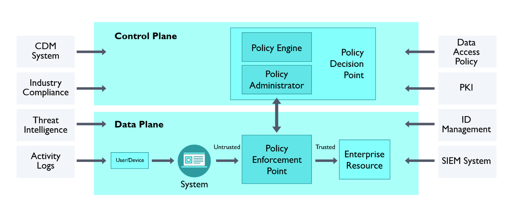
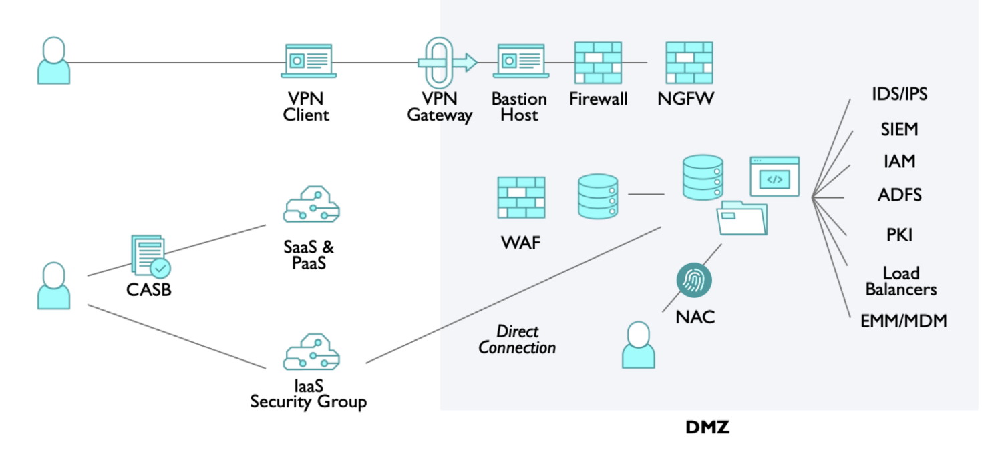
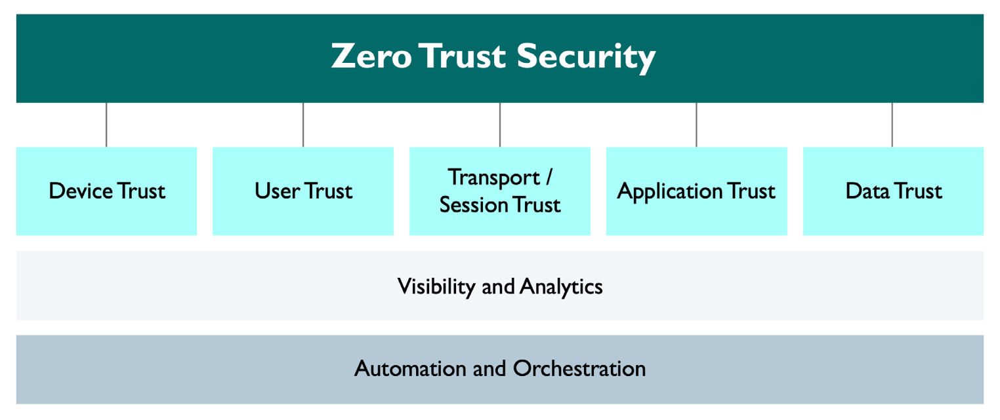
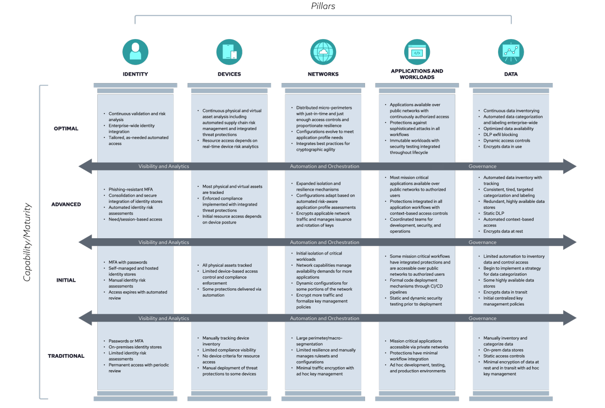
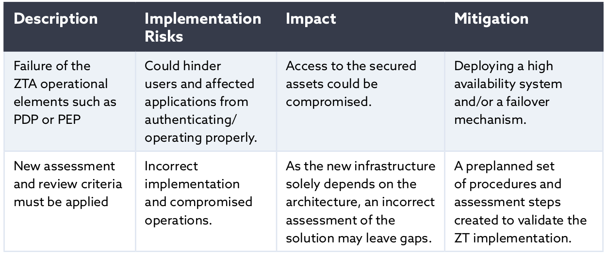
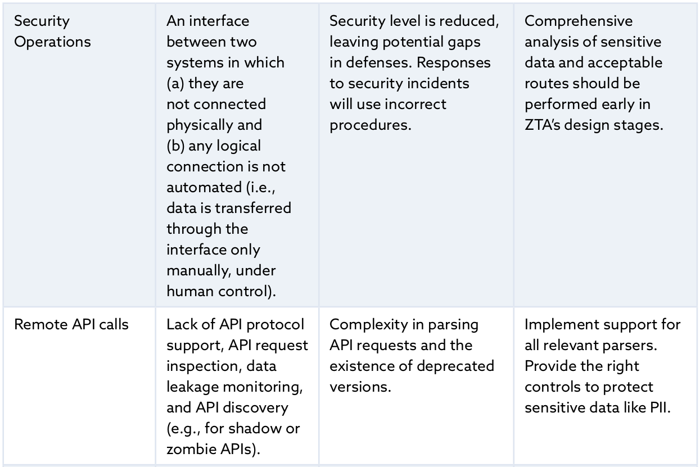
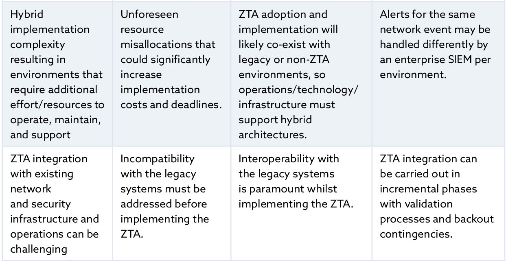

")

> :bulb: Notes on "Certificate of Competence in Zero Trust (CCZT)"

# Certificate of Competence in Zero Trust (CCZT)

# Resources
https://globalcybersecuritynetwork.com/education/csa-certificate-zero-trust/
https://cloudsecurityalliance.org/artifacts/cczt-prep-kit
https://www.udemy.com/course/certificate-of-competence-in-zero-trust-cczt-exam-tests/
https://www.pass4future.com/questions/csa/cczt

https://knowledge.cloudsecurityalliance.org/certificate-of-competence-in-zero-trust-cczt
https://exams.cloudsecurityalliance.org/en

# Zero Trust History

# Zero Trust Concepts

## Architecture
CSA defines the ZT concept as a cybersecurity approach that requires the following:
- Making no assumptions about an entity’s trustworthiness when it requests access to a resource
- Starting with no pre-established entitlements, then relying on a construct that adds entitlements, as needed
- Verifying all users, devices, workloads, network and data access, regardless of where, who, or to what resource, with the assumption that breaches are impending or have already occurred

## Tenets
A tenet is defined as a principle generally held to be true. According to the USA DOD, ZT has five
major tenets
1. Assume a hostile environment: Malicious actors reside both inside and outside the network. All users, devices, and networks/environments should be untrusted, by default.
2. Assume breach: Most large enterprises experience a barrage of attempted cybersecurity attacks against their networks every day and many have already been compromised. Create, manage, and defend resources with vigilance, assuming that an adversary already has a foothold in your environment. Access and authorization decisions should be scrutinized more closely to improve response outcomes.
3. Never trust, always verify: Deny access by default. Every device, user, application/workload, and data flow should be authenticated and explicitly authorized using least privilege, multiple attributes, and dynamic cybersecurity policies. 
4. Scrutinize explicitly: All resources should be consistently accessed in a secure manner using multiple attributes— both dynamic and static— to derive confidence levels for determining contextual access to resources. Access is conditional and can change based on the action and resulting confidence levels.
5. Apply unified analytics: Apply unified analytics and behavioristics to data, applications, assets, and services (DAAS), and log each transaction.

## Design Principles

## Pillars

## Components & Elements

### DoD target & advanced Zero Trust maturity model 

