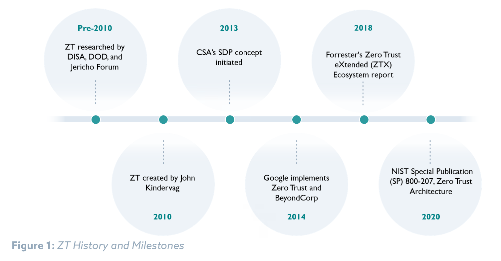
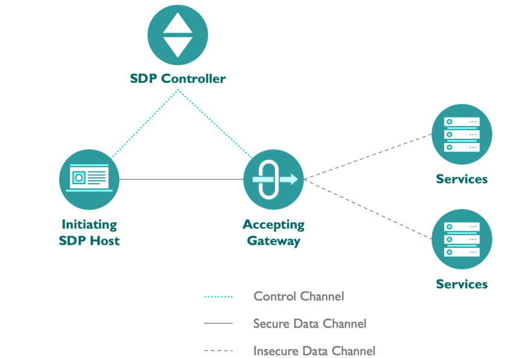
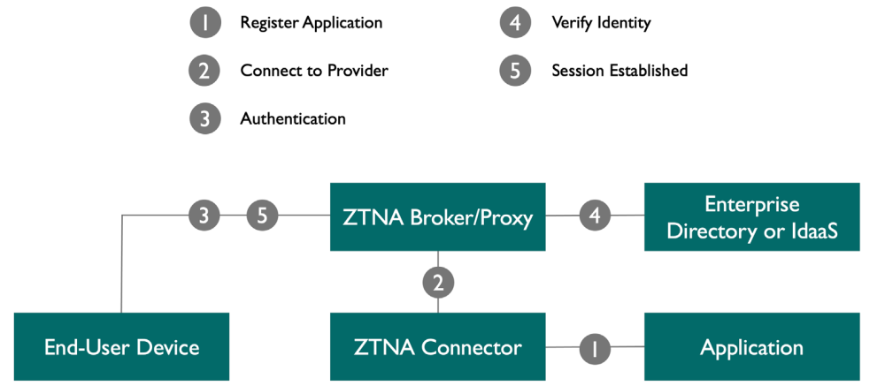
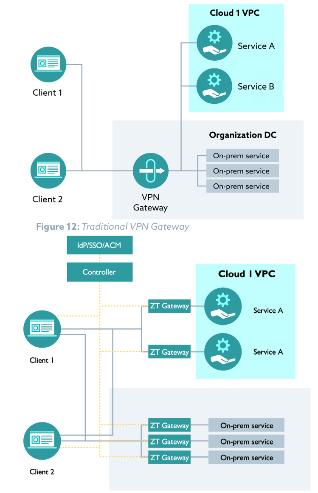
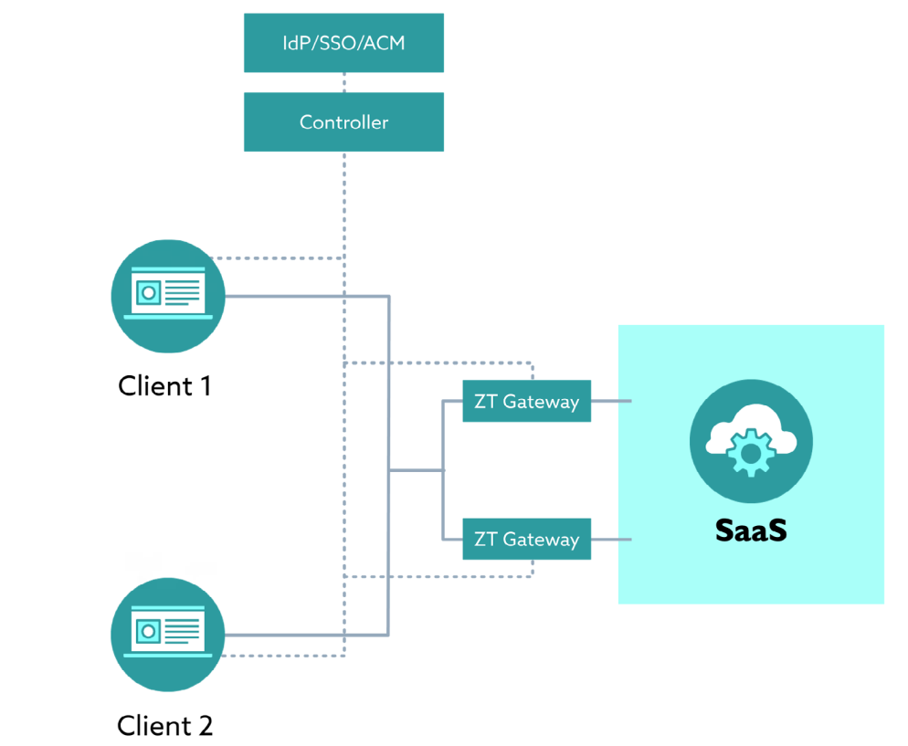
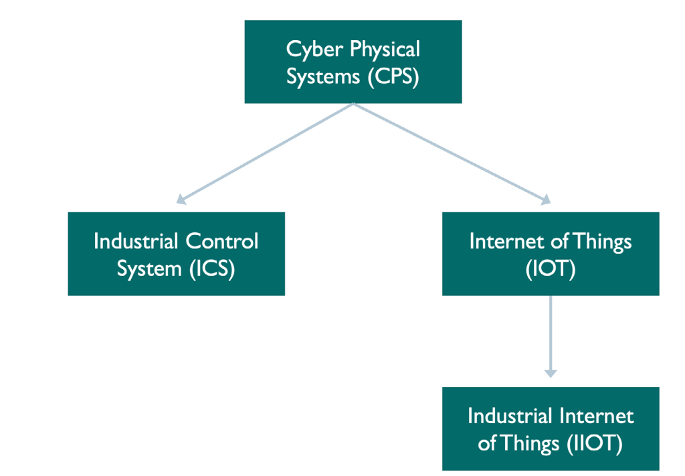

")

> :bulb: Notes on "Certificate of Competence in Zero Trust (CCZT)"

# Certificate of Competence in Zero Trust (CCZT)

# Resources
https://globalcybersecuritynetwork.com/education/csa-certificate-zero-trust/
https://cloudsecurityalliance.org/artifacts/cczt-prep-kit
https://www.udemy.com/course/certificate-of-competence-in-zero-trust-cczt-exam-tests/
https://www.pass4future.com/questions/csa/cczt

https://knowledge.cloudsecurityalliance.org/certificate-of-competence-in-zero-trust-cczt
https://exams.cloudsecurityalliance.org/en

# Zero Trust History

# Zero Trust Concepts

## Architecture
CSA defines the ZT concept as a cybersecurity approach that requires the following:
- Making no assumptions about an entity’s trustworthiness when it requests access to a resource
- Starting with no pre-established entitlements, then relying on a construct that adds entitlements, as needed
- Verifying all users, devices, workloads, network and data access, regardless of where, who, or to what resource, with the assumption that breaches are impending or have already occurred

## Tenets
A tenet is defined as a principle generally held to be true. According to the USA DOD, ZT has five
major tenets.
1. Assume a hostile environment: Malicious actors reside both inside and outside the network. All users, devices, and networks/environments should be untrusted, by default.
2. Assume breach: Most large enterprises experience a barrage of attempted cybersecurity attacks against their networks every day and many have already been compromised. Create, manage, and defend resources with vigilance, assuming that an adversary already has a foothold in your environment. Access and authorization decisions should be scrutinized more closely to improve response outcomes.
3. Never trust, always verify: Deny access by default. Every device, user, application/workload, and data flow should be authenticated and explicitly authorized using least privilege, multiple attributes, and dynamic cybersecurity policies. 
4. Scrutinize explicitly: All resources should be consistently accessed in a secure manner using multiple attributes - both dynamic and static - to derive confidence levels for determining contextual access to resources. Access is conditional and can change based on the action and resulting confidence levels.
5. Apply unified analytics: Apply unified analytics and behavioristics to data, applications, assets, and services (DAAS), and log each transaction.

## Design Principles
Several design principles can be used to guide the creation of a ZTA. These design principles include
the following:
- Denying access until the requestor has been thoroughly authenticated and authorized withholding access until a user, device, or even an individual packet has been thoroughly inspected, authenticated, and authorized. The access to resources is temporary and reverification is required. The timespan of the access is defined by policies
- Allowing access to the network changes with ZT; requesters (users, machines, processes) aren’t allowed access to anything until they authenticate who they are
- Allowing access to resources only after the requesting entity has been authorized
- Enforcing least privilege, specifically, granting the least amount of access required
- Requiring continuous monitoring of existing security controls’ implementation and effectiveness (e.g., controls over access or user behavior)

## Pillars
The ZT concept is a work-in-progress with boundaries and definitions that continue to evolve,
especially in terms of scope of applicability and use cases. Even so, the industry has reached a certain
level of consensus regarding what the fundamental pillars of a ZTA are. CSA emphasizes these seven pillars of the DOD ZTA.
1. Users/identities: Securing, limiting, and enforcing access for person, non-person, and federated entities’ to DAAS, encompasses the use of identity, credential, and access management capabilities, such as multi-factor authentication (MFA) and continuous multi- factor authentication (CMFA). Organizations need the ability to continuously authenticate, authorize, and monitor activity patterns to govern users’ access and privileges while protecting and securing all interactions. Role-based access control (RBAC) and attribute- based access control (ABAC) will apply to policies within this pillar in order to authorize users to access applications and data.
2. Device/endpoints: The ability to identify, authenticate, authorize, inventory, isolate, secure, remediate, and control all devices is essential in a ZT approach. Real-time attestation and patching of devices in an enterprise are critical functions. Some solutions, such as mobile device managers or comply to-connect (C2C) programs, provide data that can be useful for device confidence assessments. Other assessments (e.g., examinations of compromise state, anomaly detection, software versions, protection status, encryption enablement, etc.) should be conducted for every access request.
3. Network/environment: When taking a ZT approach, organizations should logically and physically segment, isolate, and control the on-premise and off-premises network/ environment with granular access and policy restrictions. As the perimeter becomes more granular through macro-segmentation, it enables micro segmentation to provide greater protections and controls over DAAS. It is critical to (a) control privileged access, (b) manage internal and external data flows, and (c) prevent lateral movement.
4. Applications and workload: These should include tasks on systems or services on-premises, as well as applications or services running in a cloud environment. ZT workloads should span the complete application stack from application layer to hypervisor. Securing and properly managing the application layer as well as compute containers and virtual machines should be central to the ZT adoption. Application delivery methods like proxy technologies enable additional protections and therefore should also be an important part of ZT decision and enforcement points. Source code developed in-house and common libraries should be vetted through DevSecOps development practices to secure applications from inception.
5. Data: ZT protects critical data, assets, applications, and services. A clear understanding of an organization’s DAAS is critical for the successful implementation of ZTA. Organizations should categorize their DAAS in terms of mission criticality and use this information to develop a comprehensive data management strategy, as part of their overall ZT approach. This can be achieved through the categorization of data, developing schemas, and encrypting data at rest and in transit. Solutions such as DRM, DLP, software-defined storage and granular data-tagging are crucial for protecting critical data.
6. Visibility and analytics: Vital, contextual details should be included to provide a greater understanding of performance, behavior, and activity baselines across the various ZT pillars. This visibility improves the detection of anomalous behavior and provides the ability to make dynamic changes to security policies and real-time contextual access decisions. Additionally, other monitoring data from sensors, in addition to telemetry, are used to provide situational awareness in the environment. This will aid in the triggering of alerts used for response. A ZT enterprise will capture and inspect traffic, looking beyond network telemetry and into the packets themselves to observe threats and bolster defences more appropriately.
7. Automation and orchestration: ZT includes automating manual security processes to take policy-based actions across the enterprise with speed and at scale. Security orchestration, automation, and response (SOAR) improves security and decreases incident response times by automating responses to threats. Security orchestration integrates security information and event management (SIEM) with other automated security tools in the management of disparate security systems. In order to provide proactive command and control, automated security responses require defined processes and consistent security policy enforcement across all environments in a ZT enterprise. 8. Governance: This is essential to ensure successful implementation and control over goals, requirements, and actions taken. A formal procedure for governance should be established through a review committee that will evaluate the progress made towards meeting objectives, ensuring that plans are funded, and assessing associated risks with future phases.

## Components & Elements
At a high level, ZTA requires three core components before any logic can be applied to allow a decision to be made for access: 
1. Communication: A request for an entity to access a resource, and the resulting access or session
2. Identity: The identity of the entity (e.g., user or device) requesting access to the resources
3. Resources: Any assets within the target environment

In addition to these three core components, ZT is also composed of two other fundamental elements:
1. Policy: The governance rules that define the who, what, when, how, why of access to the target resource access
2. Data sources: The contextual information providers can use to keep policies dynamically updated

NIST defines the following:
- PDP as the control plane: the component of the logical architecture that has the responsibility to collect, analyze, and transform the data first into intelligence and then into rules to govern the access to resources.
- PEP as the data plane: the component that, based on input passed by the control plane, has the responsibility to enforce the rules and provide access to the resources (i.e., data).

The figure below provides an alternative representation of the data flows and data sources that feed into the PDPs and PEPs.

# Objectives of ZT

ZT Concept Framework and Elements

## Technical Objectives
- Establishing a Protective Framework
- Reduce Management Overhead
- Reduce Attack Surface
- Reduce Complexity
- Enforce the Principle of Least Privilege
- Improve Security Posture & Resilience
- Improve Incident Containment & Management

## Business Objectives
- Risk Reduction
- Compliance Management
- Organizational Improvements

# Benefits of ZT
- Reduced Risk of Compromise
    - Reduced Attack Surface & Impact Radius
    - Reduced Ability to Move Laterally
    - Reduced Time to Detect & Contain Breaches
- Increased Trustworthiness of Access
- Increased Visibility & Analytics
- Improved Compliance
- Additional Benefits
    - Potential cost reduction
    - Simplification of IT management design
    - Improved data protection (business critical data and customer data)
    - Secure remote access
    - Improved user experience

# Planning Considerations for ZTA

This is a process that depends on a number of different factors, including the following:
- The maturity level of the organization’s security approach, especially regarding asset mapping and classification and identity and access management
- The existing organizational culture, skills, and expertise
- The amount of existing legacy technology and its criticality
- Existing investments
- Available budget
- The complexity of service architecture and data flows
- The end goal and objectives of the organization

## CISA ZT Maturity Model

## Organizational & Technical Planning
- Understand Your Needs
- Identify Key Stakeholders
- Assemble a Team
- Define Current State
- Set Goals
- Define the Use Cases
- Develop Collaboration Plan

## Risks of Project Implementation

### DoD target & advanced Zero Trust maturity model 

