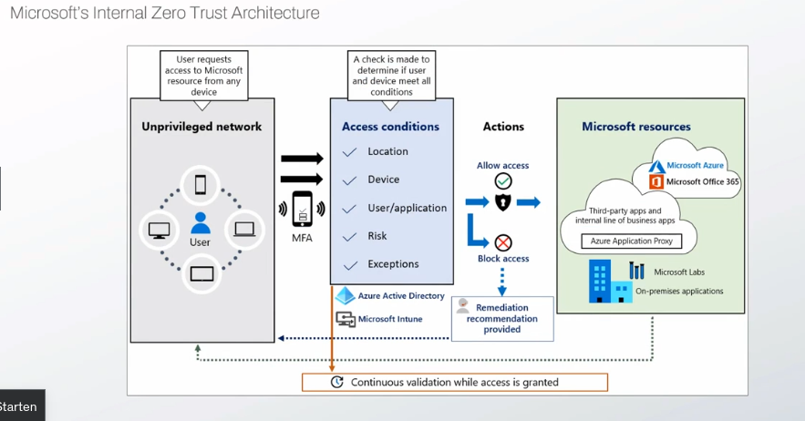

")

> :bulb: Notes on "Certificate of Competence in Zero Trust (CCZT)"

https://www.udemy.com/course/zero-trust-security-fundamentals-for-it-professionals/
https://www.udemy.com/course/certificate-of-competence-in-zero-trust-cczt-exam-tests/

https://www.cloudflare.com/lp/ppc/zero-trust-roadmap-x/

https://csrc.nist.gov/pubs/sp/800/207/final
https://www.cisa.gov/zero-trust-maturity-model

# Certificate of Competence in Zero Trust (CCZT)

## Zero Trust Fundamentals

Zero Trust is
- security model, strategy and framework
    - Never trust, always verify
    - Assume breach
    - Verify explicitly
    - Least privileged access

Assumptions
- Network is assumed to be hostile
- External and internal threats are always present
- Network locality isn't sufficient for determining trust
- Every single device, user and network flow is authenticated and authorized with dynymic policies

Never trust, always verify
- Trust isn't implicit
- Trust is a vulnerability
- every device, user, request is treated as potential threat
- just-in-time and just-enough-access least privilege access controls

Zero trust architecture (ZTA)
- cybersecurity plan to utilize zero trust concepts
- encompasses component relationships, workflow planning and access policies

$$
Zero Trust Enterprise = Zero Trust (ZT) + Zero trust architecture (ZTA)
$$

7 Tenets of Zero Trust Architecture
- consider every data source and computing device as a resource
- keep all communication secured, regardless of network location
- grant resource access on a per-session basis
- moderate access with a dynamic policy
- maintain data integrity
- rigorously enforce authentication and authorization
- gather data for improved security

5 Pillars of Zero Trust
- Users & Identity
    - identification, authentication and access control policies
- Devices
    - validation to determince acceptable trustworthiness
- Network & Environment
    - segment, isolate, control the network environment
- Application & Workloads
    - secure everything from applications to hypervisors, vms and containers
- Data
    - secure and enforce access control
    - data categorization and classification
    - data isolation

2 Foundations of Zero Trust
- Visibility & Analytics
    - provide insight into user and system behavior
    - observe real-time communication
- Automation & Orchestration
    - automate security and network operation
    - orchestrate functions between systems and applications

## Why We Need Zero Trust

Perimeter security pittfalls
- Outside-in
- trust by verify approach
- static policies
- insider threats
- lateral movement

Digital transformation
- Cloud
- Remote/hybrid work
- BYOD
- Blurred traditional network boundaries
- Complex IT infrastructure environments
- Increased attack surface
- Attackers shifting to identity based attacks

Forrester Case study
- 92% ROI
- 50% reduction of data breach risk
- $11.6M net benefits
- less than 6 months payback

Gartner survey reported benefits
- 75% reported improved risk management
- 65% reported improved secure remote access
- 41% reported a reduced nuber of IT security incidents
- 34% reported a reduced network complexity
- 26% reported lower overall security costs

Gartner survey adoption concerns
- 56% Cost
- 51% Technology gaps
- 51% Skills gaps
- 39% shadow IT
- 38% BYOD

## Zero Trust Architecture (ZTA) Fundamentals

### NIST Zero Trust Architectural Model

- Untrusted requestor
    - requestor is untrusted by default
- Policy enforcement point (PEP)
    - enables, monitors and terminates connections between a subject and a resource
- Policy administrator (PA)
    - executes the policy engine's decision by signaling it to the PEP
- Policy engine (PE)
    - brain of the model
    - inputs signals and compares them with access policies to determine wheter access should be granted
- Policy decision point (PDP)
    - conjuction of PE and PA

Data sources
- Continuous diagnostics and mitication (CDM) system
    - collect information regarding systems to determine their current state and apply configuration and sofware updates as needed
- Industrial compliance
    - ensures the enterprise remains compliant with regulatory requirements
- Threat intelligence
    - information regarding newly discovered attacks and vulnerabilities helping to unterstand threats
- Activity logs
    - aggregated real-/near time information on the security posture
- Data access policy
    - attributes, rules and policies to determine how access is granted on trusted resources
- PKI
    - generating and logging certificates
- ID management
    - responsible for creating, storing and managing accounts and identiy records
- SIEM system
    - collect, aggregate and analyze security-centric information

### NIST ZTA architecture approaches
- Enhanced identity governance
    - identity as main source of policy creation
- Micro-segmentation
    - network segments to protect resources
- Software defined perimeters
    - commonly used in the cloud

### NIST ZTA deployment models
#### Device agent/gateway
- PEP agent is deployed on all enterprise systems
- PEP agent communicates with the PA
- if approved, the PA establishes a communication channel between the user agent and the resource gateway

#### Enclave based
- variation of agent/gateway model
- gateway protects several resources instead of one -> resource enclave

#### Resource portal
- Agentless (no PEP)
- Gateway web portal to access resources
- Access to single source or enclave

### Netskope private access

### Microsoft's internal ZTA

## Zero Trust Architectural Pillars

## Designing a Zero Trust Architecture

## Migrating to Zero Trust

## ZTA Use Cases

## Zero Trust Maturity Models

## Conclusion

