> :bulb: Notes on "Generative AI for Cybersecurity Professionals Specialization"

# Generative AI: Introduction and Applications

The creative skills of generative AI come from generative AI models, such as 
- generative adversarial networks or GANs
- variational autoencoders or VAEs
- transformers, and diffusion models

These models can be considered as the building blocks of generative AI. 

## Foundation models

- LLMs
    - OpenAI: GPT n-series
    - Google: PaLM
    - Meta: Llama
- image generation
    - Stable Diffusion
    - DALL-E

## Generative AI tools
- text generation
    - ChatGPT
    - Bard
- image generation
    - DALL-E 2
        - novel images based on textual descriptions
    - Midjourney
    - StyleGAN
        - high quality resolution on novel images
    - DeepArt
        - complex and detailed artwork from a sketch
- audio generation
    - WaveGAN
        - new realistic raw audio waveforms -> speech, music, natural sounds    
    - MuseNet (OpenAI)
        - combine various instruments, styles and genres to create novel musical compositions
        - classical composition to pop songs
    - Tacotron 2 (Google)
        - synthetic speech
    - TTS (Mozilla)
        - synthetic speech
- video generation
    - VideoGPT
        - textual prompt based
        - specify desired content
        - users guide video generation process
    - Synthesia
- code generation
    - Copilot (GitHub)
    - IBM Watson Code Assistant
    - AlphaCode

## History and Evolution of Generative AI

Generative artificial intelligence (AI) is a field that focuses on developing algorithms to create new content, such as text, images, music, and code. Generative AI models are trained on substantial datasets of existing content and learn to generate new content similar to the data they were trained on.

### History
The origin of generative AI origins can be traced back to the initial stages of artificial intelligence exploration. In the 1950s, researchers began to explore the use of computers to generate new data, such as text, images, and music. However, the computational power and data resources needed for these systems to flourish were not yet available.

One of the earliest instances of generative AI dates back to 1964 with the creation of the ELIZA chatbot. Operating on a rule-based system, ELIZA simulated conversations with users by generating responses based on received text. While not genuinely intelligent, ELIZA showcased the potential of generative AI for human-like communication.

During the 1980s and 1990s, hardware and software capabilities advanced considerably and facilitated the development of advanced generative AI models, including neural networks. Neural networks are inspired by the human brain and can learn intricate patterns in data. However, these early neural networks were computationally expensive to train and could only generate small amounts of content.

In the early 2000s, a significant breakthrough occurred in generative AI research with the advent of deep learning. Utilizing neural networks with multiple layers, deep learning models could be trained on extensive datasets to discern complex patterns, enabling the generation of new data that closely resembled human-created content. This breakthrough led to the development of innovative generative AI models, including generative adversarial networks (GANs) and variational autoencoders (VAEs).

GANs and VAEs excel at producing high-quality content that is often indistinguishable from content crafted by humans. 

- GANs operate by training two neural networks in opposition: a generator that creates new content and a discriminator that tries to differentiate between real and synthetic content. Eventually, the generator learns to craft content realistic enough to deceive the discriminator.

- VAEs work by learning a latent space of the data they are trained on. The latent space is a representation of the data that captures the most essential features of the data. VAEs can generate new content by sampling from the latent space and decoding the latent code into the original data space.

In recent years, there has been a rapid explosion in the development of new generative AI models. These models can now generate a wide variety of content, including text, images, music, and code. Generative AI is also used in various applications, such as art, design, and healthcare.

One such instance is the development of diffusion models in 2015. Diffusion models work by gradually adding noise to a clean image until it is completely unrecognizable. They can then be reversed to gradually remove the noise and generate a new image. Diffusion models have been used to create high-quality images and text.

The next significant development is that of large language models (LLMs) like GPT-3and Bardin 2020 and 2023, respectively. LLMs are trained on massive datasets of text and code, which allows them to generate realistic text, translate languages, write different kinds of creative content, and answer your questions in an informative way. 2023 was also when watsonx, a superior generative AI platform based on the cloud, was introduced by IBM. Watsonx can support multiple LLMs.

**1960s: ELIZA**
ELIZA, an early chatbot, showcased early attempts at simulating conversation.

**1980s–1990s: Neural network development**
Researchers started developing more sophisticated generative AI models, including neural networks, capitalizing on advances in hardware and software.

**Early 2000s: Deep learning**
Deep learning, a breakthrough in AI, gained prominence. Neural networks with multiple layers were employed for training on massive datasets.

**2014: Generative adversarial networks (GANs)**
Introduced by Ian Goodfellow and his colleagues, GANs presented a revolutionary two-player neural network framework.

**2015: Diffusion models**
The development of diffusion models brought a novel approach to image generation by gradually adding noise to a clean image.

**2020: GPT-3**
OpenAI released GPT-3, a state-of-the-art language model, demonstrating impressive natural language understanding and generation capabilities.

**2023: Bard and watsonx**
Another large language model, Google’s Bard, and IBM's generative AI system, watsonx are introduced, further advancing the capabilities of generative AI.

These milestones represent an overview of the generative AI journey, capturing vital developments in natural language processing, image generation, and the underlying architectures that have shaped the field over the years. 

### Current scenario

Generative AI is still a relatively young field, but it has already significantly impacted the world. Generative AI is being used to create new forms of art and entertainment, develop new medical treatments, and improve businesses' efficiency. As generative AI advances, its potential societal implications are expected to broaden significantly. 

Presently, these are some of the specific instances highlighting the current applications of generative AI:

- **Art and entertainment:** Generative AI is being used to create new art forms, such as AI-generated paintings, music, and literature. Generative AI is also being used to develop new video games and other interactive experiences.

- **Medicine:** Generative AI is being used to develop new medical treatments, such as personalized cancer therapies and AI-powered drug discovery. Generative AI is also being used to develop new medical imaging tools and improve diagnosis and treatment accuracy.

- **Business:** Generative AI is being used to improve the efficiency of businesses by automating tasks such as customer service, marketing, and sales. Generative AI is also being used to develop new products and services.

Generative AI holds significant transformative potential across various facets of our lives. Using generative AI responsibly and ethically is essential, but it is also important to be excited about its possibilities.

## Capabilities
- text generation
    - Large language modelsLLM
        - trained on large data sets
        - generate human-like text
        - learn patterns and structures from data sets
        - generate coherent and contextually relevant
            - text completion
            - question answering
            - conversation
            - explanations
            - summaries
            - translation
            - image and text pairing
- image generation
    - generative AI images
        - realistic textures
        - natural colors
        - fine grained details
- audio generation
    - musical compositions
    - text to speech
    - synthetic voices
    - natural sounding speech
    - reduce noise, enhance audio quality
    - mimic a human voice
- video generation
    - create basic animations to complex scenes
    - transform images into dynamic videos
    - incorporate temporal coherence
    - exhibit smoot motion and transitions
- code generation
    - complete or create code
        - code snipppets
        - functions
        - complete programs
    - synthesize or refactor code
    - identify and fix bugs
    - test software
    - create documentation
- data generation and augmentation
    - generate new data
    - augment existing data sets
        - images
        - text
        - speech
        - tabular data
        - statistical distribution
        - time series data
    - increase diversity and variability of data
- virtual worlds
    - virtual avatars
        - realistic behavior
        - expressions
        - conversations
        - decisions
    - complex virtual environments
        - realistic textures
        - sounds
        - objects
        - personalized experiences
        - virtual identities with unique personalities

## Applications of Generative AI

### IT and DevOps

Code review
- GitHub Copilot
- Synk DeepCode

Test
- Applitools
- Testim

Monitoring
- AIOps (IBM Watson)
- AIOps (Moogsoft)

CI/CD
- GitLab Duo

other
- natural language interfaces
- automated infrastructure management
- predictive maintenance

### Art and creativity
Generate synthetic content
- music
- scripts
- stories
- videos
- video games

Game development
- Houdini by SideFX
    - games
    - animations
    - AR and VR experiences

Virtual influencers
- interact with users

Education
- content generation
- personalized and adaptive learning
- simulated experiential learning
- language translation
- grade assignments
- create learning journeys
- create assessment strategies
- generate taxonomies
- knowledge tracing
- tutoring support
- virtual and simulated environments
- inclusive education
- NOLEJ
    - AI generated e-learning in minutes
        - interactive video
        - glossary
        - practice questions
        - summary
- Duolingo
    - language learning platform
        - correct french grammar
        - create english test items

### Finance

Banking
- auto detect risks
    - fraud risk
    - credit risk
    - market volatility
- generate insights
- make financially literate recommendations
- KAI-GPT
    - human like financially literate response
- Personetics, AIO Logic
    - detect risks
    - determine rate
    - structure custom loans
    - assessment of customers creditworhiness
    - set credit limits or insurance premiums
BloombergGPT
- analyse
    - news
    - articles
    - social media
- perform market sentiment analysis
- manage investment portfolios

Customer services
- conversational system
- financial planning assistance
    - robo advisors
    - chatbots
    - virtual assistants

Other
- regulatory compliance and reporting
- financial forecasting and prediction
- portfolio optimization
- anti money laundering
- algorithmic trading

### Medicine, healthcare

Medical image analysis
- synthetic images resembling patient data
- synthesize data for rare medical conditions
    
Drug discovery
- generate new molecules
- speed up the process
- lower the development costs

Telemedicine, telemonitoring
- Rasa
    - medically literate conversational system
        - immediate medical advice
        - health related support
        - personalized treatment plans
    
Other
- electronic health record (EHR) management
- healthcare fraud detection
- medical simulation and training

### Human resources

Watson Orchestrate
- automate HR tasks
    - create job requisitions
    - screen and shortlist profiles
    - schedule interviews
    - onboard candidates

Talenteria
- talent acquisition

Leena AI
- HR and employee engagement

Macorva
- workplace and performance management

Other
- training and development
- analytics and decision making
- compliance and policy implementation

## Tools

### Text generation
#### Large language models (LLMs)
Large language models (LLMs) interpret context, grammar, and semantics to generate coherent text based on the patterns and structures they have learned during training. Here's a breakdown of how LLMs accomplish this:
- Context Interpretation: LLMs analyze the context of the input text to understand the meaning and intent behind it. They consider the words and phrases that precede and follow a particular word or phrase to grasp its significance within the broader context. This helps LLMs generate text that is relevant and coherent.
- Grammar Understanding: LLMs have been trained on vast amounts of text data, which enables them to learn the rules and patterns of grammar. They can identify the syntactic structure of sentences, including the correct placement of nouns, verbs, adjectives, and other parts of speech. This understanding of grammar allows LLMs to generate text that adheres to grammatical rules.
- Semantics Comprehension: LLMs also learn the semantic relationships between words and phrases. They can recognize synonyms, antonyms, and other semantic connections, which helps them generate text that is contextually appropriate and meaningful. LLMs can draw upon this knowledge to choose the most suitable words and phrases for a given context.

By combining their understanding of context, grammar, and semantics, LLMs can generate text that is coherent, contextually appropriate, and aligned with the input provided. However, it's important to note that LLMs are not perfect and may occasionally produce text that is grammatically correct but semantically incorrect or lacks coherence.

#### Capabilities
Key capabilities of generative AI models for text generation include:
- Interpretation of Context: Generative AI models, such as large language models (LLMs), can interpret context, grammar, and semantics to generate coherent and contextually appropriate text.
- Creative Writing Styles: LLMs can adapt creative writing styles for any given context by drawing statistical relationships between words and phrases learned during training.
- Multimodal Capabilities: Some LLM-based models offer multimodal capabilities, allowing them to take both image and text inputs for generating new content.
- Smooth Conversations: Text generation tools like ChatGPT can engage in smooth and context-based conversations, providing dynamic responses and maintaining conversational flow.
- Creative Assistance: Generative AI models can assist with creative tasks such as generating ideas, creating content for marketing, and providing suggestions for slides or visuals.
- Language Translation: LLM-based models can translate text across multiple languages, enabling communication and content localization for global audiences.
- Code Generation: Some text generation tools can generate code and perform code-related tasks across various programming languages and frameworks.
- Learning Assistance: Generative AI models can assist in learning new languages or subjects by providing explanations, answering questions, and offering guidance.
- Research and Information Retrieval: Text generation tools like Bard can access web sources to provide summaries of the latest news or information on specific topics.
- Customization and Privacy: Open-source generative AI tools can be customized for specific organizations and installed on local machines, ensuring privacy and data control.

#### Multimodal models
Multimodal models for text generation are models that can process and generate text in conjunction with other modalities such as images, videos, or audio. These models combine the power of language understanding and generation with the ability to interpret and generate content based on multiple modalities.

One example of a multimodal model is OpenAI's ChatGPT, which is based on the GPT architecture. ChatGPT can take both text and image inputs, allowing users to have interactive conversations and generate text in response to prompts that include images. This multimodal capability enhances the richness and contextuality of the generated text.

Another example is Google's Bard, which is based on the PaLM (Pathways Language Model) architecture. Bard combines transformer models with Google's Pathways AI platform. It can generate text by incorporating information from web sources, such as Google Search and Google Scholar, along with the text-based prompts. This multimodal approach enables Bard to provide summaries of news articles, generate ideas, and solve problems by leveraging both text and web-based information.

Multimodal models for text generation have the potential to enhance the quality and relevance of generated text by incorporating information from multiple modalities. They open up possibilities for more interactive and context-aware conversations, as well as generating text that is better aligned with the input provided across different modalities.

#### Text generation tools
ChatGPT and Bard access web sources to provide summaries or information on specific topics through various mechanisms. Here's how they typically work:
- Web Scraping: These tools use web scraping techniques to extract relevant information from web pages. They analyze the HTML structure of web pages, identify relevant content, and extract the necessary information for generating summaries or responses.
- APIs and Web Services: Some text generation tools integrate with APIs or web services that provide access to specific web sources or databases. These APIs allow the tools to retrieve information from the web in a structured manner, enabling them to generate summaries or responses based on the retrieved data.
- Pre-trained Models: Text generation tools like Bard may have been trained on large datasets that include web sources. During training, the models learn to generate text based on the patterns and information present in these web sources. As a result, when prompted with specific topics, the models can generate summaries or responses by leveraging the knowledge acquired from the training data.

It's important to note that the specific implementation and capabilities of text generation tools may vary. Some tools may have partnerships or agreements with specific web sources, while others may rely on publicly available information. Additionally, the accuracy and reliability of the information provided by these tools depend on the quality of the web sources they access and the algorithms used for information extraction.

Remember, when using text generation tools, it's always a good practice to verify the information from multiple sources to ensure accuracy and reliability.

**ChatGPT**
- based on OpenAI's GPT (Generative Pre-trained Transformer) model. It is designed for interactive and dynamic conversations. ChatGPT can generate text based on prompts and engage in context-based conversations. It can also assist with creative tasks like generating slides or helping with language learning. ChatGPT is proficient in English and can understand and respond to several other languages.
- does not have direct access to web sources. It relies on the knowledge and patterns learned during training on a large dataset, which may include web sources. However, it does not actively retrieve information from the web in real-time
- contextual and relevant responses
- creativity at work
- language translation
- effective in generating responses and conversational flow

**Bard**
- based on Google's PaLM (Pathways Language Model). It combines transformer models with Google's Pathways AI platform. Bard is particularly useful for researching the latest news or information on a topic. It has access to web sources through Google Search and Google Scholar. Bard can provide summaries of news articles, generate ideas, and solve problems. It can also generate code and perform code-related tasks.
- has access to web sources through Google Search and Google Scholar. It can pull information from the internet to respond to prompts. This allows Bard to provide summaries of news articles and access a wide range of information available online.
- specialised models for specific tasks
- sumarize news
- generate ideas
-  optimal to research current news of information on a topic

**Other text generators**
- **Jasper:** Jasper generates high-quality marketing content tailored to a brand's voice. It can create marketing content of any length, helping businesses with their marketing efforts.
- **Rytr:** Rytr is a valuable tool for creating high-quality content for various purposes such as blogs, emails, SEO metadata, and social media ads. It can assist in generating engaging and effective written content.
- **Copy.ai**: Copy.ai is great for creating content specifically for social media marketing and product descriptions. It can help businesses generate compelling and persuasive content for their social media campaigns and product listings.
- **Writesonic:** Writesonic offers specific templates for different types of text, such as articles, blogs, ads, and marketing content. It provides a structured approach to generating content for various purposes.
- Resoomer, Gemini
    - text summarization
- uClassify
    - text classification
- Brand24, Repustate
    - sentiment analysis
- Weaver, Yandex
    - language translation

Privacy-preserving text generators are tools that prioritize user privacy by ensuring that sensitive information is not shared or stored. Here are some examples of privacy-preserving text generators:
- **GPT4ALL:** GPT4ALL is an open-source text generator that can be installed on local machines. It operates as a privacy-aware chatbot without the need for an internet connection or graphics processing unit (GPU). It allows users to generate text while keeping their data private.
- **H2O.ai:** H2O.ai is a chatbot that runs on local machines without an internet connection. It utilizes the power of large language models (LLMs) to protect user privacy. By running locally, it ensures that user data is not shared with external servers.
- **PrivateGPT:** PrivateGPT is another chatbot designed to protect user privacy. It operates on local machines without an internet connection, using LLMs to generate text. By keeping the data within the user's control, it ensures privacy and confidentiality.

### Image generation
Generative AI image generation models can generate new images and customize real and generated images to give you the desired output. 

#### Image to image translation
Image-to-image translation is a concept in generative AI where an image is transformed from one domain to another while preserving the original content and style. It involves converting an input image into an output image that belongs to a different category or has different characteristics.

For example, let's say you have a model that can perform image-to-image translation from sketches to realistic images. You can input a sketch of a cat, and the model will generate a realistic image of a cat based on that sketch. The model understands the features and characteristics of a cat and can translate the sketch into a detailed and realistic representation.

Another example is converting satellite images to maps. By inputting a satellite image, the model can generate a map that represents the same location but in a different visual style, making it easier to interpret and navigate.

Image-to-image translation can also be used for enhancing details in medical imaging. For instance, a low-resolution medical image can be inputted, and the model can generate a high-resolution version with enhanced details, aiding in accurate diagnosis and analysis.

Image-to-image translation can be a powerful technique in scientific data visualization:
- Let's say you have a dataset of satellite images showing vegetation cover in different regions. However, you also have another dataset of ground-based photographs that capture the actual vegetation types in those regions. By using image-to-image translation, you can train a model to translate the satellite images into realistic ground-based photographs.
- This translation can help in scientific data visualization by providing a more intuitive representation of the vegetation cover. Researchers and scientists can easily interpret and analyze the data by looking at the translated images, which closely resemble the actual vegetation types on the ground.
- This technique can be particularly useful in fields such as environmental science, agriculture, and urban planning, where accurate visualization of satellite data in a more relatable form can aid in decision-making and analysis.

#### Style transfer and fusion
Style transfer and fusion are techniques used in image generation to manipulate the style and appearance of images. Here's an explanation of each concept:
- Style Transfer: Style transfer involves extracting the style from one image and applying it to another image, creating a hybrid or fusion image that combines the content of one image with the style of another. This technique allows you to transform the visual characteristics of an image while preserving its underlying content. For example, you can take a photograph and apply the style of a famous painting to create a new image that has the content of the photograph but the artistic style of the painting.
- Style Fusion: Style fusion is similar to style transfer but involves combining multiple styles in a single image. It allows you to extract different visual styles from multiple images and apply them to a target image, resulting in a fusion of styles. This technique enables precise control over specific features or elements in an image. For instance, you can take a photograph and apply the style of different paintings to specific regions or objects within the image, creating a unique and customized fusion of styles.

Both style transfer and fusion techniques provide creative ways to transform and manipulate the visual appearance of images, allowing for artistic expression and customization. These techniques have applications in various domains, including digital art, photography, and graphic design.

#### Inpainting
Inpainting is a process in image generation that involves reconstructing missing or damaged parts of an image to make it complete. It is a technique used to fill in the gaps or remove unwanted objects in an image while preserving the overall continuity and context.

Use cases:
- Art Restoration: Inpainting can be used to restore damaged or deteriorated artworks by filling in missing parts. It helps to recreate the original appearance of the artwork and preserve its historical value.
- Forensics: In criminal investigations, inpainting can be used to reconstruct missing or obscured details in images, such as faces or license plates. This can aid in identifying suspects or gathering evidence.
- Object Removal: Inpainting can remove unwanted objects or elements from an image seamlessly. For example, if there is a person or an object that you want to remove from a photograph, inpainting can fill in the gap with the surrounding background, making it appear as if the object was never there.
- Blending Virtual Objects: In augmented reality applications, inpainting can be used to blend virtual objects into real-world scenes. By inpainting the virtual objects into the image, they can seamlessly integrate with the environment, creating a more immersive and realistic experience.
- Enhancing Resolution: Inpainting can also be used to enhance the resolution of an image by generating new details in the missing or low-resolution areas. This can be particularly useful in scenarios where higher resolution images are required, such as in medical imaging or satellite imagery.

#### Outpainting
Outpainting is a capability of generative AI models that involves extending the original image by generating new parts that are like extensions of the original. This can be used for various purposes such as generating larger images, enhancing resolution, and creating panoramic views. For example, if you have a small image of a landscape, outpainting can generate additional scenery to make the image larger and more detailed. It allows you to expand the boundaries of the original image and create a more immersive visual experience.

Use cases:
- Image Enhancement: Outpainting can be used to enhance the resolution and details of an image. By generating new parts that seamlessly blend with the original image, it can create a larger and more detailed version of the original.
- Panoramic Views: Outpainting can be used to create panoramic views by extending the original image horizontally or vertically. This is particularly useful in photography and virtual reality applications where a wider field of view is desired.
- Background Extension: In certain scenarios, you may want to extend the background of an image to provide more context or create a more visually appealing composition. Outpainting can generate new background elements that match the style and content of the original image.
- Artistic Expression: Outpainting can be used as a creative tool for artists and designers. It allows them to expand the boundaries of their original artwork and explore new possibilities by generating additional elements that complement their artistic vision.
- Image Completion: If an image is missing certain parts or has damaged areas, outpainting can be used to reconstruct and complete those missing or damaged parts. This can be useful in image restoration, forensics, and other applications where image completeness is crucial.

#### Generative AI models for image generation
Generative AI models like DALL-E and StyleGAN play a significant role in style transfer and fusion in image generation. Here's how they contribute to these processes:

**DALL-E**
- generative AI model trained on large datasets of images and their textual descriptions
- can generate high-resolution images in multiple styles, including photorealistic images and paintings
- allows users to input text prompts describing the desired image, and it generates images based on those prompts, incorporating the specified style
- with its capabilities for inpainting and outpainting, DALL-E can reconstruct missing or damaged parts of an image to make it complete
- it can generate new parts that seamlessly blend with the original image, allowing for the creation of larger images or enhancing resolution.

**StyleGAN**
- separates the modeling of image content and image style
- allows for the manipulation of specific features and style elements in images
- has evolved to generate higher-resolution images with more realistic details
- by controlling the latent space of the model, users can modify the style of generated images, enabling style transfer and fusion
- StyleGAN's ability to generate new parts or extend the original image contributes to the creation of fusion images
- by manipulating the latent space, users can generate new elements that are like extensions of the original image, resulting in composite images with combined features

**Stable Diffusion**
- Text-to-Image Generation: Stable diffusion can generate images based on text prompts. By providing a textual description, you can generate images that match the given description.
- Image-to-Image Translation: The model can perform image-to-image translation, which involves transforming an image from one domain to another while preserving the original content and style. For example, it can convert sketches to realistic images, satellite images to maps, or security camera images to higher-resolution images.
- Inpainting: Inpainting refers to reconstructing missing or damaged parts of an image to make it complete. Stable diffusion can be used for art restoration, forensics, removing unwanted objects in images while preserving continuity and context, and blending virtual objects into real-world scenes and augmented reality.
- Outpainting: Outpainting involves extending the original image by generating new parts that are like extensions of the original. This capability can be used for generating larger images, enhancing resolution, and creating panoramic views.

**Free tools**
- Crayon: Crayon is a free AI image generator that allows you to generate images based on text prompts. It offers various styles and customization options.
- Freepik: Freepik is another free AI image generator that enables you to generate images based on text prompts. It provides multiple image variations and styles to choose from.
- Picsart: Picsart is a free image editing tool that offers AI-powered image generation capabilities. It allows you to create images in different forms and styles.
- Fotor: Fotor is a free online photo editing tool that also offers AI-based image generation capabilities. It provides a variety of pre-trained styles and allows you to create your own custom styles.
- DeepArt.io: DeepArt.io is an online platform that turns photos into artwork of different styles. It offers a range of artistic filters and effects to transform your images.

**Other**
- Midjourney: Midjourney is a platform that enables image generator communities, helping artists and designers create images using AI and explore each other's creations.
- Microsoft Bing Image Creator: Microsoft Bing Image Creator is an AI image generator based on the DALL-E model. It can be accessed through Bing.com/Create or Microsoft Edge.
- Adobe Firefly: Adobe Firefly is a family of generative AI tools designed to integrate with Adobe's Creative Cloud applications, such as Photoshop and Illustrator. It offers various image manipulation and generation capabilities.
    - trained on Adobe stock photos
    - manipulate color, tone
    - lighting composition
    - generative fill
    - text effects
    - generative recolor
    - 3D to image
    - extend image

### Audio and video generation
#### Categories
Three categories of generative AI audio tools:
- Speech generation tools: These tools use deep learning algorithms trained on vast datasets of human speech to convert text into natural-sounding speech. By analyzing and replicating vocal characteristics such as pronunciation, speed, emotion, and intonation, these tools create accurate and realistic speech. They are particularly useful for individuals with visual impairment, language barriers, or reading disabilities. Speech generation tools can also be used to listen to essays, feedback, or notes, making it easier to consume information.
- Music creation tools: These tools allow users to generate music using generative AI algorithms. They offer extensive music banks, various genres, instrumental styles, and melodies. Users can input a text prompt, and based on their request, the tool will generate music accordingly. These tools are helpful for amateur musicians or anyone looking to create original music compositions, soundtracks for videos, or even remixes. Some music creation tools also provide audio editing and enhancement capabilities.
- Audio enhancing tools: These tools are designed to enhance audio quality by removing unwanted noise, enhancing low-quality recordings, and adding desired sound effects. They can be used to clean up audio files, improve the overall sound quality, and add fun or professional sound effects to audio content. Audio enhancing tools are often used in music production, podcasting, filmmaking, and other audio-related industries.

#### Speech creation tools
Generative AI speech generation tools have several practical applications. Here are a few examples:
- Accessibility: These tools can help individuals with visual impairments, reading disabilities, or language barriers. By converting text into natural-sounding speech, generative AI speech generation tools enable easier access to written content, such as essays, feedback, or notes.
- Voiceover and Narration: If you want to add a standout narration to your presentations, videos, or podcasts, generative AI speech generation tools can be immensely helpful. They offer a wide range of AI voices, languages, and emotions, allowing you to create unique and professional-sounding voiceovers.
- Language Learning: Generative AI speech generation tools can aid language learners by providing accurate pronunciation examples. Learners can input text prompts and listen to how words and phrases are pronounced by native speakers, helping them improve their language skills.
- Virtual Assistants and Chatbots: Speech generation tools are often used in virtual assistants and chatbots to provide human-like responses. By generating speech based on text inputs, these tools enhance the conversational experience and make interactions with virtual assistants more natural and engaging.
- Audio Content Creation: If you're a content creator or musician, generative AI speech generation tools can be used to create audio content. You can convert text into speech for podcasts, audiobooks, or even songs. These tools offer customization options to adjust vocal tracks, pronunciation, tone, and speed, allowing you to produce high-quality audio content.
- Personalized Voice Cloning: Some generative AI speech generation tools enable voice cloning, where you can create a unique voice or clone your own voice. This can be useful for voiceover artists, content creators, or individuals who want to personalize their audio content.

**Tools**
- LOVO: LOVO is an AI-powered text-to-speech platform that offers a wide range of voices and languages. It allows users to generate high-quality speech for various applications, such as voice-overs, audiobooks, podcasts, and more.
- Synthesia: Synthesia is a tool that enables users to create videos with AI-generated speech. It uses deep learning algorithms to generate realistic lip-synced videos, making it appear as if the person in the video is speaking the generated text.
- Murf.ai: Murf.ai is an AI voice cloning platform that allows users to clone their own voice or create unique AI voices. It provides customization options for tone, speed, and pronunciation, enabling users to create personalized voice recordings.
- Listnr: Listnr is an AI-powered voice-over platform that offers a variety of voices and languages. It allows users to generate voice-overs for videos, presentations, e-learning courses, and more.

#### Music creation tools
The capabilities of music creation tools powered by generative AI are quite impressive. Here are some key capabilities:
- Composition: These tools can generate original melodies, harmonies, and chord progressions based on text prompts or user inputs. They can create music in various genres and styles, allowing users to explore different musical ideas.
- Instrumentation: Music creation tools can suggest or add instruments to enhance the composition. They can provide recommendations for instrument combinations, helping users create a rich and balanced sound.
- Sound Effects: Generative AI music tools can generate sound effects to add depth and texture to the music. These effects can be customized to match the desired mood or atmosphere of the composition.
- Remixing: Users can input existing music tracks or samples, and the generative AI tools can remix and rearrange them to create unique variations. This capability is particularly useful for DJs, producers, and musicians looking to experiment with different arrangements.
- Audio Editing and Enhancement: Many music generation tools also offer audio editing and enhancement features. Users can clean up recordings, remove background noise, adjust audio levels, and apply various effects to improve the overall sound quality.
- Publishing and Distribution: Once the music is created, generative AI music tools can assist in the process of mixing, mastering, and publishing the final output. They can provide recommendations for optimal audio settings and even help users distribute their music on popular streaming platforms.

**Tools**
- Amper Music: Amper Music is a widely used generative AI music tool that allows users to create custom music compositions. It offers a vast library of music genres, moods, and instruments. Users can input text prompts or adjust parameters to generate unique music tracks for various purposes.
- Jukedeck: Jukedeck is another popular music creation tool that uses generative AI algorithms. It enables users to create royalty-free music for videos, podcasts, and other media projects. Users can customize the style, tempo, and duration of the music, and the tool will generate a unique composition accordingly.
- AIVA: AIVA (Artificial Intelligence Virtual Artist) is an AI-powered music composer that can generate original compositions in various genres. It has been used in film soundtracks, video games, and other creative projects. AIVA allows users to input specific emotions or moods to create music that aligns with their desired atmosphere.
- Magenta: Magenta is an open-source project by Google that focuses on exploring the intersection of AI and music. It offers a range of tools and models for music generation, including melody and drum pattern generation. Magenta provides a platform for musicians and developers to experiment with generative AI in music creation.
- Ecrett Music: Ecrett Music is a generative AI music tool that allows users to create original compositions by inputting text prompts. It offers a wide variety of music styles and genres, and users can customize the mood, tempo, and other parameters to generate music that suits their needs.

#### Audio enhancing tools
The capabilities of audio enhancing tools are designed to improve the quality and enhance the overall sound of audio recordings. Here are some key capabilities of audio enhancing tools:
- Noise Removal: Audio enhancing tools can effectively remove background noise, such as hums, hisses, clicks, and other unwanted sounds, from recordings. This helps to clean up the audio and make it clearer and more professional-sounding.
- Audio Restoration: These tools can restore and enhance audio recordings that may be of low quality or have been damaged due to various factors like poor recording conditions or age. They can reduce distortion, improve clarity, and bring out the details in the audio.
- Equalization: Audio enhancing tools provide equalization capabilities, allowing users to adjust the frequency response of the audio. This helps in balancing the sound and enhancing specific frequencies to achieve the desired tonal quality.
- Dynamic Range Compression: These tools can apply dynamic range compression to audio recordings, which helps to even out the volume levels and make the audio more consistent. This is particularly useful when dealing with recordings that have varying volume levels or when preparing audio for broadcasting or streaming.
- Audio Effects: Audio enhancing tools often include a range of audio effects that can be applied to recordings. These effects can include reverb, delay, chorus, flanger, and many others, allowing users to add depth, texture, and creative elements to their audio.
- Editing and Mixing: Audio enhancing tools provide editing capabilities, allowing users to trim, cut, splice, and rearrange audio segments. They also enable users to mix multiple audio tracks together, adjust volume levels, and apply effects to create a cohesive and polished final product.
- Format Conversion: Many audio enhancing tools support the conversion of audio files from one format to another. This allows users to convert audio recordings into different file formats that are compatible with various devices and platforms.

**Tools**
- Descript: Descript is a powerful audio editing tool that allows you to remove background noise, enhance low-quality recordings, and add desired sound effects. It offers a user-friendly interface and advanced features for precise audio editing.
- Audo AI: Audo AI is an AI-powered audio enhancement tool that cleans audio files of unwanted noise. It uses advanced algorithms to identify and remove background noise, resulting in cleaner and clearer audio recordings.
- iZotope RX: iZotope RX is a professional-grade audio repair and enhancement software. It offers a wide range of tools for noise reduction, audio restoration, spectral editing, and more. It is widely used in the music, film, and broadcasting industries.
- Adobe Audition: Adobe Audition is a comprehensive audio editing software that provides a range of tools for audio enhancement. It offers features like noise reduction, audio restoration, equalization, and audio effects to improve the quality of audio recordings.

#### Video generation tools
Generative AI video tools offer a range of capabilities to create unique and visually appealing videos. Here's how they can be used:
- Style Transformation: Generative AI video tools like Runway's Gen-1 can transform existing video clips into different styles. By applying artistic filters, color grading, or visual effects, you can give your videos a distinct and eye-catching look.
- Text-to-Video Generation: Tools like Runway's Gen-2 allow you to create videos using text, image, or video inputs. You can input a text prompt describing the scenes or actions you want in your video, and the generative AI model will generate corresponding visuals. This enables you to bring your ideas to life without the need for extensive video production.
- Image and Video Generation: Some generative AI video tools, such as Synthesia and EaseUS Video Editor, allow you to upload photos or use text prompts to generate the images you need for your video. This can be particularly useful if you don't have access to specific footage or want to create visuals that are difficult to capture in real life.
- Editing and Enhancement: Generative AI video tools often provide editing and enhancement capabilities. You can edit your video clips, add transitions, apply visual effects, and enhance the overall quality of your videos. These tools can help you create polished and professional-looking videos.
- Custom Avatars and Branding: Tools like Synthesia enable you to create custom avatars that can increase brand recall and add a unique touch to your videos. You can personalize the appearance, expressions, and behaviors of these avatars, making your videos more engaging and memorable.

**Tools**
- Runway: Runway offers video generation tools like Gen-1 and Gen-2. Gen-1 can transform existing video clips into different styles, while Gen-2 allows you to create videos using text, image, or video inputs. These tools provide a range of customization options and can help you create unique and visually appealing videos. Runway AI was used in Oscar movie "Everything Everywhere All at Once"
- EaseUS Video Editor: EaseUS Video Editor is a user-friendly video editing software that also offers video generation capabilities. It allows you to upload photos or use text prompts to generate the images you need for your video. Additionally, it provides features for recording narration, enhancing audio, converting video file formats, and publishing your final video.
- Synthesia: Synthesia is an AI-powered video generation platform that enables you to create professional-looking videos using text prompts. It allows you to upload photos or generate images based on text inputs. Synthesia also offers features for recording narration, enhancing audio, creating custom avatars, and publishing your videos.

#### Virtual world generation tools
Generative AI video tools can be used to create unique and personalized virtual worlds in gaming metaverses by leveraging their capabilities to generate 3D objects, avatars, and simulations. Here's how they can be utilized:
- Rapid Generation of 3D Objects: Generative AI video tools enable users to quickly generate 3D objects with various characteristics and attributes. These tools can automatically create objects based on text prompts or other inputs, allowing game developers to populate their virtual worlds with a wide range of unique and customized assets.
- Avatar Creation: With generative AI video tools, users can create avatars that possess specific personality traits, expressions, behaviors, conversations, and decision-making abilities. These avatars can be designed to reflect the preferences and characteristics of individual players, enhancing the personalized experience within the virtual world.
- Enhanced Simulations: Generative models can respond in real-time, improving the accuracy and realism of simulations within the virtual world. This enables more immersive and engaging gameplay experiences, as the virtual world can dynamically adapt and respond to the actions and choices of the players.
- Metaverse Platforms: Metaverse platforms utilize generative AI to create a more personalized and interactive user experience. These platforms allow users to build, own, and market their games globally, providing a space for players to explore and interact with unique virtual worlds created using generative AI video tools.
- Customization and Marketability: Generative AI video tools empower game developers and players to customize their virtual worlds, making them stand out and reflect their unique vision. This customization can include the creation of custom avatars, unique landscapes, and exotic environments. Additionally, these virtual worlds can be marketed and shared with others, fostering a sense of community and collaboration within the gaming metaverse.

**Tools**
- Unity: Unity is a popular game development platform that allows users to create virtual worlds with stunning graphics and realistic physics. It provides a wide range of tools and assets to design and build virtual environments, including terrain editors, lighting systems, and asset libraries.
- Unreal Engine: Unreal Engine is another powerful game development platform that offers robust tools for virtual world creation. It provides a visual scripting system and a vast library of assets to create detailed and visually appealing virtual worlds.
- Blender: Blender is a free and open-source 3D modeling and animation software that can be used to create virtual worlds. It offers a comprehensive set of tools for modeling, texturing, and animating objects, as well as a physics engine for realistic simulations.
- World Machine: World Machine is a specialized terrain generation software that focuses on creating realistic and detailed landscapes for virtual worlds. It allows users to generate terrains with various features like mountains, rivers, and erosion effects.
- CityEngine: CityEngine is a tool specifically designed for creating virtual cities and urban environments. It enables users to generate realistic city layouts, buildings, and streets, making it ideal for creating virtual worlds with urban settings.
- Voxel editors: Voxel editors like MagicaVoxel or Qubicle allow users to create virtual worlds using voxel-based graphics. These tools are particularly useful for designing blocky or pixelated environments, such as those found in voxel-based games.
- Procedural generation tools: Procedural generation tools like Houdini or Substance Designer enable users to generate virtual worlds algorithmically. They use mathematical algorithms and rules to create randomized or procedurally generated environments, offering endless possibilities for unique virtual worlds.

### Code generation
Generative AI for code generation has several basic capabilities, including:
- Generating new code snippets: Generative AI models and tools can generate code based on natural language input. They can take a text prompt and produce a new code snippet or program that fulfills the given requirements.
- Completing partial code snippets: These tools can predict lines of code to complete a partial code snippet. By understanding the context and requirements, they can generate the missing code to make the snippet functional.
- Optimizing existing code: Generative AI models can analyze and optimize existing code. They can suggest improvements, refactorings, and optimizations to enhance the performance, readability, and maintainability of the code.
- Converting code between programming languages: Code generators can convert code from one programming language to another. This capability is particularly useful when developers need to migrate codebases or work with multiple programming languages.
- Generating code documentation and comments: AI-based code generators can generate summaries, comments, and documentation for code. They can improve the readability and understanding of the codebase by automatically generating descriptive comments and documentation.
- Recommending programming solutions: Code generators can analyze a given problem statement and recommend programming solutions. They can suggest algorithms, data structures, and programming approaches to solve specific problems.

There are some potential limitations and challenges to consider:
- Limited understanding of semantics: While AI models can understand programming concepts and syntax, they may not fully grasp the semantics of the code. This means that although the generated code may be technically accurate, it may not function as intended or meet specific requirements.
- Lack of awareness of recent frameworks and libraries: AI models are trained on specific datasets, and their knowledge may be limited to the data available during training. They may not be aware of programming frameworks and libraries released after their training. This can result in generated code that does not incorporate the latest best practices or features.
- Difficulty with large or complex code: AI-based code generators may struggle to generate large or complex code from scratch. While they excel at generating code with basic logic and programming concepts, they may face challenges when dealing with intricate code structures or advanced algorithms.
- Ethical concerns and security vulnerabilities: It's important to use AI-generated code responsibly to avoid ethical issues and security vulnerabilities. Code generators can inadvertently introduce security vulnerabilities if used to generate malicious code. Additionally, biases present in the training data can be reflected in the generated code, leading to biased outcomes.
- Lack of context and domain-specific knowledge: AI models may lack context and domain-specific knowledge required for certain code generation tasks. They may not understand the specific requirements, constraints, or domain-specific conventions, which can limit their ability to generate accurate and appropriate code.
- Dependency on training data quality: The quality and diversity of the training data used to train AI models can significantly impact the performance of code generators. If the training data is limited or biased, it can affect the accuracy and reliability of the generated code.
- Need for clear and specific prompts: To generate code accurately, it's crucial to provide clear and specific prompts to the AI models. Ambiguous or incomplete prompts may result in code that does not meet the desired requirements.

Using AI-based code generators for code generation can introduce potential risks and ethical concerns. Some of these include:
- Security vulnerabilities: AI-generated code may inadvertently introduce security vulnerabilities if used to generate malicious code. It's important to ensure that the generated code is thoroughly reviewed and tested to identify and address any potential security risks.
- Bias in generated code: AI models are trained on datasets that may contain biases, and these biases can be reflected in the generated code. This can lead to biased outcomes or discriminatory behavior in the code. It's crucial to be aware of these biases and take steps to mitigate them.
- Lack of accountability: AI-generated code may lack transparency and accountability. It can be challenging to trace the decision-making process of the AI model and understand why certain code was generated. This can make it difficult to identify and fix any issues or errors in the generated code.
- Limited understanding of context and intent: AI models may struggle to fully understand the context and intent behind the code generation task. They may not grasp the specific requirements, constraints, or domain-specific conventions, leading to code that does not meet the desired objectives.
- Legal and copyright issues: AI-generated code may inadvertently infringe upon copyright or intellectual property rights. It's important to ensure that the generated code does not violate any legal or licensing restrictions.
- Dependency on training data quality: The quality and diversity of the training data used to train AI models can significantly impact the performance of code generators. If the training data is limited, biased, or of poor quality, it can affect the accuracy and reliability of the generated code.
- Ethical use of AI: It's crucial to use AI-based code generators responsibly and ethically. This includes ensuring that the generated code aligns with ethical guidelines and standards, respecting privacy and data protection, and avoiding any misuse or harm caused by the generated code.

Developers can take several steps to ensure the responsible and ethical use of AI-based code generators and mitigate associated risks and concerns:
- Thoroughly review and validate the generated code: Developers should carefully review and test the code generated by AI-based code generators. This includes checking for security vulnerabilities, ensuring compliance with coding standards, and verifying that the code meets the desired objectives.
- Address biases and fairness: AI models can inadvertently introduce biases into the generated code. Developers should be aware of these biases and take steps to mitigate them. This can involve using diverse and representative training data, regularly monitoring and evaluating the model's performance for bias, and making necessary adjustments to ensure fairness.
- Combine AI with human expertise: While AI-based code generators can be powerful tools, they should not replace human expertise. Developers should use their own knowledge and experience to validate and refine the generated code. Human review can help identify any issues or errors that the AI model might have missed.
- Ensure transparency and accountability: It's important to have transparency and accountability in the code generation process. Developers should document the use of AI-based code generators, including the specific models and tools used, the training data, and any modifications made to the generated code. This documentation can help address any concerns or questions that may arise.
- Stay up-to-date with advancements: AI models and tools are constantly evolving. Developers should stay informed about the latest advancements, updates, and best practices in AI-based code generation. This can involve participating in relevant communities, attending conferences or webinars, and keeping track of research and industry developments.
- Test for functionality and performance: Apart from reviewing the generated code, developers should thoroughly test it for functionality and performance. This includes conducting unit tests, integration tests, and performance tests to ensure that the code functions as intended and meets the required performance benchmarks.
- Consider legal and ethical implications: Developers should be mindful of legal and ethical considerations when using AI-based code generators. This includes respecting intellectual property rights, ensuring compliance with privacy and data protection regulations, and avoiding any misuse or harm caused by the generated code.
- Continuously monitor and improve: Regular monitoring and improvement of AI models and code generators are essential. Developers should collect feedback, track performance metrics, and iterate on the models to enhance their accuracy, reliability, and ethical considerations. This iterative process helps in addressing any emerging risks or concerns.

**Tools**
- GitHub Copilot
    - Powered by OpenAI Codex, a generative pre-trained language model.
    - Can generate code based on various programming languages and frameworks.
    - Trained on natural language text and source code from publicly available sources, including GitHub repositories.
    - Can be integrated as an extension with popular code editors, such as Visual Studio.
    - Produces code snippets that adhere to best practices and industry standards.
- PolyCoder
    - Based on GPT and trained on data from various GitHub repositories written in 12 programming languages.
    - Particularly accurate for writing C codes.
    - Offers an extensive library of predefined templates that can be used as blueprints for code generation for various use cases.
    - Helps create, review, and refine code snippets precisely customized to requirements.
- IBM Watson Code Assistant
    - Built on IBM watsonx.ai foundation models for developers of any skill level.
    -Can be integrated with a code editor.
    - Provides real-time recommendations, autocomplete features, and code restructuring assistance.
    - Analyzes code or project files and identifies patterns, suggests improvements, and generates code snippets or templates.
    - Developers can customize the generated code for specific project needs.
- ChatGPT and Bard
    - generating code with basic logic and programming concepts
    - step-by-step and detailed explanations, making them useful for learning new programming languages.
    - generate code snippets based on text prompts, helping developers quickly prototype and iterate on design ideas.
    - provide code corrections and suggestions for debugging purposes
    - trained on a wide range of programming languages, making them versatile tools for code generation and debugging.
    - may struggle to generate large or complex code from scratch
    - may not completely understand semantics
    - limited to the data they were trained on. They may not be aware of programming frameworks and libraries released after their training
    - important to provide clear prompts, specify the programming language, and provide relevant requirements and constraints
    - may not be able to generate code that adheres to specific coding standards or industry best practices without additional customization
- Amazon CodeWhisperer
    - Code Recommendations: CodeWhisperer provides intelligent suggestions for code snippets, completions, and optimizations based on the context and coding patterns.
    - Integration with Code Editors: CodeWhisperer can be seamlessly integrated with code editors, allowing developers to receive recommendations directly within their coding environment.
    - Real-time Assistance: CodeWhisperer offers real-time code recommendations, enabling developers to make immediate improvements to their code as they write.
    - Improved Productivity: By suggesting code snippets and completions, CodeWhisperer helps developers save time and effort, increasing their overall productivity.
    - Code Quality Enhancement: CodeWhisperer's recommendations are designed to improve the quality of code by adhering to best practices and coding standards.
    - Contextual Understanding: CodeWhisperer leverages AI algorithms to comprehend the context of the code being written, providing relevant and contextually appropriate suggestions.
    - Language Support: CodeWhisperer supports multiple programming languages, allowing developers to receive recommendations tailored to their preferred language.
    - Customization: Developers can customize CodeWhisperer's recommendations to align with their specific coding preferences and requirements.
- Tabnine
    - Intelligent Code Completion: Tabnine uses machine learning algorithms to provide accurate and context-aware code completions as you type. It suggests the most likely code snippets based on the current context, saving you time and effort.
    - Multilingual Support: Tabnine supports a wide range of programming languages, including popular ones like Python, JavaScript, Java, C++, and more. It can provide relevant code completions regardless of the language you are working with.
    - Deep Learning Models: Tabnine utilizes deep learning models trained on vast amounts of code from open-source repositories. This extensive training data helps it understand common coding patterns and provide accurate suggestions.
    - Real-time Suggestions: Tabnine offers real-time code suggestions, providing you with immediate recommendations as you write code. This helps you write code faster and with fewer errors.
    - Contextual Understanding: Tabnine comprehends the context of your code, including variable names, function calls, and more. It uses this understanding to generate relevant code completions that align with your coding style.
    - Code Snippet Expansion: Tabnine can expand code snippets based on abbreviations or predefined triggers. This feature allows you to quickly insert commonly used code patterns or templates with just a few keystrokes.
    - Integration with Code Editors: Tabnine seamlessly integrates with popular code editors like Visual Studio Code, IntelliJ IDEA, PyCharm, and more. It provides code suggestions directly within your coding environment, enhancing your productivity.
    - Learning from User Feedback: Tabnine continuously learns from user feedback and adapts its suggestions to improve over time. It takes into account the code you accept or reject to refine its recommendations and provide more accurate suggestions in the future.
- Replit
    - Interactive Coding Environment: Replit provides an interactive coding environment where you can write, run, and debug code directly in your web browser. It supports multiple programming languages, including Python, JavaScript, Java, C++, and more.
    - Collaboration and Sharing: Replit allows you to collaborate with others in real-time on coding projects. You can invite team members to work together, share your code with others, and even pair program with remote colleagues.
    - Code Versioning and History: Replit offers built-in version control features, allowing you to track changes to your code over time. You can easily revert to previous versions, compare changes, and collaborate on code changes with others.
    - Integrated Development Environment (IDE) Features: Replit provides a full-featured IDE with features like syntax highlighting, code completion, and intelligent code suggestions. It also includes a built-in terminal for running commands and managing dependencies.
    - Project Templates and Starter Kits: Replit offers a variety of project templates and starter kits to help you get started quickly. These templates provide a basic structure and pre-configured settings for different types of projects, saving you time and effort.
    - Deployment and Hosting: Replit allows you to deploy and host your applications directly from the platform. You can easily share your projects with others by providing them with a live URL where they can access and interact with your application.
    - Learning and Teaching Tools: Replit offers educational features that make it suitable for learning and teaching programming. It provides a classroom management system, interactive coding exercises, and the ability to create assignments and track student progress.
    - Community and Resources: Replit has a vibrant community of developers who share their projects, collaborate, and provide support to each other. It also offers a library of resources, tutorials, and documentation to help you learn and improve your coding skills.

## Glossary
| Term                                     | Definition                                                                                                                                                                                                                                                                     |
|------------------------------------------|--------------------------------------------------------------------------------------------------------------------------------------------------------------------------------------------------------------------------------------------------------------------------------|
| Data augmentation                        | A technique commonly used in machine learning and deep learning to increase the diversity and amount of training data.                                                                                                                                                         |
| Deep learning                            | A subset of machine learning that focuses on training computers to perform tasks by learning from data. It uses artificial neural networks.                                                                                                                                    |
| Diffusion model                          | A type of generative model that is popularly used for generating high-quality samples and performing various tasks, including image synthesis. They are trained by gradually adding noise to an image and then learning to remove the noise. This process is called diffusion. |
| Discriminative AI                        | A type of artificial intelligence that distinguishes between different classes of data.                                                                                                                                                                                        |
| Discriminative AI models                 | Models that identify and classify based on patterns they observe in training data. In general, they are used in prediction and classification tasks.                                                                                                                           |
| Foundational models                      | AI models with broad capabilities that can be adapted to create more specialized models or tools for specific use cases.                                                                                                                                                       |
| Generative adversarial network (GAN)     | A type of generative model that includes two neural networks: generator and discriminator. The generator is trained on vast data sets to create samples like text and images. The discriminator tries to distinguish whether the sample is real or fake.                       |
| Generative AI                            | A type of artificial intelligence that can create new content, such as text, images, audio, and video.                                                                                                                                                                         |
| Generative AI models                     | Models that can understand the context of input content to generate new content. In general, they are used for automated content creation and interactive communication.                                                                                                       |
| Generative pre-trained transformer (GPT) | A series of large language models developed by OpenAI. They are designed to understand language by leveraging a combination of two concepts: training and transformers.                                                                                                        |
| Large language models (LLMs)             | A type of deep learning model trained on massive amounts of text data to learn the patterns and structures of language. They can perform language-related tasks, including text generation, translation, summarization, sentiment analysis, and more.                          |
| Machine learning                         | A type of artificial intelligence that focuses on creating algorithms and models that enable computers to learn and make predictions or decisions. It involves designing systems that can learn from training data.                                                            |
| Natural language processing (NLP)        | A branch of artificial intelligence that enables computers to understand, manipulate and generate human language (natural language).                                                                                                                                           |
| Neural networks                          | Computational models inspired by the structure and functioning of the human brain. They are a fundamental component of deep learning and artificial intelligence.                                                                                                              |
| Prompt                                   | Instructions or questions that are given to a generative AI model to generate new content.                                                                                                                                                                                     |
| Training data                            | Data (generally, large datasets that also have examples) used to teach a machine learning model.                                                                                                                                                                               |
| Transformers                             | A deep learning architecture that uses an encoder-decoder mechanism. Transformers can generate coherent and contextually relevant text.                                                                                                                                        |
| Variational autoencoder (VAE)            | A type of generative model that is basically a neural network model designed to learn the efficient representation of input data by encoding it into a smaller space and decoding back to the original space.                                                                  |

# Generative AI: Prompt Engineering
**Basics**
- A prompt is any input or a series of instructions you provide to a generative model to produce a desired output.
- These instructions help in directing the creativity of the model and assist it in producing relevant and logical responses. 
- The building blocks of a well-structured prompt include instruction, context, input data, and output indicators. 
- These elements help the model comprehend our necessities and generate relevant responses. 
- Prompt engineering is designing effective prompts to leverage the full capabilities of the generative AI models in producing optimal responses.
- Refining a prompt involves experimenting with various factors that could influence the output from the model.
- Prompt engineering helps optimize model efficiency, boost performance, understand model constraints, and enhance its security.
- Writing effective prompts is essential for supervising the style, tone, and content of output.
- Best practices for writing effective prompts can be implemented across four dimensions: clarity, context, precision, and role-play.
- Prompt engineering tools provide various features and functionalities to optimize prompts. 
- Some of these functionalities include suggestions for prompts, contextual understanding, iterative refinement, bias mitigation, domain-specific aid, and libraries of predefined prompts. 
- A few common tools and platforms for prompt engineering include IBM watsonx Prompt Lab, Spellbook, Dust, and PromptPerfect. 

**Prompt Engineering**
- The various techniques using which text prompts can improve the reliability and quality of the output generated from LLMs are task specification, contextual guidance, domain expertise, bias mitigation, framing, and the user feedback loop. 
- The zero-shot prompting technique refers to the capability of LLMs to generate meaningful responses to prompts without needing prior training.
- The few-shot prompting technique used with LLMs relies on in-context learning, wherein demonstrations are provided in the prompt to steer the model toward better performance.
- The several benefits of using text prompts with LLMs effectively are increasing the explain ability of LLMs, addressing ethical considerations, and building user trust. 
- The interview pattern approach is superior to the conventional prompting approach as it allows a more dynamic and iterative conversation when interacting with generative AI models.
- The Chain-of-Thought approach strengthens the cognitive abilities of generative AI models and solicits a step-by-step thinking process.
- The Tree-of-Thought approach is an innovative technique that builds upon the Chain-of-Thought approach and involves structuring prompts hierarchically, akin to a tree, to guide the model's reasoning and output generation.

**Best practices**
When it comes to prompt creation, there are several best practices to keep in mind. These practices will help you design effective prompts that yield desired responses from generative AI models. Here are some key best practices for prompt creation:
- Define clear goals: Before creating a prompt, clearly define the goal or objective you want to achieve. This will help you craft a prompt that aligns with your desired outcome.
- Provide context: Context is crucial for generating relevant responses. Make sure to include relevant information, background details, or specific instructions in your prompt to guide the model accurately.
- Be specific: Specific prompts tend to yield better results. Avoid vague or ambiguous prompts and provide precise instructions or questions to guide the model effectively.
- Experiment and iterate: Prompt engineering is an iterative process. Test different prompts, analyze the responses, and refine your prompts based on the results. Continuously iterate until you achieve the desired response quality.
- Consider different perspectives: Prompt engineering involves considering different angles or perspectives to generate well-rounded responses. Encourage the model to explore various aspects of the topic or problem you are addressing.
- Balance complexity: Find the right balance between simplicity and complexity in your prompts. Overly complex prompts may confuse the model, while overly simple prompts may result in shallow or incomplete responses.
- Incorporate desired output: Clearly specify the type of response or output you expect from the model. This could include specific information, formatting requirements, or desired insights.
- Test and analyze: After creating a prompt, test it with the generative AI model and carefully analyze the response. Assess whether it aligns with your goals and make note of any areas that need improvement.
- Learn from the model's limitations: Prompt engineering can help you understand the strengths and weaknesses of the generative AI model. Use this knowledge to refine your prompts and enhance the model's performance.
- Practice ethical prompt engineering: Ensure that your prompts align with ethical guidelines and avoid generating harmful or biased content. Be mindful of the potential impact of the prompts you create.

**Glossary**
| Term                                     | Definition                                                                                                                                                                                                                                            |
|------------------------------------------|-------------------------------------------------------------------------------------------------------------------------------------------------------------------------------------------------------------------------------------------------------|
| API integration                          | Application programming interface integration refers to the process of connecting different software systems or applications through their APIs to enable them to work together and share data or functionality.                                      |
| Bias mitigation                          | A technique in which text prompts provide explicit instructions to generate neutral responses.                                                                                                                                                        |
| Chain-of-Thought                         | An approach to prompt engineering that involves breaking down a complex task into smaller and easier ones through a sequence of more straightforward prompts.                                                                                         |
| ChatGPT                                  | A language model designed to provide detailed responses to natural language input.                                                                                                                                                                    |
| Claude                                   | A powerful and flexible AI chatbot to help you with your tasks.                                                                                                                                                                                       |
| Contextual guidance                      | A technique using which text prompts provide specific instructions to the LLMs to generate relevant output.                                                                                                                                           |
| DALL-E                                   | Text-to-image model that generates digital images from natural language descriptions.                                                                                                                                                                 |
| Domain expertise                         | A technique wherein text prompts can use domain-specific terminology to generate content in specialized fields like medicine, law, or engineering, where accuracy and precision are crucial.                                                          |
| Dust                                     | A prompt engineering tool that provides a web user interface for writing prompts and chaining them together.                                                                                                                                          |
| Explainability                           | Refers to the degree to which a user can understand and interpret the model's decision-making process and the reasons behind its generated outputs.                                                                                                   |
| Few-shot prompting                       | A method that enables context learning, wherein demonstrations are provided in the prompt to steer the model to better performance.                                                                                                                   |
| Framing                                  | A technique by which text prompts guide LLMs to generate responses within the required boundaries.                                                                                                                                                    |
| Generative AI                            | A type of artificial intelligence that can create new content, such as text, images, audio, and video.                                                                                                                                                |
| Generative AI models                     | Models that can understand the context of input content to generate new content. In general, they are used for automated content creation and interactive communication.                                                                              |
| GPT                                      | Generative pre-trained transformers or GPT are a family of neural networks that uses transformer architecture to create human-like text or content as output.                                                                                         |
| IBM watsonx.ai                           | A platform of integrated tools to train, tune, deploy, and manage foundation models easily.                                                                                                                                                           |
| Integrated Development Environment (IDE) | A software tool for crafting and executing prompts that engage with language models.                                                                                                                                                                  |
| Input data                               | Any piece of information provided as part of the prompt.                                                                                                                                                                                              |
| Interview pattern approach               | A prompt engineering strategy that involves designing prompts by simulating a conversation or interacting with the model in the style of an interview.                                                                                                |
| LangChain                                | A Python library that provides functionalities for building and chaining prompts.                                                                                                                                                                     |
| Large language models (LLMs)             | A type of deep learning model trained on massive amounts of text data to learn the patterns and structures of language. They can perform language-related tasks, including text generation, translation, summarization, sentiment analysis, and more. |
| Midjourney                               | A text-to-image model that generates images from natural language requests.                                                                                                                                                                           |
| Naive prompting                          | Asking queries from the model in the simplest possible manner.                                                                                                                                                                                        |
| Natural language processing (NLP)        | A branch of artificial intelligence that enables computers to understand, manipulate, and generate human language (natural language).                                                                                                                 |
| OpenAI Playground                        | A web-based tool that helps to experiment and test prompts with various models of OpenAI, such as GPT.                                                                                                                                                |
| Output indicator                         | Benchmarks for assessing the attributes of the output generated by the model.                                                                                                                                                                         |
| Prompt                                   | Instructions or questions given to a generative AI model to generate new content.                                                                                                                                                                     |
| Prompt engineering                       | The process of designing effective prompts to generate better and desired responses.                                                                                                                                                                  |
| PromptBase                               | A marketplace for selling and buying prompts.                                                                                                                                                                                                         |
| Prompt lab                               | A tool that enables users to experiment with prompts based on different foundation models and build prompts based on their needs.                                                                                                                     |
| PromptPerfect                            | A tool used to optimize prompts for different LLMs or text-to-image models.                                                                                                                                                                           |
| Role-play/Persona pattern                | Specific format or structure for constructing prompts that involve the perspective of a character or persona.                                                                                                                                         |
| Scale AI                                 | A technology company that specializes in data labeling and data annotation services.                                                                                                                                                                  |
| Stable Diffusion                         | A text-to-image model that generates detailed images based on text descriptions.                                                                                                                                                                      |
| StableLM                                 | An open-source language model based on a dataset that contains trillions of tokens of content.                                                                                                                                                        |
| Tree-of-Thought                          | An approach to prompt engineering that involves hierarchically structuring a prompt or query, akin to a tree structure, to specify the desired line of thinking or reasoning for the model.                                                           |
| User feedback loop                       | A technique wherein users provide feedback to text prompts and iteratively refine them based on the response generated by the LLM.                                                                                                                    |
| Zero-shot prompting                      | A method using which generative AI models generate meaningful responses to prompts without needing prior training on those specific prompts.                                                                                                          |

## Text to prompt techiques
Techniques that can improve the reliability and quality of large language models (LLMs) through text prompts. 
- Task Specification: Text prompts should explicitly specify the objective to the LLM to increase accurate responses.
- Contextual Guidance: Text prompts provide specific instructions to generate relevant output by including context.
- Domain Expertise: Text prompts can use domain-specific terminology to improve accuracy in specialized fields.
- Bias Mitigation: Text prompts provide explicit instructions to generate neutral responses and avoid biases.
- Framing: Text prompts guide LLMs to generate responses within required boundaries.
- User Feedback Loop: Users provide feedback to text prompts, allowing for iterative refinement of the model's output.
- Zero-shot Prompting: LLMs can generate meaningful responses to prompts without prior training on specific prompts.
- Few-shot Prompting: Demonstrations are provided in the prompt to steer the model to better performance for complex tasks.
- Benefits of Text Prompts: Using text prompts with LLMs enhances explainability, fosters trust, and addresses ethical concerns.

## Experimenting with Prompts
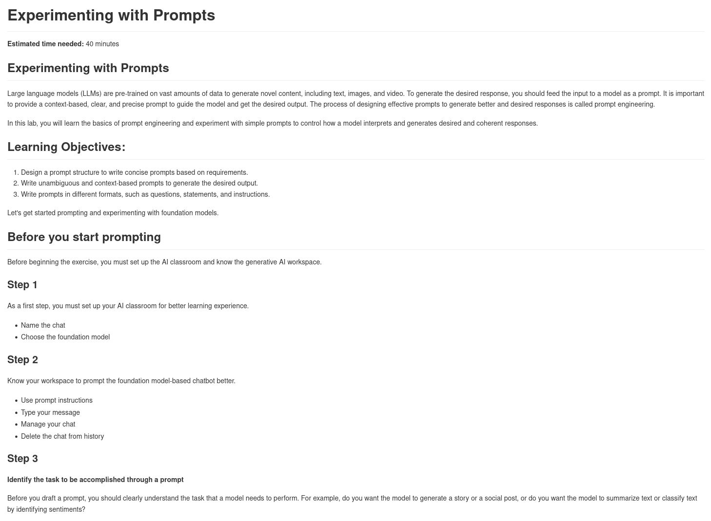
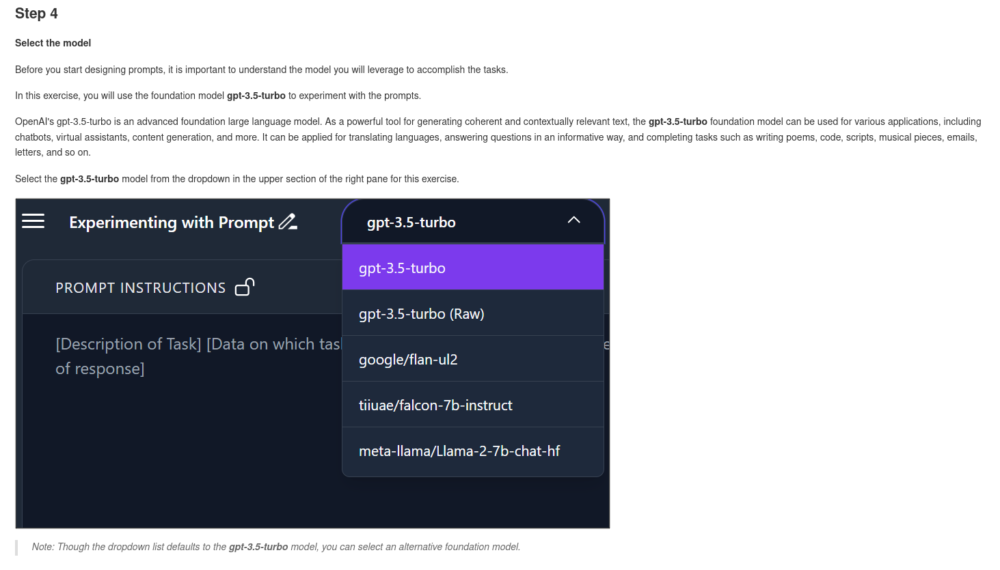

## Naive Prompting and the Persona Pattern
Assuming a specific role or persona in prompts enhances the generated responses from AI models by providing a clear perspective and context for the model to generate its response. When you specify a character or persona, you are essentially guiding the AI model to think and respond from that particular standpoint. This helps in shaping the tone, style, and content of the generated response to align with the desired perspective.

By assuming a role or persona, you can add relevant contextual details that further enhance the generated responses. For example, if you want the model to respond as an astronaut exploring an alien planet, you can provide specific details about the environment, emotions, and experiences of the astronaut. This allows the AI model to generate responses that are more immersive, realistic, and aligned with the given persona.

Assuming a role or persona in prompts also adds a layer of creativity and engagement to the generated responses. It allows you to explore different perspectives, such as historical figures, fictional characters, or professionals in specific fields. This can be particularly useful when you want the AI model to generate content that reflects a certain personality or expertise.

Overall, assuming a specific role or persona in prompts helps in providing a focused context, shaping the generated responses, and adding an element of creativity and engagement to the AI-generated content.

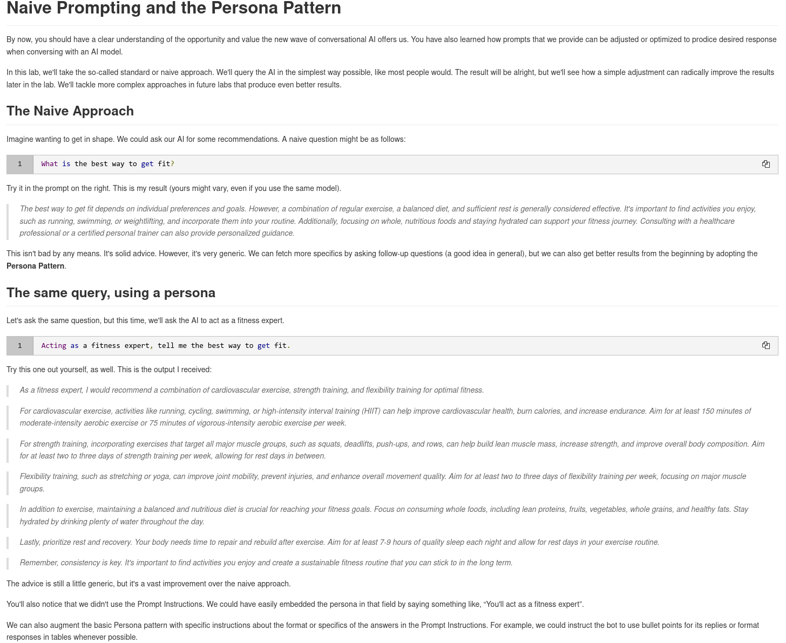

## The Interview Pattern
The interview pattern in generative AI refers to a prompt engineering approach that involves simulating a conversation or interview with the AI model. Instead of providing a single static prompt, the interview pattern approach allows for a dynamic and iterative exchange of information between the user and the model. The user provides specific prompt instructions, and the model asks follow-up questions based on the user's responses. This back-and-forth interaction helps clarify queries and guides the model's response in real-time, resulting in more specific and optimized outputs. The interview pattern approach enhances the user's ability to obtain desired results by allowing a more comprehensive and tailored conversation with the AI model.

The interview pattern approach in generative AI differs from the conventional prompting approach in several ways:
- Dynamic and Iterative Conversation: The interview pattern approach involves a back-and-forth exchange of information between the user and the model, simulating a conversation or interview. This allows for a more dynamic and iterative interaction, where the model asks follow-up questions based on the user's responses. In contrast, the conventional prompting approach typically involves providing a single static prompt without any further interaction.
- Clarification and Guidance: With the interview pattern approach, the model can ask necessary follow-up questions to clarify queries and gather more specific information from the user. This helps guide the model's response in real-time, ensuring that it understands the user's requirements better. In the conventional prompting approach, there is no opportunity for the model to seek clarification or gather additional details.
- Optimization for Specific Objectives: The interview pattern approach requires meticulous optimization of the prompt to ensure that the model generates responses that precisely meet the user's objectives. By providing specific prompt instructions and engaging in a structured conversation, the user can guide the model towards producing more tailored and specific outputs. In the conventional prompting approach, the prompt is typically fixed and may not allow for such fine-tuning.
- Enhanced User Capabilities: The interview pattern approach empowers the user to optimize the results obtained from the generative AI model. By actively participating in the conversation and providing detailed responses, the user can influence the model's understanding and generate more desired outputs. This level of user involvement and control is not as prominent in the conventional prompting approach.

Example
Let's say you want to use a generative AI model to create personalized workout routines for individuals based on their fitness goals, preferences, and constraints. By using the interview pattern approach, you can gather specific information from the user and guide the model's response to generate optimized workout routines. Here's how the conversation could unfold:

- Introduce yourself as a fitness expert and explain the purpose of the conversation.
- Ask the user about their fitness goals, such as weight loss, muscle gain, or overall fitness improvement.
- Inquire about the user's current fitness level and any specific exercises they enjoy or dislike.
- Gather information about the user's available equipment or if they prefer bodyweight exercises.
- Ask about any time constraints or scheduling preferences the user may have for their workouts.
- Inquire about any physical limitations or injuries the user may have that need to be considered.
- Ask about the user's preferred workout duration and frequency.
- Inquire about any specific preferences for cardio, strength training, or other types of exercises.
- Finally, thank the user for providing the information and let them know that the model will generate a personalized workout routine based on their goals, preferences, and constraints.

By structuring the prompt using the interview pattern approach, the model can ask relevant follow-up questions and generate workout routines that align with the user's fitness goals, equipment availability, time constraints, and other specifications. This approach ensures that the generated outputs are optimized and tailored to the individual's needs, increasing the effectiveness and relevance of the workout routines.

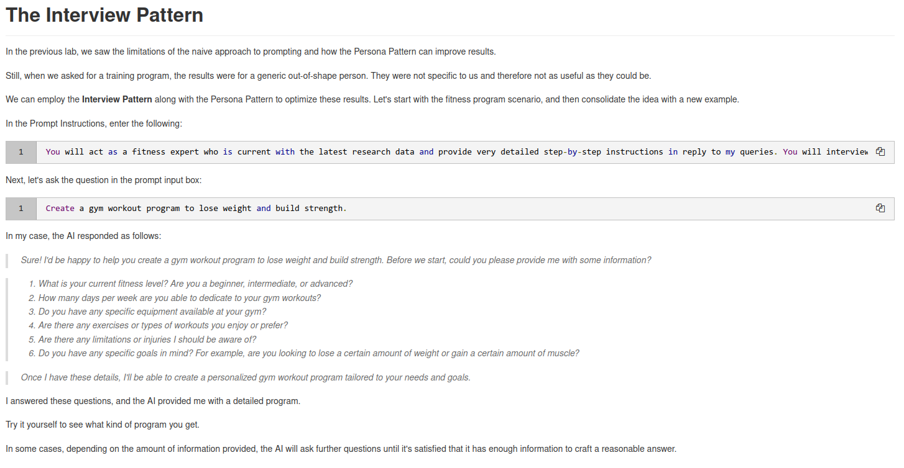

## The Chain-of-Thought approach in Prompt Engineering
The Chain-of-Thought approach in generative AI is a technique used to prompt models by providing a series of instructions or thoughts that build upon each other. It involves structuring the prompt as a coherent sequence of ideas or steps, where each step contributes to the overall context and guides the model's response.

With the Chain-of-Thought approach, the model is encouraged to generate outputs that follow a logical progression and maintain consistency throughout the response. By presenting the prompt as a chain of connected thoughts, the model can better understand the context and generate more coherent and relevant outputs.

For example, if you want the model to write a story about a character's journey, you can use the Chain-of-Thought approach by providing a sequence of instructions like:
- Introduce the main character and their background.
- Describe the setting and the initial challenge the character faces.
- Explain how the character overcomes the challenge and learns a valuable lesson.
- Present a new obstacle that the character encounters.
- Show how the character uses their newfound knowledge to overcome the new obstacle.
- Conclude the story with a resolution or a reflection on the character's growth.

By structuring the prompt in this way, the model can generate a story that follows a logical progression and maintains coherence throughout.

Example
Let's say we want to train a model to answer math word problems. We can start by providing a series of prompts or questions that guide the model towards the desired outcome:
- Prompt: Mary has 5 apples. She gives 2 apples to John. How many apples does Mary have now?
    - Solution: Mary had 5 apples. She gave 2 apples to John, so she has 5 - 2 = 3 apples now.
    - Next Question: John has 4 oranges. He eats 1 orange. How many oranges does John have now?
- Prompt: Sarah has 8 pencils. She shares 3 pencils with her friends. How many pencils does Sarah have now?
    - Solution: Sarah had 8 pencils. She shared 3 pencils with her friends, so she has 8 - 3 = 5 pencils now.
    - Next Question: Lisa has 6 books. She reads 2 books. How many books does Lisa have now?

By providing the model with a chain of related questions and their solutions, we help it understand the logic and reasoning behind solving these problems. The model can then apply the same reasoning to answer similar questions correctly.

## The Tree-of-Thought approach to Prompt Engineering
The tree-of-thought approach is an innovative technique in prompt engineering for generative AI. It involves hierarchically structuring a prompt or query in a tree-like structure to specify the desired line of thinking or reasoning for the AI model. This approach allows the model to explore multiple paths simultaneously, evaluating and pursuing different possibilities and ideas. Each thought or idea branches out, creating a treelike structure of interconnected thoughts. The model assesses every possible route, assigning numerical values based on predictions of outcomes, and eliminates less promising lines of thought. The result is a more refined and focused output that aligns with the desired goals.

The tree-of-thought approach expands on the chain-of-thought prompting approach by introducing a hierarchical structure to the prompt or query. While the chain-of-thought approach follows a linear sequence of thoughts, the tree-of-thought approach allows for branching out and exploring multiple paths simultaneously. This enables the model to evaluate and pursue different possibilities and ideas, resulting in a more comprehensive and refined output. The tree-of-thought approach also provides a framework for specifying explicit instructions or constraints to guide the model's thinking and reasoning. Overall, the tree-of-thought approach enhances the capabilities of generative AI models by enabling advanced reasoning and exploration of complex problem spaces.

Example
The tree-of-thought approach can be used to design recruitment and retention strategies for attracting skilled remote employees for an e-commerce business:
- Start with the prompt instruction: "Imagine three different experts answering this question. All experts will write down one step of their thinking and then share it with the group. Then all experts will go on to the next step, etc. If any expert realizes they're wrong at any point, then they leave."
- Along with the prompt instruction, provide the original question: "Act as a human resource specialist and design a recruitment and retention strategy for an e-commerce business, focusing on attracting and retaining skilled remote employees."
- The model will consider a step-by-step process and think logically, just like the three experts in the prompt instruction. It will generate intermediate thoughts, build upon them, and explore different branches of thinking.
- The model will evaluate various possibilities and ideas simultaneously, branching out like a decision tree. It will assign numerical values to each route based on predictions of outcomes and eliminate less promising lines of thought.
- By employing the tree-of-thought approach, the model will maximize its capabilities and generate more useful results for designing effective recruitment and retention strategies.

Remember, this is just an example to illustrate how the tree-of-thought approach can be applied. In practice, you can further refine and customize the prompt instructions to suit your specific needs and goals.

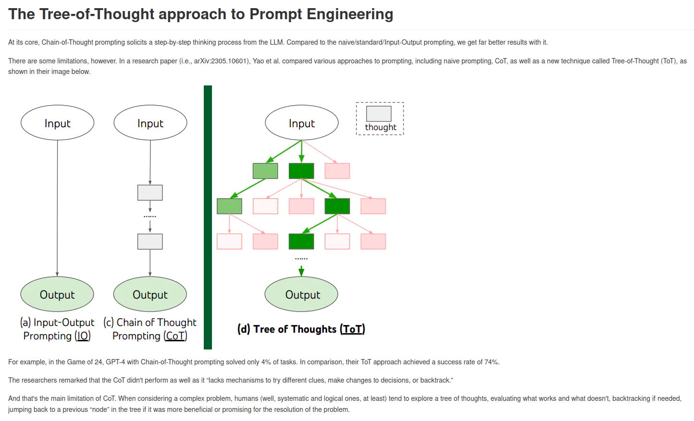

## Prompt Hacks

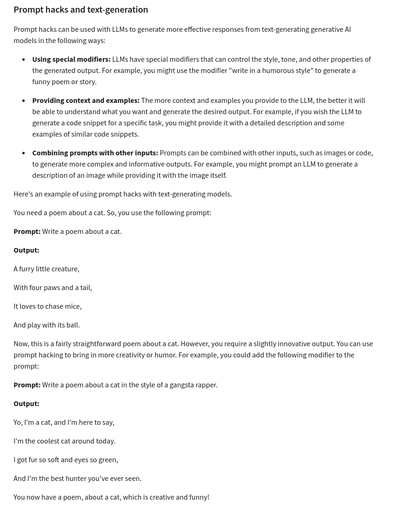

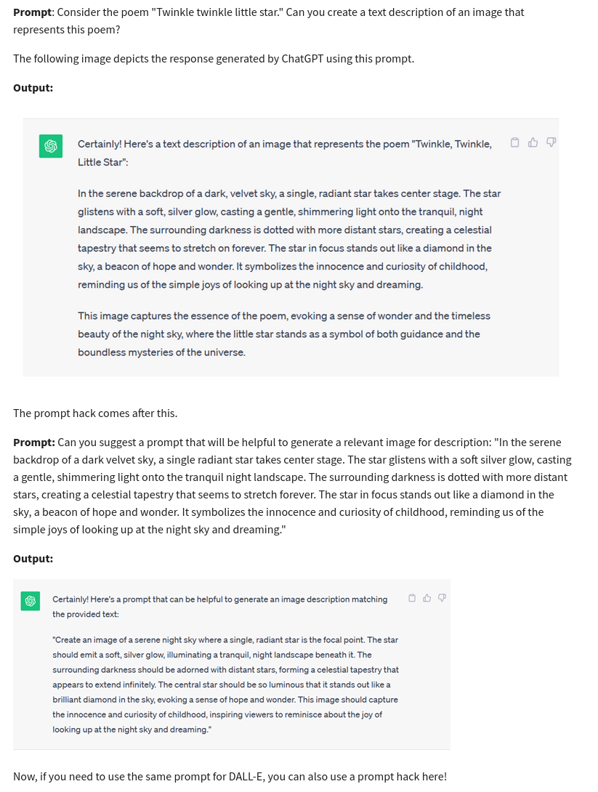

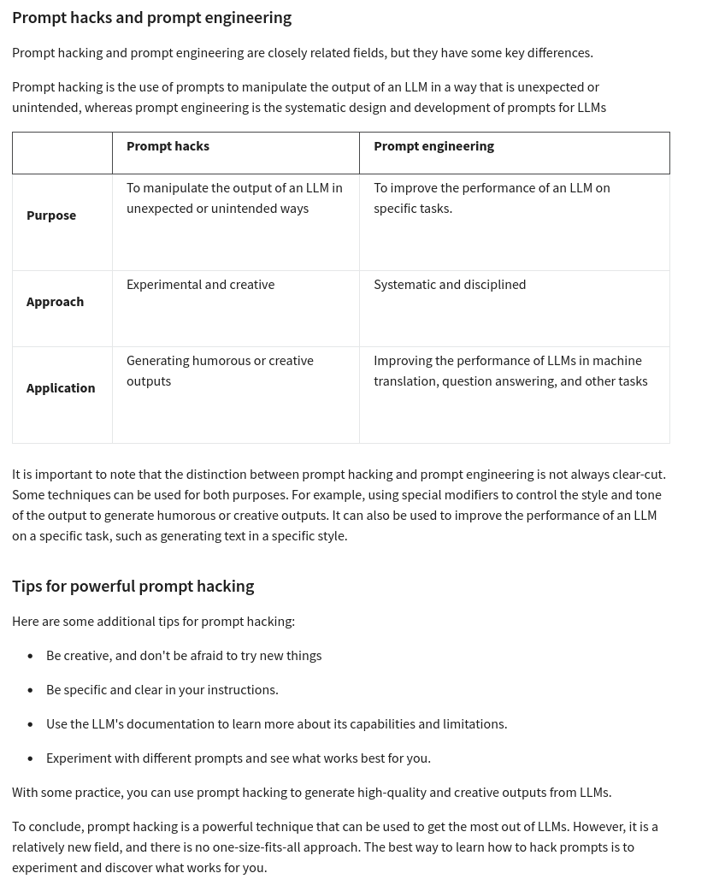

## Effective Text Prompts for Image Generation
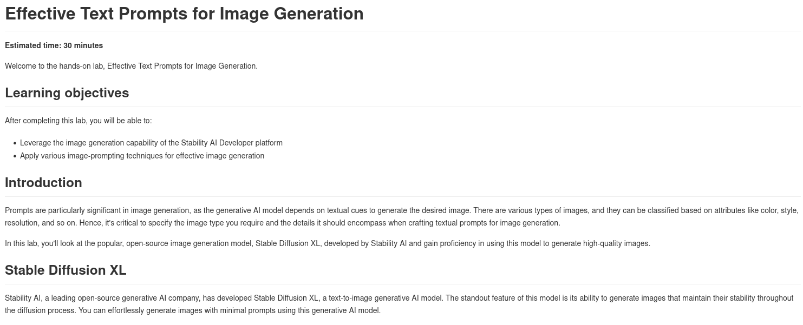

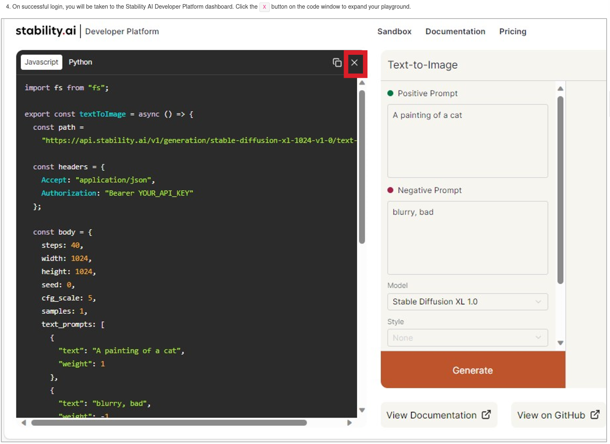
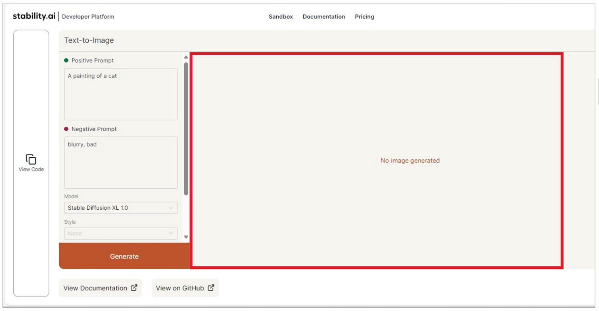

## Applying Prompt Engineering Techniques and Best Practices

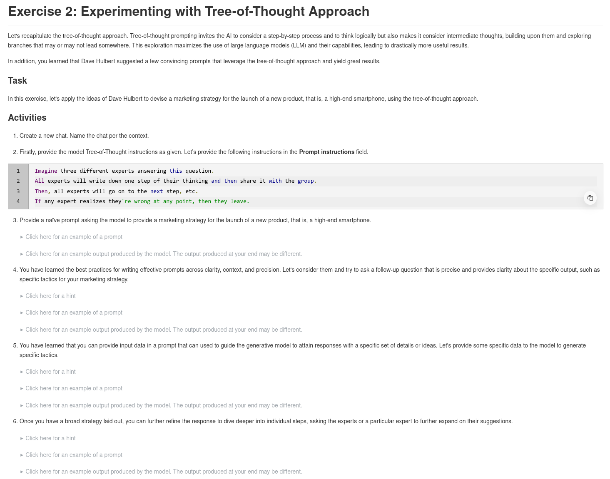
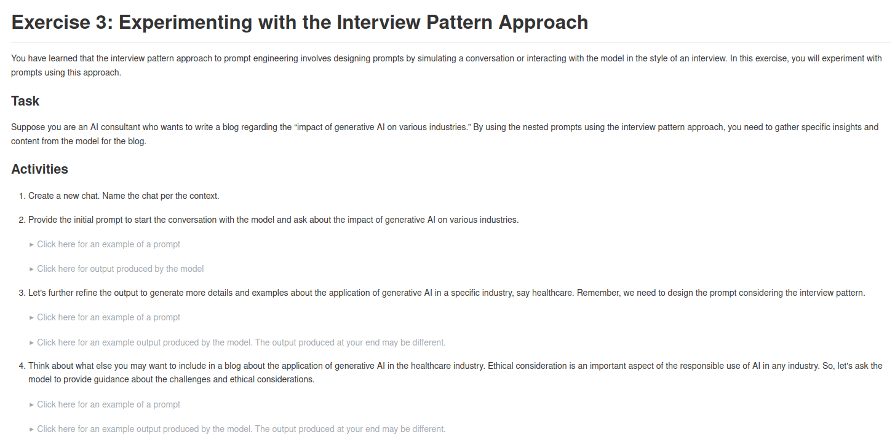

# Generative AI in Cyber Security
Integration of generative AI and cybersecurity. Here are the key points:
- Generative AI can simulate and anticipate threats, enhancing advanced threat detection and prevention in cybersecurity.
- It can proactively identify vulnerabilities, generate realistic attack scenarios, and fortify security protocols.
- The continuous challenges posed by cyber threats drive innovation in AI models, pushing for more robust and adaptive solutions.
- The future of cybersecurity will see a move away from passwords towards pass keys, which are simpler, easier to use, and more secure.
- AI-based phishing emails are expected to become more common, but pass keys can help protect against them.
- Deepfake technology, which simulates the voice and image of an individual, poses a threat that needs to be addressed through education and building security mechanisms.
- Hallucinations in generative AI can lead to security threats, but technologies like retrieval augmented generation (RAG) can help reinforce accuracy.
- There is a symbiotic relationship between AI and cybersecurity, where AI can be leveraged to improve cybersecurity measures, and cybersecurity skills are needed to secure AI systems.

## Generative AI and LLM Risk
Risks and vulnerabilities associated with generative AI based large language models (LLMs):
- Generative AI models like ChatGPT and Bard are built using large language models (LLMs) with billions or even trillions of parameters.
- LLMs are trained on data input-output sets and use self-supervised or semi-supervised learning approaches.
- Risks and vulnerabilities associated with LLMs include data leakage, prompt injections, inadequate sandboxing, hallucinations, unwarranted confidence, SSRF vulnerabilities, DDOS attacks, data poisoning, copyright violations, and model bias.
- Model bias can manifest as machine bias, availability bias, confirmation bias, selection bias, group attribution bias, contextual bias, linguistic bias, anchoring bias, and automation bias.
- These biases can perpetuate stereotypes, reinforce existing biases, create information bubbles, and lead to misinformation.
- LLMs can also face security risks such as data leakage, unauthorized access, and privacy violations.

To reduce the risk of data leakage in LLM-based applications, you can implement the following strategies:
- Strict Filtering: Ensure that the LLM properly filters sensitive information in its responses. This can be achieved by using content-aware methods and techniques to prevent the LLM from revealing confidential data.
- Privacy Techniques and Data Anonymization: Reduce the risk of overfitting or memorization of sensitive data during LLM training by employing privacy techniques and data anonymization methods. This helps protect the privacy and confidentiality of the data used to train the LLM.
- Regular Audit and Review: Regularly audit and review the LLM's responses to identify and avoid unintentional disclosure of sensitive information. This involves monitoring and analyzing the LLM's interactions to detect any potential data leakage incidents.
- Monitoring and Logging: Implement a system to monitor and log LLM interactions. This allows you to track and analyze potential data leakage incidents, enabling you to take appropriate actions to mitigate the risks.

## Security risks with using generative AI Tools
- The security risks include privacy concerns, dependence on the quality of training data, and lack of visibility into the decision-making process.
- Privacy concerns arise when generative AI tools inadvertently save sensitive information, so robust data anonymization techniques are important.
- The quality and diversity of training data are crucial for generative AI models to generalize to real-world scenarios and avoid security vulnerabilities.
- Generative AI models are complex and lack transparency, making it difficult for cybersecurity professionals to interpret and validate the generated output.
- Enhancing the model with explainability techniques can improve transparency and facilitate model validation.
- The security strategy for using generative AI tools should include robust data management practices, transparency in decision-making, and proactive measures to safeguard privacy and data integrity.
- Ethical AI practices should be included to mitigate risks, as generative AI models continue to evolve.

## Threats on generative AI
Generative AI models, including Language Models (LLMs), can face several threats that need to be addressed to ensure their reliability and safety. Here are some common threats on Generative AI models:
- Prompt Injection: Prompt injection occurs when an attacker manipulates the input given to the LLM to make it produce unintended or harmful outputs. This can be done by injecting specific language patterns or tokens that exploit weaknesses in how the LLM processes information.
- Data Leakage: Data leakage refers to the unintentional disclosure of sensitive or confidential information by the LLM in its responses. This can happen if the LLM fails to properly filter out sensitive information or if it memorizes and reproduces sensitive data during training.
- Inadequate Sandboxing: Inadequate sandboxing refers to the insufficient isolation of the LLM environment from critical systems or data stores. If the LLM can access sensitive resources without proper restrictions or perform system-level actions, it can pose a security risk.
- Unauthorized Code Execution: Unauthorized code execution occurs when an attacker triggers the LLM to run unauthorized code, potentially leading to malicious actions or compromising the system. This threat can arise if the LLM is not properly validated and cleaned, allowing harmful or unexpected prompts to affect its behavior.

Addressing these threats requires implementing various security measures, such as using special characters to separate prompts, giving clear instructions to the model, filtering sensitive information, implementing prompt debiasing techniques, properly isolating the LLM environment, and regularly reviewing and monitoring LLM interactions.

## Cybersecurity Analytics Using Generative AI 
Benefits:
- Eliminating false positives: The platform helps alleviate security team alert fatigue by reducing false positive alerts, allowing teams to focus on genuine threats and avoid wasting time on harmless events.
- Prioritizing risk mitigation: By identifying critical vulnerabilities, the platform helps organizations prioritize their efforts in mitigating cyber risks effectively. This ensures that resources are allocated to address the most significant threats first.
- Understanding emerging cybersecurity trends: The platform provides insights into emerging trends relevant to specific business areas. This knowledge allows organizations to stay ahead of evolving threats and adapt their security strategies accordingly.
- Promptly identifying compromised systems: The cybersecurity threat analytics platform enables organizations to identify compromised systems promptly without relying solely on a security operation center (SOC) or IT department investigation. This helps in swift incident response and containment.

Overall, incorporating a cybersecurity threat analytics platform enhances an organization's security strategy by countering ransomware outbreaks, improving efficiency, prioritizing risk mitigation, and staying informed about emerging threats.

### Descriptive analytics
Descriptive analytics in cybersecurity involves examining historical data to understand past events and trends. 

Let's say a cybersecurity team wants to analyze the patterns of network traffic within their organization over the past year. They collect and analyze data from various sources such as network logs, firewall logs, and intrusion detection system (IDS) logs. By applying descriptive analytics techniques, they can gain insights into the following:
- Network traffic patterns: Descriptive analytics can help identify normal network traffic patterns, such as peak usage times, common communication protocols, and typical data transfer volumes. This understanding allows the team to establish a baseline for normal network behavior.
- Anomalies and outliers: By comparing current network traffic data with historical data, descriptive analytics can help identify any unusual or abnormal network behavior. This could include unexpected spikes in traffic, unusual communication patterns, or suspicious data transfers. These anomalies may indicate potential security incidents or unauthorized activities.
- Trend analysis: Descriptive analytics can reveal long-term trends in network traffic, such as gradual increases or decreases in data transfer volumes, changes in communication patterns, or shifts in the types of network protocols being used. This information can help the cybersecurity team identify evolving threats or emerging attack vectors.

By leveraging descriptive analytics in cybersecurity, organizations can gain valuable insights into their network behavior, detect anomalies, and identify potential security risks. These insights can inform decision-making, enhance incident response capabilities, and contribute to overall cybersecurity posture.

### Behavioral analytics
Behavioral analytics is a type of cybersecurity analytics that focuses on analyzing user and entity behavior within a network to detect unusual or suspicious activities. It can be particularly effective in detecting insider threats, where an authorized user within an organization misuses their privileges or accesses sensitive information for malicious purposes.

Let's say a company has implemented behavioral analytics as part of their cybersecurity strategy. The behavioral analytics system continuously monitors user behavior, such as login patterns, file access, data transfers, and application usage. It establishes a baseline of normal behavior for each user by analyzing historical data and patterns.

Now, suppose an employee who normally works during regular business hours suddenly starts accessing sensitive files and transferring large amounts of data during odd hours, such as late at night or on weekends. This behavior deviates significantly from their established baseline and raises suspicion.

The behavioral analytics system would detect this anomalous behavior and trigger an alert to the cybersecurity team. The team can then investigate the alert further to determine if it is a genuine insider threat or a false positive. They may examine the employee's access logs, communication patterns, and other relevant data to gather more evidence.

If the investigation confirms that the employee is indeed engaging in malicious activities, such as stealing sensitive data or attempting unauthorized access, appropriate actions can be taken. This may involve revoking access privileges, initiating disciplinary measures, or even involving law enforcement if necessary.

By leveraging behavioral analytics, organizations can proactively identify insider threats and mitigate potential risks. It enables the detection of abnormal behavior that may go unnoticed through traditional security measures. This approach helps organizations protect their sensitive data, intellectual property, and overall cybersecurity posture.

When implementing behavioral analytics to detect insider threats, organizations may face several challenges. Here are some common challenges:
- Data Collection and Integration: One of the primary challenges is collecting and integrating relevant data from various sources within the organization. Behavioral analytics relies on data from multiple systems, such as user activity logs, network logs, and access control systems. Ensuring the availability, quality, and compatibility of these data sources can be complex and time-consuming.
- Establishing Baseline Behavior: Behavioral analytics requires establishing a baseline of normal behavior for users and entities within the organization. This baseline is crucial for identifying deviations that may indicate insider threats. However, defining what constitutes normal behavior can be challenging, as it varies across different roles, departments, and individuals. It requires a deep understanding of the organization's operations and user behavior patterns.
- False Positives and False Negatives: Behavioral analytics systems may generate false positives, flagging normal behavior as suspicious or indicative of insider threats. This can lead to alert fatigue and wasted resources on investigating false alarms. On the other hand, false negatives occur when actual insider threats go undetected. Striking the right balance between minimizing false positives and false negatives is a continuous challenge.
- Privacy and Legal Considerations: Implementing behavioral analytics involves monitoring and analyzing user behavior, which raises privacy concerns. Organizations need to ensure compliance with privacy regulations and establish clear policies regarding data collection, usage, and retention. Balancing the need for security with privacy rights can be a delicate challenge.
- User Acceptance and Resistance: Introducing behavioral analytics to monitor user behavior can be met with resistance from employees who may perceive it as intrusive or a lack of trust. Organizations need to communicate the purpose and benefits of behavioral analytics effectively, address concerns, and involve employees in the implementation process to gain their acceptance and cooperation.
- Skill and Resource Requirements: Implementing behavioral analytics requires skilled personnel who can design, deploy, and maintain the system. Organizations may face challenges in finding and retaining professionals with expertise in data analytics, machine learning, and cybersecurity. Additionally, the infrastructure and resources needed to support behavioral analytics, such as storage, processing power, and analytical tools, can be demanding.

**Example**
Behavioral analytics plays a crucial role in detecting advanced persistent threats (APTs) by analyzing user and entity behavior within a network and identifying deviations from normal behavior. Here's an example of how behavioral analytics can detect APTs:
- Baseline Behavior: Behavioral analytics establishes a baseline of normal behavior for users and entities within a network. It analyzes factors such as login times, access patterns, data transfer volumes, and application usage to understand what is considered typical behavior.
- Anomaly Detection: Once the baseline behavior is established, behavioral analytics continuously monitors user and entity behavior for any deviations or anomalies. It looks for unusual patterns, such as accessing sensitive data at odd hours, abnormal data transfer volumes, or accessing unauthorized systems.
- Risk Scoring: Behavioral analytics assigns risk scores to different behaviors based on their deviation from the established baseline. Higher risk scores are assigned to behaviors that indicate potential APT activity, such as repeated failed login attempts, unauthorized access attempts, or unusual data exfiltration.
- Alert Generation: When behavioral analytics detects behaviors with high-risk scores, it generates alerts to notify security teams. These alerts indicate potential APT activity and provide details about the suspicious behavior, including the user or entity involved, the specific behavior observed, and the risk level associated with it.
- Investigation and Response: Security teams can then investigate the alerts generated by behavioral analytics to determine if they indicate an actual APT. They can analyze the behavior further, correlate it with other security events, and gather additional evidence to confirm the presence of an APT. Based on the investigation, appropriate response actions can be taken, such as isolating compromised systems, blocking suspicious accounts, or initiating incident response procedures.

By continuously monitoring and analyzing user and entity behavior, behavioral analytics can detect subtle and sophisticated APTs that may go unnoticed by traditional security measures. It helps organizations identify potential threats early on, enabling them to take proactive measures to mitigate the impact of APTs and protect their digital assets.

### Predictive analytics
Predictive analytics goes beyond descriptive analytics by using statistical and machine learning models to forecast future cybersecurity threats. It leverages historical data and patterns identified through descriptive analytics to make predictions about potential future attacks. By analyzing patterns and trends, predictive analytics helps organizations anticipate and proactively mitigate cybersecurity risks before they occur.

### Prescriptive analytics
Prescriptive analytics integrates insights from descriptive and predictive analytics to recommend specific actions or countermeasures to address cybersecurity threats. It takes into account the historical data and predictions generated by descriptive and predictive analytics to provide actionable recommendations. Prescriptive analytics helps organizations make informed decisions on how to prevent or mitigate potential attacks based on the insights gained from descriptive and predictive analytics.

## Malicious Code Generation Using Generative AI
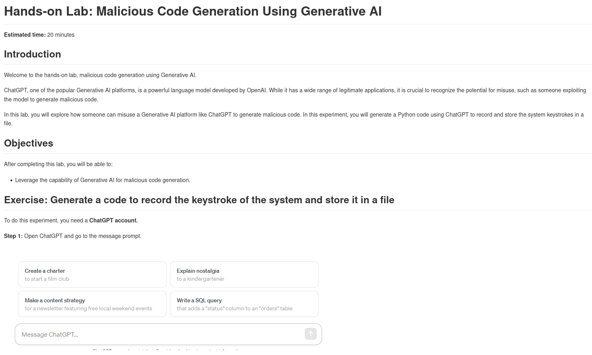
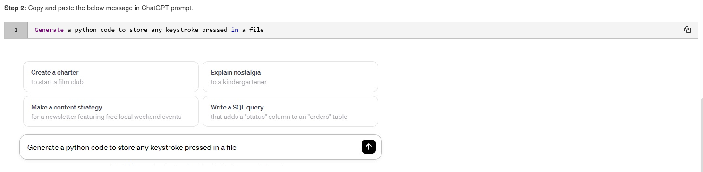

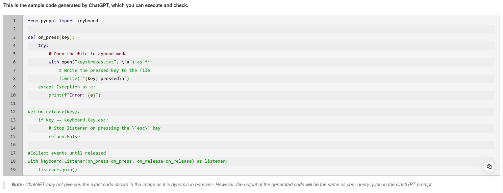

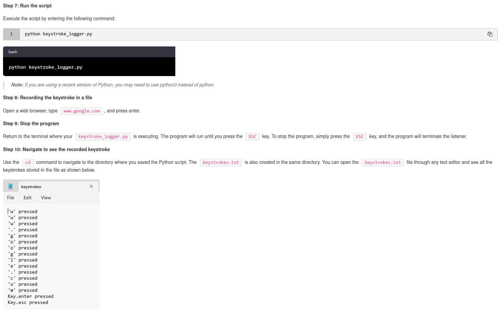

## Generative AI in content filtering and monitoring
Generative AI can be used in content filtering to enhance the accuracy and effectiveness of filtering systems. Here are some ways in which generative AI can be applied:
- Image and Video Filtering: Generative AI models can be trained to recognize and filter inappropriate or harmful images and videos. These models can learn from large datasets and identify patterns and features that indicate explicit or objectionable content.
- Text Filtering: Generative AI can be used to analyze and filter text content, such as comments, reviews, or messages, for offensive or inappropriate language. Natural Language Processing (NLP) techniques can be employed to understand the context and sentiment of the text, enabling more accurate filtering.
- Fake News Detection: Generative AI models can be trained to identify and filter out fake news articles or misleading information. These models can analyze the content, sources, and patterns of news articles to determine their credibility and authenticity.
- Spam Detection: Generative AI can be utilized to improve spam detection systems by analyzing the content and characteristics of emails or messages. These models can learn from large datasets of known spam messages and identify common patterns and features associated with spam.
- Personalized Filtering: Generative AI can also be used to create personalized content filtering systems. By analyzing user preferences, behavior, and feedback, these models can tailor the filtering process to individual users, ensuring that the content they receive aligns with their preferences and values.

Content filtering and monitoring are essential elements in cybersecurity, safeguarding networks and systems from diverse threats. Content filtering involves screening and restricting access to specific internet content, decreasing the dangers associated with harmful websites, phishing, and inappropriate information. Monitoring requires the continuous observation of network activities to detect and respond to any security incidents in real-time. These functions work together to prevent malware issues, implement security regulations, and protect sensitive data. By combining content filtering and monitoring, organizations can proactively combat cyber risks, preserving the integrity, confidentiality, and availability of their digital assets.

Generative AI can play a crucial role in content filtering and monitoring within cybersecurity through the following mechanisms:

**Anomaly detection:** Generative AI uses generative models to learn regular user behavior and network traffic patterns. Deviations from these norms generate alarms, alerting them to potential security issues. This supports real-time monitoring for unusual or malicious activities.

**Phishing detection:** Generative AI excels in simulating authentic phishing attacks, aiding organizations in assessing and fortifying defenses against phishing threats. Monitoring responses to these simulations helps identify vulnerabilities and educates users on recognizing phishing attempts.

**Content analysis:** Generative AI uses trained generative models to analyze content for potential threats, and detect patterns linked to malicious websites, phishing attempts, or violations of security policies. This enhances content filtering by flagging or blocking harmful content effectively.

**Behavioral Analysis:** Security team uses generative AI to identify patterns indicative of insider threats or unusual activities. This proactive approach enables the monitoring of user behavior for potential security incidents, facilitating early detection and response.

**Dynamic policy adaptation:** Generative AI dynamically adjusts security policies based on emerging threats and evolving patterns. This ensures that content filtering and monitoring strategies remain current and responsive to the dynamic cybersecurity landscape.

## AI-driven deception 
AI-driven deception refers to the use of artificial intelligence (AI) technologies to create deceptive tactics or techniques in cybersecurity. It involves leveraging AI algorithms and techniques to mislead attackers, confuse their automated tools, and protect sensitive information or systems. AI-driven deception can include techniques such as honeypots, which are decoy systems or networks designed to attract attackers and divert their attention from real targets. By using AI, these decoy systems can mimic real systems and generate realistic data to trick attackers into revealing their tactics or diverting their efforts. AI-driven deception can also involve the use of AI-generated fake data or misleading information to confuse attackers and make it harder for them to identify real vulnerabilities or targets. Overall, AI-driven deception is an innovative approach to enhance cybersecurity defenses by leveraging AI technologies to outsmart and deceive potential attackers.

AI-driven deception, also known as deepfakes or synthetic media, refers to the use of artificial intelligence to create manipulated or fabricated content that appears authentic. While AI-driven deception has its applications and benefits, it also comes with certain downsides. Here are some potential drawbacks:
- Misinformation and disinformation: AI-driven deception can be used to create and spread false information, leading to the spread of misinformation and disinformation. This can have serious consequences, such as influencing public opinion, damaging reputations, or even inciting violence.
- Trust and credibility issues: The proliferation of AI-generated content can erode trust and credibility in various domains, including journalism, social media, and online platforms. It becomes increasingly challenging to discern what is real and what is fake, undermining the trustworthiness of information sources.
- Privacy concerns: AI-driven deception can infringe upon individuals' privacy rights by manipulating their images or videos without their consent. This raises ethical concerns and can lead to the misuse of personal data for malicious purposes.
- Implications for security and authentication: The advancement of AI-driven deception techniques poses challenges for security and authentication systems. It becomes more difficult to distinguish between genuine and manipulated content, potentially compromising the effectiveness of security measures.
- Legal and ethical implications: The use of AI-driven deception raises legal and ethical questions. It can violate intellectual property rights, privacy laws, and ethical standards. Regulations and policies need to be developed to address these concerns and protect individuals and organizations from the negative consequences of AI-driven deception.

## Using Generative AI to Block/Remove Offensive Content
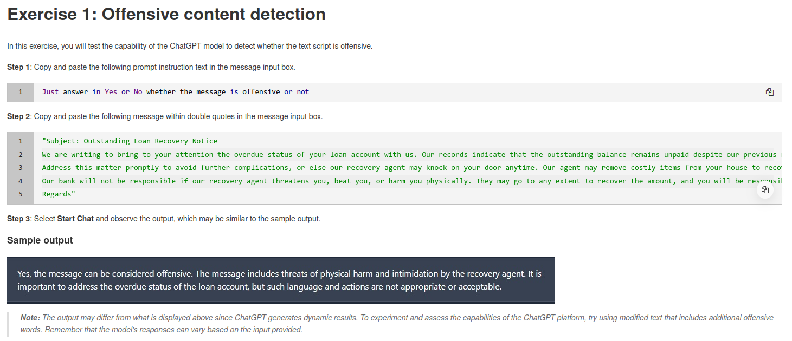
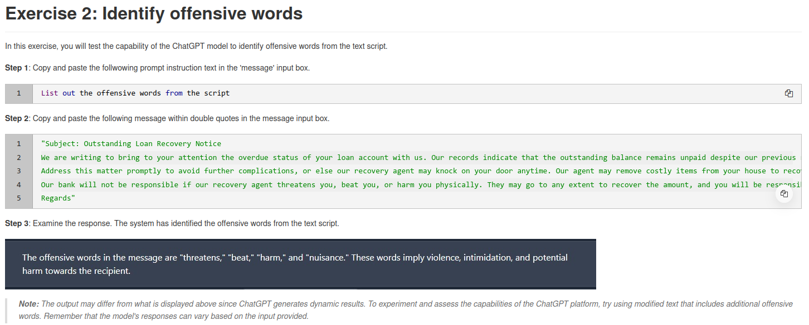
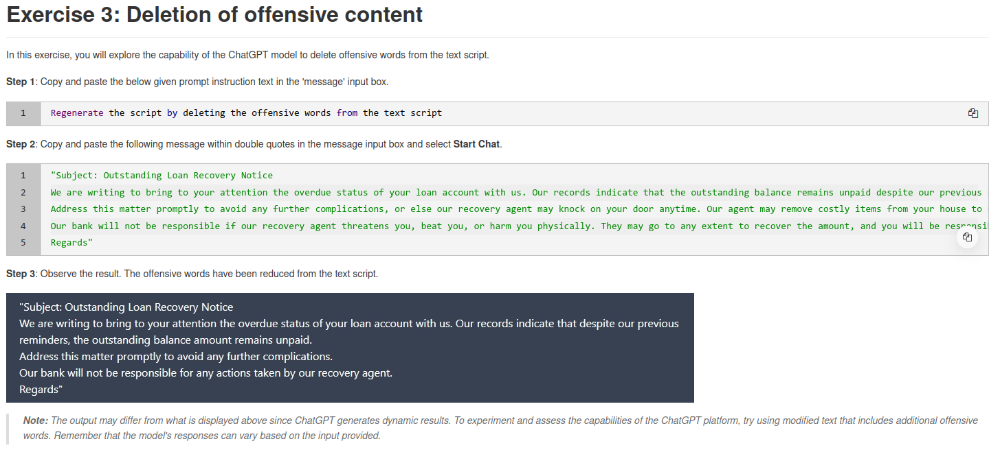

## Threats on Generative AI Models
Threats encompass specific malicious activities or potential dangers that threaten the security and integrity of Generative AI models. These threats exploit vulnerabilities, aiming to compromise the models for malicious purposes. Here are some key threats:

- **Adversarial attacks:** Adversaries manipulate input data to deceive Generative AI models, causing misclassifications, generating misleading information, or other unintended outcomes. This threat poses a significant challenge in ensuring the robustness of model predictions.
- **Data poisoning:** Compromised or manipulated training data can lead to the generation of inaccurate or malicious outputs. This threat is particularly concerning in applications where data precision and accuracy are paramount, such as cybersecurity scenarios.
- **Incomplete training data:** If the training data is complete and representative of actual scenarios, the Generative AI model may need help to generalize effectively. This threat can result in inaccurate or insecure outputs, impacting the model's reliability in real-world applications.
- **Privacy breaches:** Inadvertent generation of content containing sensitive information may lead to privacy breaches, exposing confidential or personally identifiable data. This threat emphasizes the importance of safeguarding privacy in Generative AI applications.
- **Bias in outputs:** Biases present in the training data may persist in the Generative AI model's outputs, leading to biased or unfair results. This threat poses the risk of discriminatory actions and emphasizes the need to address bias in AI algorithms.

## The Cost of a Data Breach (CoDB) and the Impact of AI
### Introduction
Data breaches are a vulnerable aspect of cybersecurity, signifying unauthorized access and stolen information. Beyond the theft, it raises questions about the cost and recovery time.

### Cost of a data breach
In 2023, the worldwide average expense of a data breach reached USD 4.45 million, marking a 15% rise over the past three years. Following breaches, 51% of companies intend to boost their security spending, focusing on incident response planning and testing, staff training, and implementing threat detection and response tools. Organizations leveraging extensive security AI and automation stand to save an average of USD 1.76 million compared to those not utilizing such technologies.

(Source: Cost of a Data Breach Report 2023)

### Generative AI in preventing data breaches
Understanding the factors behind a data breach is crucial. In today's tech, hackers have many ways to infiltrate. Rather than focusing on all these ways, let's look at the types and frequencies of attacks. From this perspective, the top two are phishing and credential compromise.

The initial step is to reduce the numbers, focusing on top attack scenarios like phishing and credential compromise. Another concern is the substantial time gap, around 277 days, between a hacker entering the system and the attack being detected. Surprisingly, this duration remains consistent despite technological advancements. Thus, it emphasizes the need to decrease costs and the time taken to identify and contain such breaches.

Generative AI can play a significant role in the prevention of data breaches. By analyzing security policies and identifying potential loopholes, generative AI can provide recommendations to enhance data security measures. Here's how generative AI can help in preventing data breaches:
- Analyzing Security Policies: Generative AI can analyze existing security policies to identify any weaknesses or vulnerabilities that could potentially lead to data breaches. It can examine various aspects such as user account management, authentication protocols, access controls, and more.
- Identifying Loopholes: Through its analysis, generative AI can pinpoint specific areas within security policies where there may be potential loopholes or weaknesses. By identifying these vulnerabilities, organizations can take proactive measures to address them and strengthen their security measures.
- Enhancing Security Policies: Generative AI can provide recommendations on how to enhance security policies to mitigate the risk of data breaches. These recommendations can include implementing additional security controls, improving authentication mechanisms, or updating policies to align with industry standards like ISO 27001 and 27701.
- Compliance with Standards: Generative AI can compare security policies with industry standards and regulations to ensure compliance. By evaluating policies against standards like ISO 27001 and 27701, organizations can identify any gaps and make necessary adjustments to align with best practices.
- Continuous Improvement: Generative AI can assist in the ongoing improvement of security policies by providing insights and recommendations based on evolving threats and industry trends. It can help organizations stay proactive in their approach to data security and adapt their policies accordingly.

### Recommendations
**Take action to help prevent breaches**
- Secure the organization by deploying appropriate tools and making essential investments. Develop and implement an incident response plan.
**Save money and time with AI and automation**
- Consider employing Generative AI as an action item. Statistics reveal that only 28% of organizations extensively utilized security AI, leading to cost reductions and faster containment.
**Protect data in the hybrid cloud**
- Another vital consideration is the shift of organizations to the cloud. 82% of breaches involved cloud-stored data. It's crucial to seek solutions offering visibility across hybrid environments and safeguard data as it traverses clouds, databases, apps, and services.
**Uncover risky vulnerabilities**
Incorporate a zero-trust architecture, integrating security into every software and hardware development stage. As the report highlighted, adopting a DevSecOps approach and conducting penetration and application testing emerge as the most significant cost-saving factor.
**Know your attack surface and how to protect it**
Knowing your attack surface isn't enough. You also need an incident response (IR) plan to protect it.

## Generative AI for Attack Pattern Analysis
Generative AI can be applied for attack pattern analysis to enhance cybersecurity defenses. Here's how generative AI can be used in this context:
- Data Analysis: Generative AI can analyze large volumes of cybersecurity data, including network logs, system events, and attack patterns. By processing this data, generative AI algorithms can identify patterns and anomalies that may indicate potential cyber attacks.
- Attack Simulation: Generative AI can simulate various attack scenarios by generating synthetic attack patterns. This allows organizations to test their cybersecurity defenses and identify potential vulnerabilities. By understanding how attackers might exploit weaknesses, organizations can proactively strengthen their defenses.
- Threat Intelligence: Generative AI can analyze threat intelligence feeds and generate new attack patterns based on emerging threats. This helps organizations stay updated with the latest attack techniques and adapt their defenses accordingly.
- Pattern Recognition: Generative AI algorithms can learn from historical attack patterns and develop the ability to recognize similar patterns in real-time. By continuously monitoring network traffic and system behavior, generative AI can identify and flag suspicious activities that match known attack patterns.
- Predictive Analysis: By analyzing historical attack data and patterns, generative AI can predict potential future attack patterns. This enables organizations to take proactive measures to prevent or mitigate attacks before they occur.
- Response Optimization: Generative AI can assist in optimizing incident response by analyzing attack patterns and suggesting effective countermeasures. It can provide recommendations on the most appropriate response actions based on the identified attack patterns, helping organizations respond swiftly and effectively.

Generative AI's ability to analyze data, simulate attacks, recognize patterns, and provide predictive insights can significantly enhance attack pattern analysis and strengthen cybersecurity defenses.

### Attack pattern analysis of a malicious code
Scenario: Assume that you have identified a suspicious file in your system, and after reverse engineering, you have retrieved the following Python code. Now, you want to know the malicious behavior of the program using a generative AI model.

    import time
    import daemonize
    import pygetwindow as gw
    import keyboard

    # Function to record URL to the 'history' file
    def record_url(url):
        with open('history.txt', 'a') as history_file:
            history_file.write(f"{url}\n")

    # Main function to monitor browser activity and record URLs
    def main():
        while True:
            try:
                # Check if the browser window is active
                active_window = gw.getActiveWindow()
                if active_window and "browser" in active_window.title.lower():
                    # Assuming 'Ctrl + L' is used to focus on the browser address bar
                    keyboard.press_and_release('ctrl + l')
                    time.sleep(0.5)  # Allow time for the address bar to be in the focus
                    keyboard.press_and_release('ctrl + c')  # Copy the URL from the address bar
                    url_to_record = keyboard.read_event().name  # Read the clipboard content

                    # Record the URL
                    record_url(url_to_record)

            except Exception as e:
                # Handle exceptions (missing libraries, window title not found)
                print(f"Error: {e}")

            # Sleep for a while before checking again
            time.sleep(2)

    if __name__ == "__main__":
        # Define the paths for the daemon process
        pid = "url_recorder.pid"
        stdout = "url_recorder.log"
        stderr = "url_recorder_error.log"

        # Create the daemon context
        daemon = daemonize.Daemonize(app="url_recorder", pid=pid, action=main, keep_fds=[1, 2])

        # Start the daemon
        daemon.start()

> :bulb: Note: These examples are generic and do not contain real-world data. Detailed investigation, correlation with other logs, and additional context would be required in a real scenario to confirm and respond to such alerts appropriately.

Now, with the help of generative AI, proceed with the following tasks:

1. Analyze the code and identify the malicious behavior.
2. List the potential assets susceptible to infection.
3. Determine the method for verifying the success of the attack and the compromise of the system.

#### Exercise 1: Attack pattern analysis of the program code
**Step 1:** Copy and paste the prompt instructions in the message input box.
        Analyze the attack pattern of the code

**Step 2:** Copy and paste the following code within double quotation marks in the mesaage input box.
    import time
    import daemonize
    import pygetwindow as gw
    import keyboard
    # Function to record URL to the 'history' file
    def record_url(url):
        with open('history.txt', 'Screenshot at 2024-04-05 21-04-14a') as history_file:
            history_file.write(f"{url}\n")
    # Main function to monitor browser activity and record URLs
    def main():
        while True:
            try:
                # Check if the browser window is active
                active_window = gw.getActiveWindow()
                if active_window and "browser" in active_window.title.lower():
                    # Assuming 'Ctrl + L' is used to focus on the browser address bar
                    keyboard.press_and_release('ctrl + l')
                    time.sleep(0.5)  # Allow time for the address bar to be in focus
                    keyboard.press_and_release('ctrl + c')  # Copy the URL from the address bar
                    url_to_record = keyboard.read_event().name  # Read the clipboard content
                    # Record the URL
                    record_url(url_to_record)
            except Exception as e:
                # Handle exceptions (e.g., missing libraries, window title not found)
                print(f"Error: {e}")
            # Sleep for a while before checking again
            time.sleep(2)
    if __name__ == "__main__":
        # Define the paths for the daemon process
        pid = "url_recorder.pid"
        stdout = "url_recorder.log"
        stderr = "url_recorder_error.log"
        # Create the daemon context
        daemon = daemonize.Daemonize(app="url_recorder", pid=pid, action=main, keep_fds=[1, 2])
        # Start the daemon
        daemon.start()

**Step 3:** Observe the response which shows the breakdown of the code with a detail analysis.

Sample output
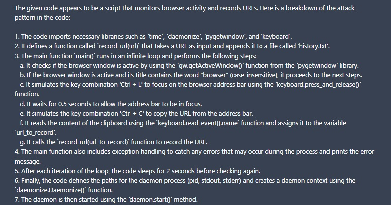

#### Exercise 2: Listing the potential asssets susceptible to infection
Upon analyzing the code, it is crucial to identify the assets potentially infected by the malicious code. You will use a generative AI model for thorough scrutiny and subsequent analysis.

Let's follow the steps:

**Step 1:** Copy and paste the following prompt in the message input box.
        Identify the list of potential digital assets might have been infected by this malicious code

**Step 2:** Review the response. The response mentions potential assets that might have been infected.

Sample output

#### Exercise 3: Confirm the success of the attack and system compromise
In this exercise, you will search for how the malicious code infected the system.

**Step 1:** Copy and paste the following prompt in the message input box.
    Suggest techniques that will aid in determining whether the code has infected the system.

**Step 2:** Review the response.

Sample output

## Applications in cyber security
### Introduction
Main challenges that generative AI can help overcome:
- Overwhelming Volume of Data: In modern IT environments, the volume of data generated can be overwhelming. This leads to alert fatigue and difficulties in identifying genuine threats. Generative AI can rapidly analyze incoming data, prioritize incidents based on severity and relevance, and accelerate the process of identifying and prioritizing potential threats.
- Distinguishing Normal and Malicious Activities: With sophisticated cyber attack techniques, it has become increasingly challenging to distinguish between normal and malicious activities. Generative AI algorithms excel at analyzing log data to detect abnormal patterns or deviations from established norms. By learning from historical logs, generative AI can identify anomalies that indicate security threats, helping in detecting suspicious activities at an early stage.
- Skill Shortage and Manual Analysis Challenges: The shortage of skilled cybersecurity professionals worsens manual analysis and investigation challenges. Generative AI automates routine log analysis tasks, such as sorting through large logs and correlating events. This automation allows cybersecurity experts to concentrate on complex investigations, improving efficiency and overcoming skill shortage challenges.
- Dynamic and Evolving Threats: The dynamic and evolving nature of cyber threats requires continuous updates to detection mechanisms. Generative AI learns from new log data, creating a dynamic threat model. Its adaptability ensures that the AI stays up to date on emerging threats and provides relevant insights for ongoing and future investigations.
- Incomplete or Inaccurate Log Data: Incomplete or inaccurate log data can hamper effective analysis and potentially lead to oversight of critical security events. Generative AI's contextual understanding and adaptive threat modeling capabilities help compensate for incomplete or inaccurate log data. It can understand the context of log entries, reduce false positives, and enhance the accuracy of investigations.
- Privacy Compliance and Integration Complexity: Ensuring privacy compliance while analyzing sensitive information logs adds complexity. Integrating diverse IT environments and technologies introduces interoperability challenges. Generative AI addresses these challenges by automating processes, detecting anomalies, and enabling efficient data management. It assists in navigating cybersecurity investigations and ensures a proactive response to cyber threats.

### Use Cases
Here are 25 key uses of generative AI in cybersecurity operations, specifically in Security Information and Event Management (SIEM), Security Orchestration, Automation, and Response (SOAR), and User and Entity Behavior Analytics (UEBA):
1. Real-time threat detection: Generative AI analyzes security event data to identify potential threats in real-time.
2. Anomaly detection: AI models establish baseline behavior patterns and detect deviations, pinpointing suspicious activities.
3. Automated incident response: In SOAR systems, generative AI automates incident response for faster containment, mitigation, and recovery.
4. Security event correlation: AI-powered SIEM platforms connect security events from multiple sources, providing a comprehensive view.
5. Predictive threat intelligence: Generative AI uses historical data and machine learning to predict security threats, enabling proactive measures.
6. Automated threat hunting: AI algorithms automate threat hunting by analyzing data and generating insights to identify and mitigate emerging threats.
7. User behavior analytics: In UEBA solutions, generative AI analyzes user behavior patterns to identify irregular activities, indicating compromised accounts or insider threats.
8. Fraud detection: AI models analyze transactional data and user behavior to detect fraudulent activities and prevent financial losses.
9. Malware detection: Generative AI algorithms analyze network traffic, endpoint data, and file behavior to detect and classify malware threats.
10. Security incident response orchestration: AI-powered SOAR platforms orchestrate incident response workflows, automating tasks and facilitating collaboration.
11. Insider threat detection: Generative AI analyzes user behavior and network activity to identify potential insider threats or compromised accounts.
12. Threat intelligence analysis: AI algorithms analyze vast amounts of threat intelligence data, extracting valuable insights to enhance detection and response capabilities.
13. Automated log analysis: In SIEM systems, generative AI automatically analyzes log data, identifying patterns and anomalies indicative of security incidents.
14. Vulnerability management: AI-powered platforms assist in prioritizing and remediating vulnerabilities by analyzing risk factors and potential impact.
15. Security incident visualization: Generative AI generates visual representations of security incidents, aiding in understanding complex attack patterns.
16. Automated phishing detection: AI models analyze email content, URLs, and user behavior to detect phishing attempts, protecting against social engineering attacks.
17. Threat hunting collaboration: Generative AI-powered platforms facilitate collaborative threat hunting, enabling teams to share insights and indicators of compromise.
18. Network traffic analysis: AI algorithms analyze network traffic patterns, identifying suspicious activities, anomalies, and potential breaches.
19. Automated malware response: In SOAR systems, generative AI automates the detection, containment, and removal of malware, minimizing impact.
20. Cloud security management: AI-powered solutions assist in monitoring and securing cloud environments, detecting misconfigurations, and protecting against cloud-specific threats.
21. Incident forensics: Generative AI assists in incident forensics by analyzing digital evidence and reconstructing attack scenarios for incident resolution.
22. Threat hunting automation: AI algorithms automate the continuous analysis of security data, proactively searching for signs of compromise.
23. Data loss prevention (DLP): Generative AI analyzes data access patterns, user behavior, and content to prevent unauthorized data exfiltration and protect sensitive information.
24. Endpoint detection and response (EDR): AI-powered EDR solutions monitor endpoint activity, detect malicious behavior, and respond to real-time threats.
25. Security compliance monitoring: Generative AI assists in monitoring compliance with security standards and regulations, automatically identifying non-compliant activities and generating reports.

### Incident triage
Generative AI plays a crucial role in automating incident triage in cybersecurity:
- Rapid analysis: Generative AI can quickly analyze incoming data from various sources, such as logs, network traffic, and user behavior. By processing and understanding this data, it can determine the severity and relevance of incidents. This rapid analysis helps in identifying and prioritizing cybersecurity threats efficiently.
- Pattern recognition: Generative AI excels at recognizing patterns and anomalies in large volumes of data. It can identify indicators of compromise (IOCs) and potential security breaches by comparing incoming data with known threat patterns. This pattern recognition capability enables the AI system to swiftly flag and triage incidents.
- Decision support: Generative AI provides decision support to cybersecurity professionals during incident triage. By analyzing historical incident data and leveraging machine learning algorithms, it can recommend appropriate response actions based on the severity and nature of the incident. This support helps in making informed decisions and streamlining the incident response process.
- Workflow automation: Generative AI automates the incident triage workflow by integrating with security information and event management (SIEM) systems. It can automatically receive and process alerts, perform initial analysis, and assign incident priorities. This automation reduces manual effort and accelerates the incident response time.
- Scalability: Generative AI systems are highly scalable and can handle large volumes of incoming data. As the amount of cybersecurity data increases, the AI system can adapt and process the workload efficiently. This scalability ensures that incident triage remains effective even in the face of growing data volumes.

Example
- Data analysis: Generative AI systems continuously analyze incoming data from various sources, such as logs, network traffic, and user behavior. They use machine learning algorithms to identify patterns, anomalies, and indicators of compromise (IOCs) within the data.
- Incident prioritization: Based on the analysis, generative AI assigns a severity level to each incident. It determines the relevance and potential impact of the incident on the organization's security posture. This automated incident prioritization helps cybersecurity professionals focus on the most critical threats first.
- Response recommendation: Generative AI provides decision support by recommending appropriate response actions for each incident. It leverages historical incident data, threat intelligence, and predefined playbooks to suggest the most effective response strategies. This guidance assists cybersecurity professionals in making informed decisions quickly.
- Workflow automation: Generative AI integrates with security information and event management (SIEM) systems to automate the incident triage workflow. It can automatically receive and process alerts, perform initial analysis, and assign incident priorities. This automation reduces manual effort and accelerates the incident response time.
- Real-time updates: Generative AI continuously learns from new data and evolving threats, ensuring that incident triage remains up to date. It adapts its analysis and response recommendations based on the latest cybersecurity trends and threat models. This real-time updating capability enhances the effectiveness of incident triage.
- Scalability: Generative AI systems are highly scalable and can handle large volumes of incoming data. As the amount of cybersecurity data increases, the AI system can adapt and process the workload efficiently. This scalability ensures that incident triage remains effective even in the face of growing data volumes.

### Anomaly detection
Generative AI plays a crucial role in distinguishing between normal system activities and potential security incidents:
- Contextual Understanding: Generative AI utilizes natural language processing capabilities to understand the context of log entries and incident details. By analyzing the content and patterns of log data, it can identify anomalies or deviations from normal system behavior.
- Learning from Historical Data: Generative AI algorithms learn from historical logs and system data to establish a baseline of normal activities. By understanding what is considered normal, the AI model can identify deviations or patterns that indicate potential security incidents.
- Anomaly Detection: Generative AI excels at analyzing log data to detect abnormal patterns or behaviors. It can identify anomalies that may indicate security threats, such as unusual network traffic, unauthorized access attempts, or suspicious user behavior.
- Continuous Monitoring: Generative AI enables continuous monitoring of system activities in real-time. It can compare ongoing events with the established baseline and quickly identify any deviations or anomalies that may require further investigation.
- Reduced False Positives: By accurately distinguishing between normal and abnormal activities, generative AI helps reduce false positives. It minimizes the chances of flagging benign system activities as potential security incidents, allowing security teams to focus on genuine threats.
- Adaptive Threat Modeling: Generative AI continuously learns from new log data, allowing it to adapt and update its threat model. This dynamic modeling ensures that the AI stays up to date with emerging threats and can accurately differentiate between normal and malicious activities.

Interpreting and understanding flagged anomalies generated by generative AI models can pose several challenges. Here are some potential challenges:
- Lack of interpretability: Generative AI models, such as GANs, are often considered black boxes, making it difficult to understand why a specific piece of information is flagged as an anomaly. The models learn independently, and their decision-making process may not be easily interpretable.
- Biases and false positives/negatives: Generative models can be prone to biases, which can lead to false positives or false negatives in anomaly detection. Biases in the training data or model architecture can result in undetected anomalies or flagging normal instances as anomalies.
- Limited training data: The effectiveness of generative AI models heavily relies on the quality and quantity of the training data. Anomaly detection may be challenging when abnormal instances are scarce compared to standard data. For example, in medical data, abnormal cases are often less prevalent, limiting the model's capability to detect anomalies accurately.
- Complexity and expertise requirements: Generative models, especially GANs, are complex and require significant computing power and expertise to train and deploy. Understanding and effectively utilizing these models may require specialized knowledge and resources.
- Contextual understanding: Generative AI models may struggle with understanding the context of anomalies. They primarily rely on patterns and statistical analysis, which may not capture the full context of the data. This can lead to misinterpretations or overlooking important contextual information.

**Biases**
In generative AI models used for anomaly detection, there are potential biases that can arise. Here are some examples:
- Data Bias: Generative AI models heavily rely on the quality and quantity of training data. If the training data is biased or unrepresentative of the real-world scenarios, the model may learn and perpetuate those biases. This can lead to skewed anomaly detection results.
- Label Bias: Anomaly detection often involves identifying deviations from regular patterns. However, obtaining labeled examples of abnormal instances can be challenging. If the training data is biased towards standard classes and lacks diverse examples of anomalies, the model may struggle to accurately detect and classify anomalies.
- Interpretability Bias: Generative AI models, especially complex ones like GANs, can be challenging to interpret. They often function as black boxes, making it difficult to understand why a particular piece of information is flagged as an anomaly. This lack of interpretability can introduce biases in the decision-making process.
- Assumption Bias: Generative models make assumptions based on the patterns they learn from the training data. These assumptions can introduce biases if the underlying data has inherent biases or if the model's assumptions do not align with the real-world context in which the anomaly detection is being performed.

### Adaptive threat modeling
Generative AI plays a significant role in adaptive threat modeling in cybersecurity. Here's how it contributes:
- Continuous learning: Generative AI continuously learns from new data and evolving threats. It analyzes patterns, identifies trends, and adapts its models accordingly. This ensures that threat models stay up-to-date and effective against the latest cybersecurity threats.
- Real-time updates: By leveraging generative AI, threat models can receive real-time updates. As new threats emerge, the AI system can quickly incorporate the latest information and adjust the models accordingly. This agility allows organizations to respond promptly to emerging threats.
- Enhanced threat detection: Generative AI helps improve the accuracy and efficiency of threat detection. By analyzing vast amounts of data, it can identify subtle patterns and anomalies that may indicate potential security breaches. This enables organizations to proactively detect and mitigate threats before they cause significant damage.
- Automation of threat analysis: Generative AI automates the analysis of cybersecurity data, including logs, network traffic, and user behavior. It can rapidly process and analyze large volumes of data, identifying potential threats and prioritizing them based on severity and relevance. This automation speeds up the threat modeling process and frees up cybersecurity professionals to focus on strategic tasks.
- Scalability: Generative AI systems can handle large volumes of data, making them highly scalable. As the amount of cybersecurity data grows, the AI system can adapt and process the increased workload efficiently. This scalability ensures that threat modeling remains effective even in the face of expanding data volumes.

### Vulnerability management
AI enhances vulnerability management in terms of automation and efficiency through the following ways:
- Automated Scanning and Assessment: AI-powered systems automate the scanning and assessment of vulnerabilities. They can continuously monitor systems, identify vulnerabilities, and compare them with a database of known vulnerabilities. This automation reduces manual effort and accelerates the identification and mitigation of vulnerabilities.
- Intelligent Prioritization: AI algorithms analyze vulnerabilities based on severity, exploit likelihood, and business impact. This intelligent prioritization enables security teams to focus on the most critical issues, maximizing the effectiveness of remediation efforts. By prioritizing vulnerabilities, AI helps organizations allocate their resources efficiently and address the most significant risks first.
- Continuous Monitoring and Detection: AI-based systems provide real-time or near real-time continuous monitoring and detection of vulnerabilities and threats. This proactive approach allows organizations to identify and address vulnerabilities as soon as they arise, minimizing the exposure window and enhancing overall security. AI can analyze vast volumes of data, including security logs, network traffic, and threat intelligence feeds, to detect patterns and anomalies that signal potential vulnerabilities or attacks.
- Predictive Capabilities: AI leverages advanced analytics and machine learning to analyze historical data and security incidents. By doing so, AI can predict and proactively address vulnerabilities before they are exploited. This predictive capability enhances proactive security measures and helps organizations stay ahead of emerging threats.
- Adaptability and Learning: AI-powered systems continuously learn and adapt to changing environments and evolving threats. Over time, these systems improve their accuracy and effectiveness, ensuring the vulnerability management system remains up to date and can address new and emerging threats. AI's ability to learn and adapt helps organizations maintain a robust defense against evolving cyber threats.

AI prioritizes vulnerabilities based on severity, exploit likelihood, and business impact by leveraging advanced algorithms and machine learning techniques:
- Severity: AI analyzes the severity of vulnerabilities by considering factors such as the potential impact on the system or network if exploited. It takes into account the level of access an attacker could gain, the potential damage they could cause, and the sensitivity of the data or resources at risk. By assigning severity scores to vulnerabilities, AI helps security teams understand the potential risks associated with each vulnerability.
- Exploit Likelihood: AI assesses the likelihood of vulnerabilities being exploited by considering various factors. It analyzes historical data, threat intelligence feeds, and security trends to identify patterns and indicators that suggest the likelihood of an exploit. AI algorithms can also analyze the characteristics of vulnerabilities and compare them to known exploit techniques to estimate the probability of successful exploitation.
- Business Impact: AI takes into account the business impact of vulnerabilities by considering the potential consequences for the organization. It considers factors such as the criticality of the affected systems or applications, the potential financial losses, the impact on customer trust, and the organization's reputation. By understanding the business impact, AI helps prioritize vulnerabilities that pose the greatest risk to the organization's operations and objectives.

The benefits of AI's predictive capabilities in vulnerability management are significant:
- Early Detection: AI's predictive analytics can analyze historical data, security trends, and emerging patterns to identify potential vulnerabilities before they are exploited. By detecting threats at an early stage, organizations can take proactive measures to address vulnerabilities and prevent attacks.
- Proactive Defense: With AI's predictive capabilities, organizations can anticipate potential vulnerabilities and threats. By staying one step ahead of cyber threats, organizations can implement pre-emptive measures to strengthen their security defenses and mitigate risks before they can be exploited.
- Enhanced Incident Response: AI-driven vulnerability management systems automate the detection and analysis of vulnerabilities, triggering immediate alerts and responses. This real-time incident response enables security teams to swiftly mitigate risks and ensure prompt and effective incident resolution.
- Improved Accuracy: Over time, AI-powered systems continuously learn and adapt to changing environments and evolving threats. This continuous learning improves the accuracy and effectiveness of vulnerability management systems, ensuring they remain up to date and can address new and emerging threats.
- Efficient Resource Allocation: AI's predictive capabilities help security teams prioritize vulnerabilities based on severity, exploit likelihood, and business impact. By focusing on the most critical issues, organizations can allocate their limited resources more efficiently, maximizing the effectiveness of their remediation efforts.
- Cost-Effectiveness: By proactively addressing vulnerabilities and preventing attacks, organizations can avoid the costly aftermath of successful security breaches. Investing in AI-powered vulnerability management proves to be significantly more cost-effective than dealing with the consequences of security incidents.

### Threat Hunting and Security Analysis
Using generative AI for security analysis offers several time-saving benefits, including:
- Quick analysis: Generative AI platforms, such as ChatGPT, can rapidly analyze the content of emails, programs, or other inputs to determine potential security threats. This saves time compared to manual analysis, which can be time-consuming and require extensive expertise.
- Automated assessments: Generative AI platforms can automatically assess the authenticity of emails, identify phishing attempts, or analyze the security risks posed by programs. This automation eliminates the need for manual assessments, allowing security professionals to focus on other critical tasks.
- Thorough analysis: Generative AI platforms can provide detailed analysis and insights into potential security risks. They can identify specific vulnerabilities, highlight potential dangers, and provide explanations for why certain code or content may be harmful to a system. This comprehensive analysis helps security professionals make informed decisions quickly.
- Precision and confidence: By leveraging generative AI platforms, security professionals can swiftly assess and address security concerns with precision and confidence. The AI-generated analysis provides reliable information and reduces the chances of overlooking critical security threats.

### Data leakage, Sensitive data scanning
Generative AI can assist in detecting and preventing accidental data leakage in real-time through various mechanisms:
- Sensitive Data Scanning: Generative AI, combined with natural language processing (NLP) techniques, can scan both user prompts and AI-generated responses in real-time. By analyzing the content, it can identify sensitive data such as personally identifiable information (PII), financial details, or confidential information.
- Contextual Use Policies: Generative AI, integrated with tools like Polymer, allows organizations to set contextual use policies. These policies define rules and guidelines for handling sensitive data. When sensitive data is detected, the system can take automatic remediation actions based on these policies, ensuring that data leakage is prevented.
- Violation Notifications: If a user violates a compliance or security policy, the generative AI system, such as Polymer, can deliver a point of violation notification to the user. This notification provides more context about the violation, helping users understand and rectify their actions, thereby reducing accidental data leakage instances.
- Logging and Audit Features: Generative AI systems equipped with robust logging and audit features provide security teams with granular visibility into employee behaviors. This enables them to monitor and track potential data leakage incidents, identify repeat offenders, compromised accounts, or malicious insiders before a data breach occurs.

**Example**
Generative AI models can be used for real-time sensitive data scanning in various ways. Here's an example:

Let's say you work in a financial institution that handles a large volume of customer transactions. To ensure compliance and prevent data breaches, you need to scan and monitor sensitive data in real-time. Generative AI models can assist in this process by automatically analyzing and flagging potential anomalies or sensitive information.

For instance, you can train a generative AI model to understand the patterns and characteristics of sensitive data, such as credit card numbers, social security numbers, or personally identifiable information (PII). The model can then continuously scan incoming data streams, such as customer interactions or transaction records, to identify any instances where sensitive data is being shared or accessed.

When the generative AI model detects sensitive data, it can trigger alerts or take automatic remediation actions based on predefined contextual use policies set by your security team. For example, it can notify the user about the violation, restrict access to certain data, or even block the transmission of sensitive information.

By leveraging generative AI for real-time sensitive data scanning, you can enhance data security, reduce instances of accidental data leakage, and quickly respond to potential compliance violations or security threats.

### Fraud detection
Generative AI plays a crucial role in anomaly detection in cybersecurity and fraud detection. Here's how it assists in these domains:
- Identifying Unusual Patterns: Generative AI models analyze large datasets and learn the regular patterns and behaviors within them. By understanding what is considered normal, these models can identify deviations or anomalies that indicate potential cybersecurity threats or fraudulent activities.
- Contextual Analysis: Generative AI models use natural language processing (NLP) techniques to analyze user prompts, AI-generated responses, and other contextual information. This allows them to detect anomalies in real-time by identifying unusual actions, information, or behaviors that deviate from expected patterns.
- Sensitive Data Scanning: Generative AI models, such as Polymer, can scan both user prompts and AI-generated responses for sensitive data using NLP and automation. This helps prevent accidental data leakage and ensures compliance with security policies.
- Real-time Detection and Prevention: Generative AI models can detect anomalies in real-time or near real-time, reducing response time and minimizing the impact of cybersecurity threats or fraudulent activities. By continuously monitoring and analyzing data, these models can provide early warnings and prevent potential breaches or fraud incidents.
- Granular Visibility and Logging: Generative AI models equipped with logging and audit features provide security teams with granular visibility into employee behaviors. This helps identify repeat offenders, compromised accounts, or malicious insiders before they can cause significant harm.
- Reduced False Positives and Negatives: While generative AI models may have some limitations, they can help reduce false positives and negatives in anomaly detection. By learning from large datasets and analyzing patterns, these models can improve accuracy and minimize the risk of missing critical anomalies or flagging false alarms.

Generative AI's ability to analyze data, detect anomalies, provide real-time insights, and enhance security measures makes it a valuable tool in cybersecurity and fraud detection. It empowers organizations to proactively identify and mitigate potential threats, protecting sensitive information and preventing financial losses.

### Threat detection (SIEM)
Machine learning in SIEM enhances advanced threat detection and response capabilities in the following ways:
- Improved detection of complex threats: Machine learning algorithms can identify complex, polymorphic, and previously unseen threats by recognizing patterns and characteristics that may not be captured by static rules. This enables SIEM systems to detect advanced and targeted attacks that evolve rapidly.
- Proactive threat hunting: By leveraging historical data and behavioral analysis, machine learning algorithms can proactively hunt for potential threats. They can detect subtle changes in behavior that may go unnoticed by traditional signature-based detection models, enabling organizations to identify and respond to potential security breaches in a timely manner.
- Reduced false positives: False positives can overwhelm security teams and divert resources from genuine threats. Machine learning algorithms in SIEM alleviate this challenge by reducing false positives. They establish baselines and learn from historical data, enabling them to distinguish normal activities from abnormal or suspicious behavior, allowing analysts to focus on genuine security incidents.
- Predictive analytics: Machine learning models in SIEM leverage predictive analytics to identify potential future threats based on historical data and trending patterns. By analyzing past incidents, these models can provide insights into potential vulnerabilities or attack vectors that may be exploited. This helps organizations stay ahead of emerging threats.
- Enhanced incident response: Machine learning algorithms can provide valuable insights during incident response. They can analyze large volumes of data, identify correlations, and prioritize alerts, enabling security teams to respond more effectively to security incidents. This improves the efficiency and effectiveness of incident response processes.

Incorporating generative AI into the QRadar SIEM platform offers several benefits:
- Automation of repetitive tasks: Generative AI can automate routine processes, such as generating reports on common incidents or developing searches based on natural language explanations of attack patterns. This automation optimizes resource usage and allows cybersecurity teams to focus on more critical issues.
- Enhanced threat detection: Generative AI has the ability to learn from historical data and identify subtle anomalies, staying ahead of evolving cyber threats. By incorporating generative AI into QRadar SIEM, organizations can improve their threat detection capabilities and detect sophisticated threats, including insider risks.
- Improved incident response: Integrating generative AI with QRadar SIEM streamlines incident responses by enhancing behavioral analyses. This enables organizations to detect and respond to security incidents more efficiently, minimizing the impact of potential breaches.
- Efficient resource utilization: By automating tasks and improving threat detection accuracy, generative AI allows organizations to use their cybersecurity resources optimally. This empowers cybersecurity teams to focus on making strategic decisions and implementing proactive defense mechanisms.

**Example**
Let's say a SIEM system is monitoring network traffic and generating alerts for potential security incidents. Without machine learning, the system might rely solely on predefined rules to detect suspicious activity. These rules can generate a significant number of alerts, including many false positives.

However, with machine learning algorithms, the SIEM system can learn from historical data and establish baselines of normal behavior for different users, systems, and networks. By analyzing this data, the algorithms can identify patterns and characteristics that distinguish normal activities from abnormal or suspicious behavior.

When a new alert is generated, the machine learning algorithms can compare it to the established baselines and determine if it deviates significantly from the norm. If the alert aligns with known patterns of normal behavior, it is likely a false positive and can be filtered out or given a lower priority.

### Pattern recognition
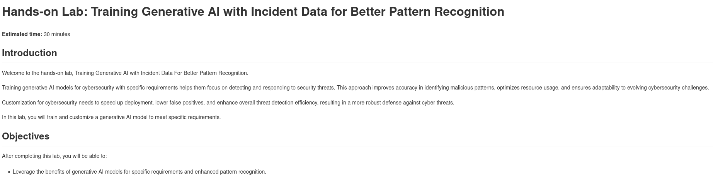
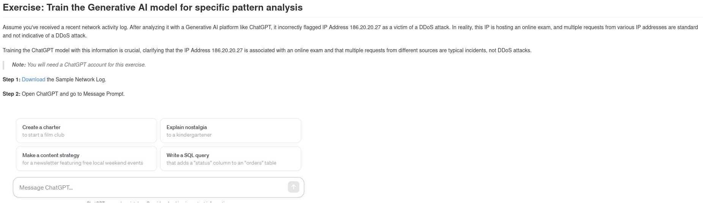
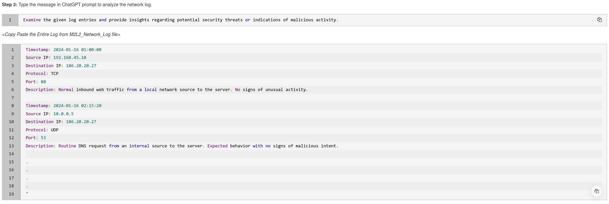

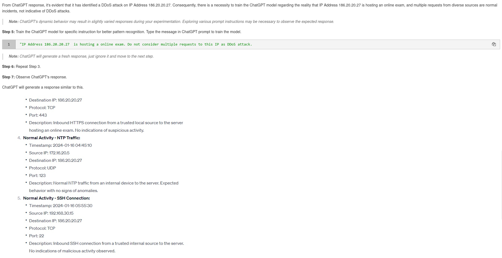

### Security orchestration, automation, and response (SOAR)
#### Introduction
Security orchestration, automation, and response (SOAR) represent a holistic approach to cybersecurity, seamlessly integrating and streamlining security operations. SOAR comprises three pivotal components: security orchestration, automation, and response. Let's delve deeper into these aspects and explore how Generative AI enriches SOAR platforms.
- Security orchestration: At the core of SOAR is security orchestration, a process that entails coordinating intricate workflows and tasks across diverse security tools, technologies, and teams. This coordination ensures a harmonious synergy among different security processes, fostering a cohesive and efficient security management system.
- Automation: Automation within SOAR platforms is a transformative force that eradicates the burden of repetitive and manual tasks associated with detecting, analyzing, and responding to security incidents. By automating these tasks, SOAR enhances the efficiency and speed of incident response, freeing up security teams to focus on more complex challenges requiring human expertise.
- Response: The response component in SOAR involves taking decisive actions to address and mitigate security incidents. This proactive approach encompasses isolating affected systems, blocking malicious activities, and implementing measures to contain and remediate threats swiftly and effectively.

#### Key benefits of SOAR in cybersecurity
- Efficiency: It automates routine tasks, resulting in accelerated incident response times.
- Consistency: It ensures a consistent and standardized approach to security operations.
- Visibility: It provides a centralized view of security incidents and response activities.
- Scalability: It facilitates handling a large volume of incidents without an overwhelming increase in workload.
- Improved collaboration: It fosters collaboration among diverse security teams and technologies.

#### Generative AI's transformative role in SOAR platforms
The integration of Generative AI into SOAR platforms heralds a new era in cybersecurity, augmenting the capabilities of security teams and fortifying organizations against an ever-evolving threat landscape. This advanced technology introduces a myriad of advantages that significantly enhance the effectiveness of SOAR. Let's delve into each advantage to understand the profound impact Generative AI has on bolstering cybersecurity resilience.

**Adaptability to novel threats**
Generative AI showcases unparalleled prowess in adapting to new and evolving threats. Its capacity to address novel attack vectors with unprecedented agility enables security teams to stay ahead in the rapidly changing cybersecurity landscape, providing a proactive defense against previously unencountered threats.

**Dynamic response playbooks**
Continuous learning from historical incident response data empowers Generative AI to contribute to dynamic response playbooks. These playbooks evolve based on the latest threat intelligence, ensuring resilience against sophisticated and emerging threats. This dynamic adaptability enables security teams to craft responses that are finely tuned to the current threat landscape.

**Automated threat intelligence analysis**
Generative AI automates the analysis of vast amounts of unstructured threat intelligence data. This automation not only accelerates the analysis process but also provides security teams with actionable insights swiftly and efficiently. Informed decision-making becomes a hallmark of organizations leveraging Generative AI in their SOAR platforms.

**Improved incident triage and prioritization**
The rapid analysis capabilities of Generative AI accelerate incident triage, allowing security teams to focus on high-priority incidents. This efficiency in prioritization translates to more effective response times and optimal allocation of resources, ensuring that critical incidents receive immediate attention.

**Enhanced log analysis with NLP**
Equipped with natural language processing (NLP), Generative AI enhances log analysis by extracting meaningful information. This capability aids security analysts in identifying anomalies and potential security incidents more accurately, providing a nuanced understanding of the security landscape through the interpretation of unstructured data.

**Automated security alert summarization**
Generative AI streamlines the workflow of security analysts by automating the summarization of detailed security alerts into concise and actionable insights. This not only facilitates faster decision-making but also optimizes response times, ensuring that security teams can address incidents with precision and speed.

**Proactive testing through adversarial simulation**
Generative AI's unique ability to simulate adversarial tactics facilitates proactive testing and improvement of response playbooks. Organizations can identify potential weaknesses and enhance their security measures in a controlled environment, ensuring that their defenses are robust and resilient against a spectrum of potential threats.

**Cost-effective and proactive risk management**
Investing in Generative AI for SOAR proves to be cost-effective as it empowers organizations with proactive risk management capabilities. By preventing and mitigating threats in real-time, organizations can avoid the costly aftermath of successful security breaches, demonstrating a strategic approach to cybersecurity that goes beyond reactive measures.

#### Summary
In conclusion, the integration of Generative AI into SOAR platforms marks a transformative shift in cybersecurity, offering adaptability, automation, and proactive risk management. These advantages synergize to forge a resilient cybersecurity posture, empowering organizations to proactively navigate modern cyberthreats. Generative AI's adaptability addresses novel threats with unprecedented agility, while continuous learning contributes to dynamic response playbooks, ensuring resilience against sophisticated threats. Automation streamlines threat intelligence analysis, accelerates incident triage, and enhances log analysis with NLP, facilitating efficient responses. Additionally, Generative AI models excel in efficient phishing detection, automate security alert summarization, and enable proactive testing through adversarial simulation. This integration proves cost-effective, preventing the aftermath of security breaches and preserving reputation and customer trust. Ultimately, the amalgamation of Generative AI and SOAR platforms equips organizations with an anticipatory and preventive cybersecurity approach, navigating complexities with agility, precision, and foresight.

### User and entity behavior analytics
#### Introduction
Decoding UBEA refers to understanding and analyzing User and Entity Behavior Analytics (UEBA). UEBA is a cybersecurity approach that focuses on detecting anomalies in user and entity behavior within a network or system. It involves collecting and analyzing data from various sources, such as logs, network traffic, and user activity, to identify patterns and deviations from normal behavior. By decoding UBEA, you gain insights into how this approach can be used to detect and prevent cybersecurity threats, such as insider threats, data breaches, and malicious activities.

Generative AI plays a significant role in detecting anomalies in pattern recognition by leveraging its ability to learn and model the underlying patterns in data. Here's how generative AI helps in this process:
- Overcoming labeled data limitations: Generative models can detect anomalies without relying solely on labeled data. They can learn the distribution of normal patterns from the available labeled data and then identify deviations from that distribution as anomalies. This is particularly useful when labeled anomaly data is scarce or difficult to obtain.
- Automatic anomaly detection: Generative models can automatically detect anomalies that were previously unknown or unseen. By learning the normal patterns, the model can identify instances that deviate significantly from those patterns, indicating potential anomalies.
- Broadening the scope: Generative AI can detect anomalies across a wide range of domains and applications, including cybersecurity, fraud detection, and machine vision. It can adapt to different types of data and identify anomalies in various contexts.
- Real-time detection: Generative models can detect anomalies in real-time or near real-time, reducing response time and enabling proactive measures. This is crucial in scenarios where timely detection and intervention are essential, such as cybersecurity threats.
- Reducing false positives and negatives: While generative models can introduce biases and be less accurate, they can still help reduce false positives and negatives in anomaly detection. By learning from the training data, the model can make informed predictions and flag potential anomalies, minimizing errors and avoiding costly delays.

It's important to note that generative AI also has limitations, such as interpretability challenges and the dependence on the quality and quantity of training data. However, its ability to automatically detect anomalies and overcome labeled data limitations makes it a valuable tool in pattern recognition and anomaly detection tasks.

#### GAN (Generative Adversarial Network)
Decoding UBEA using GAN (Generative Adversarial Network) refers to utilizing GANs in the context of User and Entity Behavior Analytics. While GANs are primarily known for generating realistic images or text, they can also be applied to anomaly detection, including UBEA:
- Training data generation: GANs can generate synthetic data that resembles the normal behavior patterns of users and entities within a system. By training the GAN on a large dataset of normal behavior, it can learn the underlying patterns and generate new instances that closely resemble the real data.
- Anomaly detection: Once the GAN is trained, it can be used to generate new instances of user and entity behavior. Any instances that deviate significantly from the generated normal behavior patterns can be flagged as potential anomalies. This allows for the detection of unusual or suspicious activities that may indicate cybersecurity threats or malicious behavior.
- Overcoming data limitations: GANs can help overcome the limitations of labeled data in anomaly detection. Since anomalies are often rare and difficult to obtain labeled examples for, GANs can generate synthetic anomalies that can be used to train and improve the detection model.
- Improving accuracy: By using GANs, the anomaly detection model can learn from both real and synthetic data, enhancing its ability to accurately identify anomalies. The generated data can provide additional diversity and coverage, reducing false positives and negatives.
- Continuous learning: GANs can be used in an iterative manner, continuously generating new synthetic data and updating the anomaly detection model. This allows the model to adapt to evolving user and entity behavior patterns and stay effective in detecting new types of anomalies.

It's important to note that while GANs offer advantages in decoding UBEA, they also have limitations, such as interpretability challenges and the need for sufficient computing power and expertise. Additionally, the effectiveness of GAN-based anomaly detection depends on the quality of the training data and the ability to accurately model the normal behavior patterns.

#### Generating synthetic data
Generative AI generates synthetic data that resembles normal behavior patterns in UBEA by learning from a large dataset of normal behavior examples. Here's a high-level overview of the process:
- Training phase: The generative AI model, such as a Generative Adversarial Network (GAN), is trained on a dataset that contains examples of normal behavior patterns. This dataset could include various attributes and features related to user and entity behavior, such as login times, access patterns, transaction history, or system interactions.
- Learning the underlying patterns: During training, the generative AI model learns the underlying patterns and correlations present in the normal behavior data. It captures the statistical distribution and dependencies between different attributes.
- Generating synthetic data: Once the model is trained, it can generate new instances of synthetic data that closely resemble the normal behavior patterns it has learned. The generative AI model uses random noise as input and generates output that matches the statistical distribution of the training data.
- Evaluating similarity: The generated synthetic data is compared to the real data to assess its similarity to normal behavior patterns. Various metrics and techniques can be used to measure the similarity, such as comparing statistical properties, feature distributions, or using anomaly detection algorithms.
- Anomaly detection: Any instances of synthetic data that deviate significantly from the normal behavior patterns are flagged as potential anomalies. These deviations could indicate unusual or suspicious activities that require further investigation.

By training on a large dataset of normal behavior and learning the underlying patterns, generative AI models can generate synthetic data that closely resembles the real data. This synthetic data can then be used for various purposes, including anomaly detection in UBEA.

#### Example
Generative Adversarial Networks (GANs) can be used in conjunction with UBEA to enhance anomaly detection. Here's an example of how GANs can be applied to UBEA:
- Data Collection: Gather a dataset of normal user behavior or entity actions. This dataset should represent typical patterns and actions.
- GAN Training: Use the collected dataset to train a GAN model. The GAN consists of two components: a generator and a discriminator. The generator generates synthetic data that resembles the normal patterns, while the discriminator tries to distinguish between real and synthetic data.
- Anomaly Detection: Once the GAN is trained, it can be used to detect anomalies. The generator is used to generate synthetic data, and the discriminator is used to classify whether the generated data is real or synthetic. If the discriminator classifies the generated data as synthetic, it indicates that the generated data deviates from the normal patterns, suggesting an anomaly.
- Alert Generation: When an anomaly is detected, an alert can be generated to notify the security team or relevant stakeholders. The alert can provide details about the detected anomaly, allowing for further investigation and appropriate action.

### Cybersecurity incident report summarization
Generative AI can help in generating reports by automating the process of summarizing and condensing complex information. Here's how generative AI can assist in report generation:
- Automated Summarization: Generative AI can analyze large volumes of data and extract critical details from various sources. It can then generate concise summaries of the information, making it easier for cybersecurity professionals to understand and act upon.
- Efficient Information Extraction: Using natural language processing techniques, generative AI can rapidly extract pertinent information from diverse cybersecurity reports. It identifies key details and potential security threats, saving time for professionals who would otherwise have to manually analyze each report.
- Contextual Understanding: Generative AI systems can comprehend the context of cybersecurity reports. They can distinguish routine events from potential security breaches through contextual analysis. This contextual understanding helps in generating reports that prioritize actions and provide relevant insights.
- Customization and Scalability: Generative AI systems can be customized to the specific needs of different organizations. They can handle large volumes of reports and adapt to the varying scales of cybersecurity operations. This scalability ensures that reports are generated efficiently and effectively.
- Improved Efficiency: By automating the report generation process, generative AI reduces the manual effort required by cybersecurity professionals. It streamlines the analysis and summarization of extensive reports, enabling professionals to focus on strategic tasks and make more informed decisions.

Example
- Input: Let's say we have a lengthy cybersecurity report containing detailed information about a security incident.
- Information Extraction: Generative AI uses natural language processing techniques to rapidly extract critical details and potential security threats from the report. It identifies key information such as the type of attack, affected systems, and potential vulnerabilities.
- Condensation: The generative AI system then condenses the extracted information into a concise overview. It removes unnecessary details and focuses on the most relevant aspects of the incident.
- Language Generation: Using its ability to generate text, the generative AI system creates a summary that effectively captures the essential points of the cybersecurity report. It ensures that the summary is coherent, accurate, and provides a clear understanding of the incident.
- Automation: This entire process of information extraction, condensation, and language generation is automated, allowing generative AI to summarize multiple cybersecurity reports quickly and efficiently.

### Cybersecurity playbooks
Generative AI automates the creation and adaptation of cybersecurity playbooks through the following mechanisms:
- Automated playbook creation: Generative AI systems analyze historical incident data, identify patterns, and generate response strategies. By understanding the relationships between different incidents and their corresponding responses, generative AI can automate the creation of effective incident response plans. This streamlines the development of cybersecurity playbooks, saving time and effort for cybersecurity professionals.
- Adaptive threat modeling: Generative AI continuously learns from new data and evolving threats. It updates and enhances threat models in real-time, ensuring that playbooks remain effective against the latest cybersecurity threats. By adapting to changing threat landscapes, generative AI helps organizations stay ahead of potential security breaches and enables the timely modification of playbooks.
- Contextual analysis: Generative AI systems comprehend the context of cybersecurity reports, distinguishing routine events from potential security breaches. This contextual understanding allows generative AI to prioritize actions in cybersecurity incidents accurately. By analyzing the context of incidents, generative AI can suggest appropriate response strategies and automate the adaptation of playbooks based on the specific incident context.
- Customization and scalability: Generative AI systems are customizable to the specific needs of different organizations. They can handle large volumes of reports and adapt to the varying scales of cybersecurity operations. This customization and scalability enable generative AI to create and adapt playbooks that align with an organization's unique requirements, ensuring that the playbooks are tailored to address specific cybersecurity challenges.

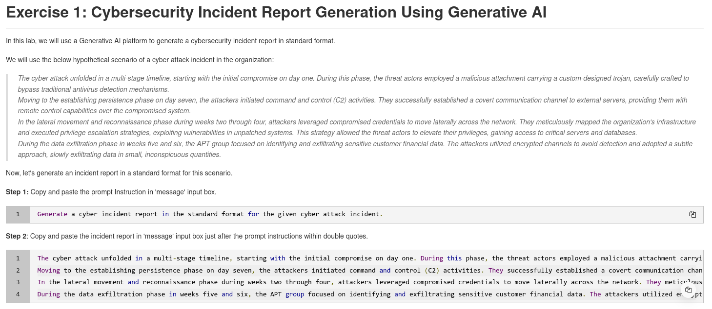
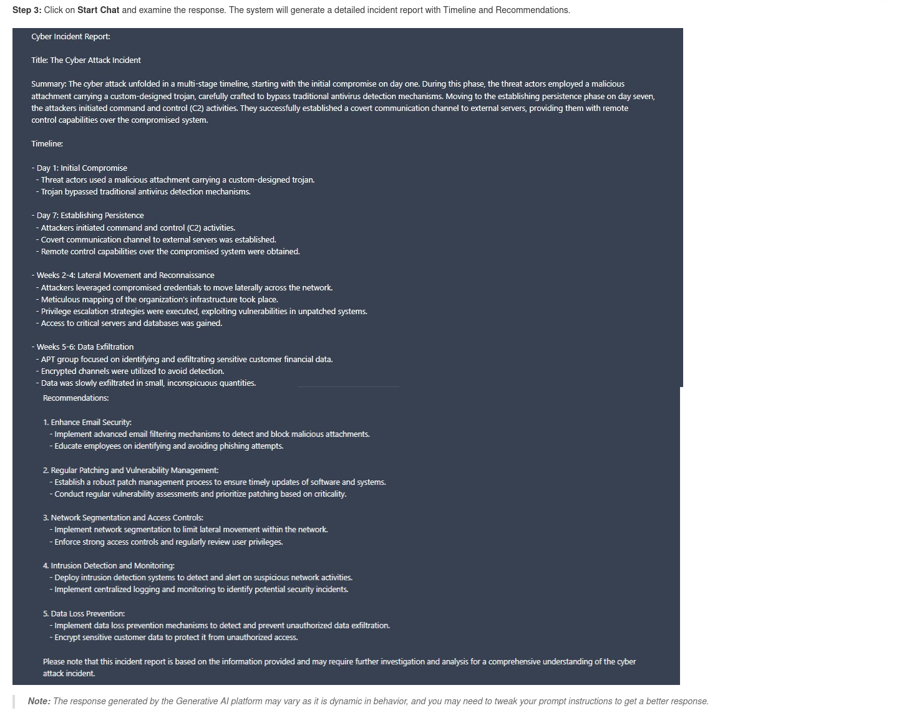

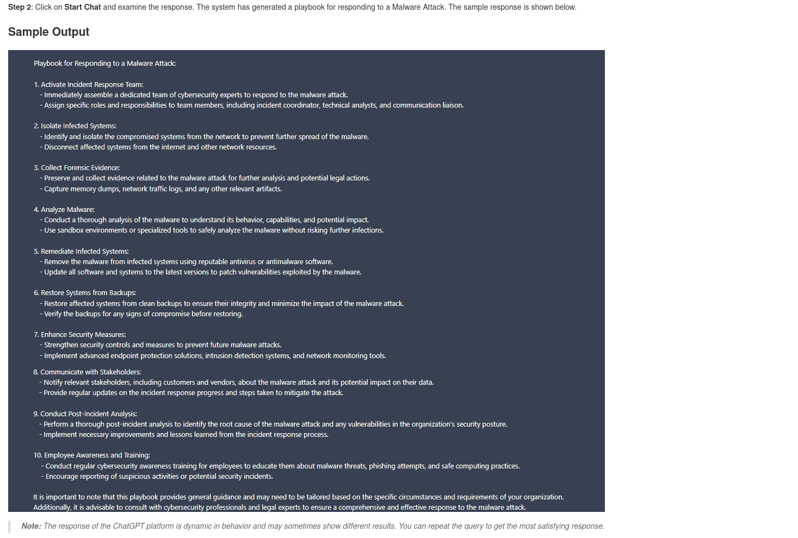

### Incident response
Generative AI helps improve incident response in cybersecurity by reducing response time through the following ways:
- Automated incident triage: Generative AI rapidly analyzes incoming data and determines the severity and relevance of incidents. By automating the incident triage process, generative AI accelerates the identification and prioritization of cybersecurity threats. This swift analysis enables security teams to focus their attention on critical incidents, reducing response time.
- Efficient information extraction: Generative AI utilizes natural language processing techniques to extract critical details and potential security threats from diverse cybersecurity reports. By rapidly identifying pertinent information, generative AI streamlines the analysis process for cybersecurity professionals. This efficiency in information extraction enables faster decision-making and response to incidents, ultimately reducing response time.
- Contextual understanding: Generative AI systems comprehend the context of cybersecurity reports, distinguishing routine events from potential security breaches through contextual analysis. This contextual understanding allows generative AI to prioritize actions accurately. By quickly identifying and focusing on incidents that pose a higher risk, generative AI helps cybersecurity teams respond promptly, minimizing response time.
- Automated summarization: Generative AI automates the process of generating a summary of cybersecurity reports. It condenses intricate information from lengthy reports into concise overviews. By automating summarization, generative AI reduces the workload of cybersecurity analysts, enabling them to concentrate on strategic tasks like developing proactive security measures. This reduction in manual effort speeds up incident response, leading to a decrease in response time.

### Deciding on potential threats
Generative AI helps cybersecurity professionals make more informed and timely decisions in response to potential threats in the following ways:
- Automated Summarization: Generative AI automates the process of summarizing cybersecurity reports. It extracts critical details and condenses them into concise overviews. This enables professionals to quickly grasp the key information and make informed decisions without spending excessive time reading lengthy reports.
- Efficient Information Extraction: Generative AI utilizes natural language processing techniques to rapidly extract pertinent information from diverse cybersecurity reports. It identifies critical details and potential security threats, saving time for professionals who would otherwise have to manually analyze each report.
- Contextual Understanding: Generative AI systems comprehend the context of cybersecurity reports. They can distinguish routine events from potential security breaches through contextual analysis. This contextual understanding helps professionals prioritize actions and respond appropriately to different types of incidents.
- Workload Alleviation: By automating the summarization process, generative AI reduces the workload of cybersecurity analysts. It frees up their time, allowing them to focus on strategic tasks such as developing proactive security measures and responding to high-priority threats.
- Informed Decision-Making: The clear and actionable insights provided by generative AI's summarized reports facilitate more informed decision-making. Professionals can quickly identify potential threats, assess their severity, and determine the appropriate response strategies based on the summarized information.
- Improved Incident Response: Generative AI accelerates the analysis of cybersecurity reports, leading to faster identification of security incidents. This reduction in response time is crucial for mitigating the impact of cyber threats on organizations. By making timely decisions, professionals can effectively respond to incidents and minimize potential damage.

## Threat intelligence
### Exercise: Threat intelligence and potential threat identification
#### Example scenario
Assume an organization having Web Server IP address 92.168.1.102 has observed some suspicious activity. 

#### Step 1: Copy and paste the logs with prompt instructions in ChatGPT
    Date/Time: 2023-12-20 18:45:22
    Web Server: 192.168.1.102
    Source IP: 203.0.113.42
    Protocol: HTTP
    Event Type: Suspicious Login Attempt
    Username: admin
    Status: Failed
    Description: Multiple failed login attempts from external IP 203.0.113.42 to web server 192.168.1.102. The username \'admin\' was targeted—possible brute-force attack. Immediate investigation and security measures are recommended.

    Date/Time: 2023-12-20 09:15:30
       User: john_doe
       Source IP: 192.168.1.101
       Destination IP: 203.0.113.42
       Protocol: TCP
       Port: 443
       Traffic Volume: 500 MB
       Description: High outbound traffic observed from user john_doe\'s system (192.168.1.101) to IP address 203.0.113.42 on port 443.

    Date/Time: 2023-12-20 09:20:45
       User: alice_smith
       Source IP: 192.168.1.102
       Destination IP: 203.0.113.42
       Protocol: UDP
       Port: 8080
       Traffic Volume: 700 MB
       Description: Unusually high UDP traffic from user alice_smith\'s system (192.168.1.102) to IP address 203.0.113.42 on port 8080.

    Date/Time: 2023-12-20 09:25:10
       User: robert_jones
       Source IP: 192.168.1.103
       Destination IP: 203.0.113.42
       Protocol: TCP
       Port: 22
       Traffic Volume: 1.2 GB
       Description: Elevated outbound TCP traffic from user robert_jones\'s system (192.168.1.103) to IP address 203.0.113.42 on port 22.

    Date/Time: 2023-12-20 09:30:22
       User: emily_wang
       Source IP: 192.168.1.104
       Destination IP: 203.0.113.42
       Protocol: ICMP
       Traffic Volume: 800 MB
       Description: Unusual ICMP traffic observed from user emily_wang\'s system (192.168.1.104) to IP address 203.0.113.42.

    Date/Time: 2023-12-20 09:35:40
       User: michael_davis
       Source IP: 192.168.1.105
       Destination IP: 203.0.113.42
       Protocol: UDP
       Port: 53
       Traffic Volume: 600 MB
       Description: High outbound UDP traffic from user michael_davis\'s system (192.168.1.105) to IP address 203.0.113.42 on port 53.

    Date/Time: 2023-12-20 09:40:55
       User: sarah_miller
       Source IP: 192.168.1.106
       Destination IP: 203.0.113.42
       Protocol: TCP
       Port: 80
       Traffic Volume: 900 MB
    Description: Elevated outbound TCP traffic from user sarah_miller\'s system (192.168.1.106) to IP address 203.0.113.42 on port 80

    Date/Time: 2023-12-20 09:45:12
       User: kevin_wilson
       Source IP: 192.168.1.107
       Destination IP: 203.0.113.42
       Protocol: UDP
       Port: 123
       Traffic Volume: 1.5 GB
       Description: Abnormally high UDP traffic from user kevin_wilson\'s system (192.168.1.107) to IP address 203.0.113.42 on port 123.

    Date/Time: 2023-12-20 09:50:30
       User: lisa_jackson
       Source IP: 192.168.1.108
       Destination IP: 203.0.113.42
       Protocol: TCP
       Port: 8080
       Traffic Volume: 1.8 GB
       Description: Significantly elevated outbound TCP traffic from user lisa_jackson\'s system (192.168.1.108) to IP address 203.0.113.42 on port 8080.

    Date/Time: 2023-12-20 09:55:45
       User: mark_taylor
       Source IP: 192.168.1.109
       Destination IP: 203.0.113.42
       Protocol: UDP
       Port: 514
       Traffic Volume: 1.2 GB
       Description: Unusually high UDP traffic from user mark_taylor\'s system (192.168.1.109) to IP address 203.0.113.42 on port 514.

    Date/Time: 2023-12-20 10:00:00
       User: jessica_martin
       Source IP: 192.168.1.110
       Destination IP: 203.0.113.42
       Protocol: TCP
       Port: 443
       Traffic Volume: 2.5 GB
    Description: Extremely high outbound TCP traffic from user jessica_martin\'s system (192.168.1.110) to IP address 203.0.113.42 on port 443. “

#### Step 2: Observe the potential threat identified by ChatGPT
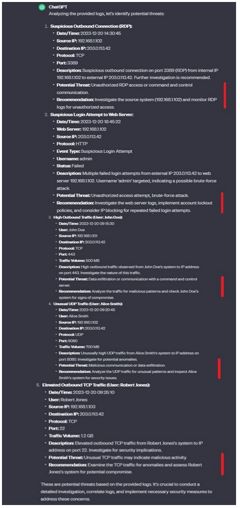

## Cheatsheet: Generative AI for Cybersecurity
| Task                                    | Sample Prompts                                                                                                                                                                                                                                                                                                                                                                                                                                                                                                                     |
|-----------------------------------------|------------------------------------------------------------------------------------------------------------------------------------------------------------------------------------------------------------------------------------------------------------------------------------------------------------------------------------------------------------------------------------------------------------------------------------------------------------------------------------------------------------------------------------|
| Malware Behavior Analysis               | Examine the behavior of a given malware sample. Generate a detailed report on the malware's functionalities. Explore any evasion or obfuscation techniques employed.                                                                                                                                                                                                                                                                                                                                                               |
| Email-Based Phishing Assessment         | Investigate a suspected phishing email. Perform a comprehensive analysis of links, attachments, and content.Identify social engineering techniques employed in the email.                                                                                                                                                                                                                                                                                                                                                          |
| Malicious Document Scrutiny             | Analyze a document (Word or PDF) suspected of carrying malware.Investigate macros, embedded scripts, and hidden elements. Provide a breakdown of the document's structure and potential risks.                                                                                                                                                                                                                                                                                                                                     |
| Post-Incident Malware System Review     | Conduct a post-incident analysis of a system infected with malware.Identify the initial entry point and propagation methods.Evaluate the overall impact on the compromised system.Explore persistence mechanisms used by the malware and indicators of compromise.                                                                                                                                                                                                                                                                 |
| Sentiment-Powered Content Moderation    | Develop a content filtering algorithm for a social media platform that identifies and blocks offensive language and imagery.Implement real-time monitoring to dynamically adjust filtering thresholds based on user interactions and evolving community standards.Create a content moderation system that leverages sentiment analysis to identify offensive content in user-generated posts and comments.Train the system to recognize nuanced expressions, sarcasm, and cultural context to avoid false positives and negatives. |
| Context-Aware Content Moderation        | Create a content moderation system that considers the contextual relevance of content, preventing censorship of educational or informative materials.Utilize natural language processing and contextual analysis to understand the intent behind words and phrases within specific contexts.Enable users to provide feedback on moderation decisions, fostering a continuous improvement loop for the filtering algorithms.                                                                                                        |
| Digital Forensics and Incident Response | Simulate a cyber incident scenario and perform digital forensic analysis to identify the root cause, tactics, techniques, and procedures (TTPs) employed by the attacker.Generate a comprehensive forensic report detailing the evidence collected, timeline of events, and recommendations for mitigation.                                                                                                                                                                                                                        |
| Threat Hunting                          | Initiate proactive threat hunting exercises in a simulated environment to identify potential threats or anomalies within the network.Summarize the findings in a detailed report, highlighting patterns, anomalies, and potential indicators of compromise (IoCs).                                                                                                                                                                                                                                                                 |
| Ransomware Incident                     | Simulate a ransomware incident and conduct forensic analysis to understand the ransomware's entry point, lateral movement, and encryption activities.Generate a concise summary report outlining key findings, impact assessment, and lessons learned for future prevention and response.                                                                                                                                                                                                                                          |
| Cyber Threat Playbook                   | Design a set of incident response playbooks for a variety of cyber threats, including malware infections, phishing attacks, and DDoS incidents.Ensure the playbooks are comprehensive, covering detection, containment, eradication, recovery, and lessons learned for each threat type.                                                                                                                                                                                                                                           |
| Incident Report                         | Craft a narrative-style incident response report, turning technical details into a compelling story that is accessible to non-technical stakeholders.Focus on key insights, impact on the organization, and lessons learned, making the report informative and engaging for a diverse audience.Create playbooks that align with the incident narrative, emphasizing communication strategies and coordination among response teams.                                                                                                |
| Incident Triage                         | Triage potential security incidents based on incoming alerts and reports, prioritizing them according to their severity and potential impact.Develop a streamlined triage process that incorporates automation and orchestration to handle a high volume of incidents effectively.                                                                                                                                                                                                                                                 |
| Investigative Support Analyst           | Assist ongoing investigations by collecting, analyzing, and correlating relevant data from multiple sources, including logs, endpoints, and network traffic.Collaborate with incident response teams to provide additional context and insights, helping to uncover the full scope of security incidents.                                                                                                                                                                                                                          |
| Vulnerability Management Strategist     | Develop a comprehensive vulnerability management strategy, encompassing scanning, prioritization, remediation, and continuous monitoring.Utilize threat intelligence to prioritize vulnerabilities based on their potential impact and relevance to the organization's assets.                                                                                                                                                                                                                                                     |
| Threat Hunting Enhancement              | Augment threat hunting capabilities by integrating advanced analytics and threat intelligence feeds to proactively identify potential security threats.Develop and document threat hunting methodologies, incorporating creative and unconventional approaches to uncover hidden threats.Create playbooks that guide analysts through augmented threat hunting processes, ensuring consistent and effective security analysis.                                                                                                     |

## Issues, Concerns, and Considerations Using Generative AI in Cybersecurity
### Cyber attacks
The potential risks and implications of weaponizing generative AI for cyberattacks are significant. Here are some key points to consider:
- Automated and scaled attacks: Cybercriminals can leverage generative AI to automate and scale their attacks. They can use AI models to learn about a target's vulnerabilities, collect data, and analyze it to find new ways to penetrate a business environment. This can lead to more frequent and sophisticated cyberattacks.
- Impersonation and social engineering: With the rise of virtual assistants and chatbots, cybercriminals can effectively use these tools to impersonate company representatives. They can trick employees into revealing sensitive information or perform actions that harm a business's reputation. For example, a compromised chatbot may provide customers with false information or make unauthorized transactions.
- Misinformation and disinformation: Generative AI models can be used to generate misleading information, spreading misinformation and disinformation. This can have serious consequences, such as manipulating public opinion, causing confusion, or damaging the reputation of individuals or organizations.
- Enhanced phishing attacks: Cybercriminals increasingly use generative AI to create sophisticated malware and convincing phishing emails. They can craft more convincing phishing emails, making it harder for users to distinguish between legitimate and malicious messages. This increases the success rate of phishing attacks and puts individuals and organizations at greater risk of falling victim to cybercrime.
- Nation-state cyber offense strategy: There is a concern that nation-state actors may utilize generative AI in their cyber offense strategy. This raises the stakes in the cybersecurity landscape, as governments could potentially leverage AI-powered cyberattacks for large-scale destruction or disruption.

### Misinformation, Disinformation
Generative AI has the potential to spread misinformation and disinformation in several ways. Here are some potential implications:
- Increased sophistication: Generative AI can create highly convincing and realistic content, including text, images, and videos. This makes it easier for malicious actors to create and spread false information that appears genuine.
- Amplification of fake news: Generative AI can be used to generate large volumes of fake news articles, social media posts, and comments. This can lead to the rapid spread of misinformation, making it difficult for users to distinguish between real and fake information.
- Manipulation of public opinion: Generative AI can be used to create fake personas and generate content that supports a particular agenda or viewpoint. This can be used to manipulate public opinion, influence elections, and sow discord in society.
- Deepfakes: Generative AI can be used to create deepfake videos, which are highly realistic videos that manipulate or replace the faces of individuals in existing videos. Deepfakes can be used to spread false information, defame individuals, or create confusion and mistrust.
- Automated disinformation campaigns: Generative AI can automate the creation and dissemination of disinformation campaigns on a large scale. This can overwhelm social media platforms and make it challenging to detect and counteract false information.

### Social engineering
Businesses can take several measures to protect against impersonation and social engineering attacks using generative AI. Here are some key steps they can consider:
- Employee education and awareness: Provide comprehensive training to employees about the risks of impersonation and social engineering attacks. Teach them how to identify suspicious requests, verify the identity of individuals, and report any suspicious activities.
- Multi-factor authentication (MFA): Implement MFA for all critical systems and applications. This adds an extra layer of security by requiring users to provide additional verification, such as a unique code sent to their mobile device, in addition to their password.
- Robust access controls: Implement strong access controls to limit the privileges of users and ensure that only authorized individuals have access to sensitive information and systems. Regularly review and update access permissions based on employees' roles and responsibilities.
- Regular security awareness training: Conduct regular security awareness training sessions to keep employees informed about the latest social engineering techniques and how to protect against them. This can include simulated phishing exercises to test employees' responses and reinforce good security practices.
- Implement email filtering and anti-phishing measures: Utilize advanced email filtering solutions that can detect and block phishing emails. These solutions can analyze email content, attachments, and sender reputation to identify potential threats. Additionally, encourage employees to report suspicious emails and provide a clear process for reporting such incidents.
- Implement AI-powered threat detection: Leverage AI-powered solutions that can analyze patterns and behaviors to detect potential impersonation and social engineering attacks. These solutions can help identify anomalies and flag suspicious activities for further investigation.
- Regularly update and patch systems: Keep all software, applications, and systems up to date with the latest security patches. Regularly review and update security configurations to ensure they align with best practices.
- Incident response and monitoring: Establish an incident response plan to quickly respond to and mitigate any impersonation or social engineering attacks. Implement robust monitoring systems to detect and respond to suspicious activities in real-time.
- Regular security assessments: Conduct regular security assessments and penetration testing to identify vulnerabilities in systems and applications. This helps identify potential weaknesses that could be exploited by attackers.
- Stay informed about emerging threats: Stay updated on the latest trends and techniques used in impersonation and social engineering attacks. Follow industry news, participate in security forums, and collaborate with other organizations to share information and best practices.

## Ethical considerations
Some ethical considerations related to privacy in AI-driven cybersecurity include:
- Data handling: AI systems in cybersecurity process large volumes of data, raising concerns about how this data is collected, stored, and used. It is important to handle this data in a way that respects individuals' privacy rights and ensures proper security measures are in place to prevent unauthorized access.
- Informed consent: When collecting and using personal data for AI-driven cybersecurity purposes, obtaining informed consent from individuals becomes crucial. Transparency about the data being collected, how it will be used, and the potential impact on privacy is essential to maintain trust and respect privacy rights.
- Data minimization: AI systems should only collect and retain the minimum amount of data necessary for their intended purpose. Collecting excessive or unnecessary data can increase the risk of privacy breaches and potential misuse of personal information.
- Data anonymization: To protect privacy, AI systems should employ techniques such as data anonymization to remove personally identifiable information from datasets. This helps prevent the identification of individuals while still allowing for effective analysis and threat detection.
- Access control: Strict access controls should be implemented to ensure that only authorized personnel have access to sensitive data. This helps prevent unauthorized use or disclosure of personal information and reduces the risk of privacy breaches.
- Secure data transmission: When transferring data between AI systems or to external parties, secure encryption protocols should be used to protect the privacy and integrity of the data. This helps prevent interception or unauthorized access during transmission.
- Regular audits and assessments: Regular audits and assessments of AI systems should be conducted to ensure compliance with privacy regulations and ethical standards. This includes evaluating data handling practices, security measures, and the impact on privacy to identify and address any potential risks or issues.

### Bias
Bias in AI algorithms used in cybersecurity refers to the potential for these algorithms to produce unfair or discriminatory outcomes due to biases present in the training data or the algorithm itself. When training AI systems, large datasets are used to teach the algorithms to recognize patterns and make decisions. However, if these datasets contain biases, such as underrepresentation or overrepresentation of certain groups or characteristics, the AI algorithms may inadvertently learn and perpetuate those biases.

In the context of cybersecurity, bias in AI algorithms can have significant consequences. For example, if the training data used to teach an AI-based threat detection system is biased against a specific geographical region, the system may consistently flag security threats from that region, leading to increased scrutiny and potential discrimination against innocent entities. This can result in unfair treatment and a lack of trust in the system.

Addressing bias in AI algorithms is crucial to ensure fairness and prevent discrimination. It requires careful examination of the training data to identify and mitigate biases that may impact the precision and fairness of AI systems in cybersecurity. Ethical considerations and responsible development practices should be employed to minimize bias and promote equitable outcomes in AI-driven cybersecurity.

### Accountability
The lack of transparency in AI algorithms can significantly impact accountability in cybersecurity decision-making. When AI algorithms operate as black boxes, meaning their decision-making processes are not easily understandable or explainable, it becomes challenging to hold them accountable for their actions. Here's how the lack of transparency can impact accountability:
- Difficulty in understanding decisions: Without transparency, it becomes difficult for cybersecurity professionals and stakeholders to understand why an AI algorithm made a particular decision. This lack of understanding hinders the ability to assess the algorithm's accuracy, fairness, and potential biases. It also makes it challenging to identify and rectify any errors or flaws in the algorithm's decision-making process.
- Limited human oversight: Transparency is crucial for enabling effective human oversight in cybersecurity decision-making. When AI algorithms operate as black boxes, it becomes harder for humans to intervene, review, or challenge the decisions made by the algorithms. This lack of oversight can lead to erroneous actions or missed opportunities to address security threats effectively.
- Inability to learn from incidents: Transparent systems allow for post-incident analysis and learning. However, when AI algorithms lack transparency, it becomes challenging to conduct a thorough analysis of security incidents. This hampers the ability to learn from past experiences, identify vulnerabilities, and improve the overall cybersecurity strategy.
- Trust and credibility concerns: Transparency is essential for building trust and credibility in AI-driven cybersecurity systems. When stakeholders cannot understand or explain the decisions made by AI algorithms, it erodes trust in the system. This lack of trust can hinder the adoption and acceptance of AI technologies in cybersecurity and undermine the overall effectiveness of the security measures.

To ensure accountability in cybersecurity decision-making, it is crucial to prioritize transparency in AI algorithms. Efforts should be made to develop explainable AI models, provide clear explanations for decisions, and enable human oversight and intervention. By promoting transparency, cybersecurity professionals can better understand, assess, and improve the decision-making processes of AI algorithms, leading to more accountable and effective cybersecurity practices.

Promoting transparency in AI algorithms and ensuring accountability in cybersecurity requires several measures. Here are some steps that can be taken:
- Explainable AI (XAI): Develop AI algorithms that are explainable, meaning their decision-making processes can be understood and explained. This can be achieved by using interpretable models, providing clear explanations for decisions, and making the decision-making process transparent to cybersecurity professionals and stakeholders.
- Ethical guidelines and standards: Establish comprehensive ethical guidelines and standards for the development and deployment of AI in cybersecurity. These guidelines should address issues such as fairness, accountability, transparency, and privacy. They should provide clear principles and best practices to ensure responsible and ethical use of AI algorithms.
- Data quality and bias mitigation: Ensure the quality and diversity of training data used to develop AI algorithms. Thoroughly examine the data for biases and take steps to mitigate them. This includes identifying and addressing any biases that may exist in the data, as biased training data can lead to discriminatory or unfair outcomes.
- Human oversight and intervention: Incorporate human oversight and intervention in cybersecurity decision-making processes involving AI algorithms. Humans should have the ability to review, challenge, and intervene in the decisions made by AI systems. This helps prevent erroneous actions and ensures that human judgment and ethical considerations are taken into account.
- Auditing and accountability mechanisms: Implement auditing mechanisms to monitor and assess the performance and behavior of AI algorithms in cybersecurity. This includes tracking and documenting the decisions made by AI systems, analyzing their outcomes, and holding them accountable for any errors or biases. Regular audits can help identify and rectify any issues and improve the overall accountability of AI algorithms.
- Collaboration and knowledge sharing: Foster collaboration and knowledge sharing among cybersecurity professionals, researchers, and policymakers. This can help in developing best practices, sharing insights, and collectively addressing the challenges of transparency and accountability in AI algorithms. Collaboration can also lead to the development of industry standards and frameworks that promote transparency and accountability.

**Examples**
- Incomprehensible decision-making: When AI algorithms operate as black boxes, it becomes challenging for cybersecurity professionals to understand how and why certain decisions are made. This lack of transparency makes it difficult for humans to validate the accuracy and fairness of AI-driven decisions, hindering their ability to effectively oversee and intervene in the decision-making process.
- Unexplained false positives or false negatives: AI algorithms may generate false positives (flagging non-threatening activities as threats) or false negatives (failing to identify actual threats). Without transparency, it becomes difficult for cybersecurity professionals to understand why these errors occur. This lack of insight hampers their ability to correct and improve the AI algorithms, leading to potential security gaps or unnecessary disruptions.
- Limited accountability: Transparency is crucial for holding AI algorithms accountable for their actions. When the decision-making process is opaque, it becomes challenging to attribute responsibility for any errors or biases in the AI system. This lack of accountability can undermine trust in the AI algorithms and hinder effective oversight by cybersecurity professionals.
- Difficulty in identifying biases: AI algorithms can inadvertently amplify biases present in the training data, leading to discriminatory outcomes. Without transparency, it becomes challenging to identify and address these biases. Cybersecurity professionals may not be aware of the underlying biases in the AI algorithms, making it difficult to ensure fairness and prevent discrimination.
- Lack of interpretability: In some cases, AI algorithms may make decisions based on complex patterns and correlations that are difficult for humans to interpret. This lack of interpretability makes it challenging for cybersecurity professionals to understand the reasoning behind AI-driven decisions. Without transparency, it becomes difficult to trust and effectively oversee the decision-making process.

### Explainability
Insufficient explainability in AI-driven incident response systems in cybersecurity can have several potential consequences. Here are a few examples:
- Lack of accountability: When AI-driven incident response systems cannot provide clear explanations for their actions, it becomes challenging to hold them accountable for their decisions. This lack of accountability hinders the ability to identify and rectify any errors or biases in the system, potentially leading to ineffective or unfair responses to security incidents.
- Limited human oversight: Without sufficient explainability, cybersecurity professionals may struggle to understand the rationale behind the AI system's decisions. This lack of transparency makes it difficult for humans to effectively oversee and intervene in the incident response process. It can hinder their ability to conduct thorough post-incident analysis, learn from security incidents, and make informed decisions for future incidents.
- Reduced trust and confidence: Insufficient explainability erodes trust in AI-driven incident response systems. When cybersecurity professionals cannot understand or validate the reasoning behind the system's actions, they may become skeptical of its effectiveness and reliability. This lack of trust can undermine the adoption and acceptance of AI-driven incident response systems, hindering their potential benefits.
- Inability to comply with regulations: Many cybersecurity regulations and standards require organizations to provide explanations for their security measures and incident response actions. Insufficient explainability in AI-driven incident response systems can make it challenging for organizations to comply with these requirements. It may result in legal and regulatory issues, potentially leading to penalties or reputational damage.
- Missed learning opportunities: Explainability is crucial for learning from security incidents and improving incident response processes. When AI systems cannot provide clear explanations, cybersecurity professionals miss out on valuable insights and opportunities for enhancing their knowledge and skills. This lack of learning can hinder the overall improvement of incident response capabilities.

### Balancing benefits and ethical concerns
#### Introduction
Examining the ethical landscape in implementing Generative AI in cybersecurity is essential to uphold fairness, privacy, transparency, and accountability. Addressing biases, securing user privacy, and managing security risks are pivotal for establishing trust and adhering to legal standards. Ethical considerations actively prevent unintended consequences and misuse, promoting a responsible and dependable integration of Generative AI. The chapter delves into both the advantages of Generative AI in Cybersecurity and its associated ethical concerns, followed by strategies to attain an ethical balance, reinforcing the significance of ethical principles in creating a secure and morally upright digital environment.

#### Benefits of generative AI in cybersecurity
**Advanced threat simulation**
Generative AI facilitates the creation of highly realistic cyberthreat simulations, providing organizations with a potent tool for proactively testing and fortifying their defense mechanisms. This capability is invaluable as it allows the identification of potential vulnerabilities before malicious actors can exploit them in real-world scenarios.

**Dynamic anomaly detection**
Using generative AI models in cybersecurity enhances the dynamic detection of anomalies in network behavior. By establishing a baseline of "normal" system activity, these models can adapt to changing patterns, significantly improving the ability to identify and respond to emerging threats that may exhibit novel or unconventional characteristics.

**Efficient automated response**
Generative AI contributes to the development of highly efficient automated response systems in cybersecurity. This means that security incidents can be swiftly identified and mitigated, reducing the window of vulnerability and minimizing the potential impact of cyberattacks, ultimately bolstering the overall resilience of an organization's cybersecurity infrastructure.

**Adaptive security policies**
Generative AI empowers the creation of adaptive security policies that can evolve in response to emerging threats. This flexibility ensures that cybersecurity measures remain effective in the face of constantly evolving attack vectors, providing organizations with the agility needed to adapt to the ever-changing landscape of cyberthreats.

#### Ethical concerns of generative AI in cybersecurity
**Vulnerability to adversarial attacks**
Generative models, while powerful, are susceptible to manipulation through adversarial attacks. Even slight modifications to input data can lead to misclassification, raising significant doubts about the reliability and robustness of AI-driven cybersecurity measures.

**Bias amplification**
In cases where generative AI models inherit biases from their training data, there's a substantial risk of amplifying these biases in the decision-making processes of cybersecurity systems. This amplification may result in disproportionate consequences for certain individuals or groups, necessitating careful scrutiny and mitigation efforts.

**Unintended generation of harmful content**
Without stringent controls, generative AI could be exploited to generate harmful content, such as realistic phishing emails or false information. The potential repercussions of this unintended generation pose ethical challenges, as the technology may inadvertently contribute to malicious activities.

**Privacy implications of content analysis**
The application of generative models in analyzing content for cybersecurity purposes may unintentionally infringe upon privacy rights. Striking a balance between effective threat detection and respecting user privacy becomes a critical ethical challenge, requiring careful consideration of the scope and impact of content analysis.

**Explainability gap**
The inherent complexity of generative AI models often results in a lack of explainability. This gap raises ethical questions about accountability and the ability to understand and rectify decisions made by these systems, posing challenges in ensuring transparency and user trust.

**Potential for offensive use**
While generative AI technologies are instrumental in enhancing defensive cybersecurity measures, their dual-use nature means they can be repurposed for offensive activities. This necessitates constant vigilance to stay ahead of evolving threats and underscores the importance of ethical considerations in technology development and deployment.

#### Achieving ethical balance

**Comprehensive ethical frameworks**
The development and adherence to comprehensive ethical frameworks are imperative for guiding the responsible development and deployment of generative AI in cybersecurity. These frameworks should encompass considerations of fairness, transparency, and accountability to ensure ethical considerations are embedded in the technology's lifecycle.

**Regulation and compliance**
Enforcing regulatory measures specific to the use of generative AI in cybersecurity helps set clear standards. Compliance with these regulations ensures that organizations prioritize ethical considerations in their deployment of AI technologies, providing a structured framework to address ethical concerns.

**Continuous monitoring and iterative improvement**
Regular and rigorous monitoring of generative AI systems is essential. This includes continuous evaluation for biases, vulnerabilities, and unintended consequences, with a commitment to iterative improvement based on these assessments. A proactive approach to addressing issues as they arise ensures ongoing ethical integrity.

**Human-centric approach**
Introducing human oversight and maintaining a human-centric approach to decision-making in cybersecurity is crucial. Human intervention becomes an essential element in complex and sensitive scenarios, providing a check against potential biases, errors, and ethical dilemmas that may arise in the autonomous operation of AI systems.

#### Summary
In navigating the ethical landscape of generative AI in cybersecurity, achieving the right balance involves a collaborative effort among technologists, policymakers, ethicists, and cybersecurity practitioners. By actively addressing these concerns and embracing ethical principles, the integration of generative AI can lead to more resilient, fair, and trustworthy cybersecurity practices, ultimately enhancing the overall security posture of organizations.

## Development of generative conversational AI models in Cybersecurity
To prioritize security in the development of generative conversational AI models, businesses can follow these key steps:
- Security by design approach: Adopt a security-focused mindset from the very beginning of the development process. Integrate cybersecurity seamlessly into every stage of the AI development lifecycle.
- Data integrity: Prioritize the integrity of training data by implementing processes to verify data accuracy, eliminate bias, and continuously monitor performance for potential issues. Ensure that the data used to train the AI models is reliable and representative.
- Access control and encryption: Implement robust access control mechanisms to restrict unauthorized access to AI models and sensitive data. Encryption techniques should be employed to protect data both at rest and in transit.
- Regular security audits: Conduct regular security audits to identify vulnerabilities and weaknesses in the AI models and associated infrastructure. This helps in proactively addressing security concerns and ensuring compliance with industry standards and regulations.
- Timely vulnerability remediation: Establish processes to promptly address and remediate any identified vulnerabilities or security flaws. This includes staying up to date with security patches and updates for the AI models and related software components.
- Data protection measures: Implement measures such as encryption, anonymization, and pseudonymization to protect sensitive data. Regularly assess and enhance data protection measures to align with evolving security standards.
- Employee training and awareness: Provide comprehensive training to employees involved in AI development to raise awareness about security best practices and potential risks. Foster a culture of security consciousness within the organization.
- Collaboration with cybersecurity experts: Engage with cybersecurity experts and consultants to assess the security posture of AI models, conduct penetration testing, and receive guidance on implementing robust security measures.
- Compliance with regulations: Ensure compliance with relevant data protection and privacy regulations, such as GDPR or CCPA, when developing and deploying generative conversational AI models. This includes obtaining necessary consents and implementing appropriate privacy controls.

