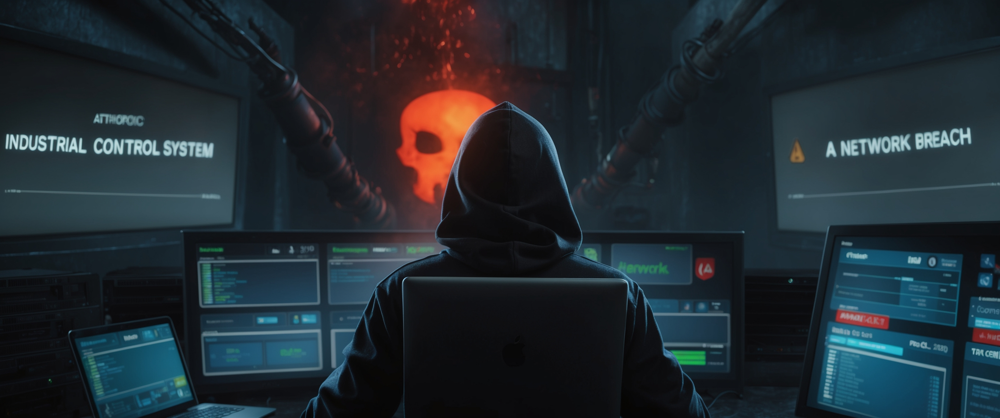
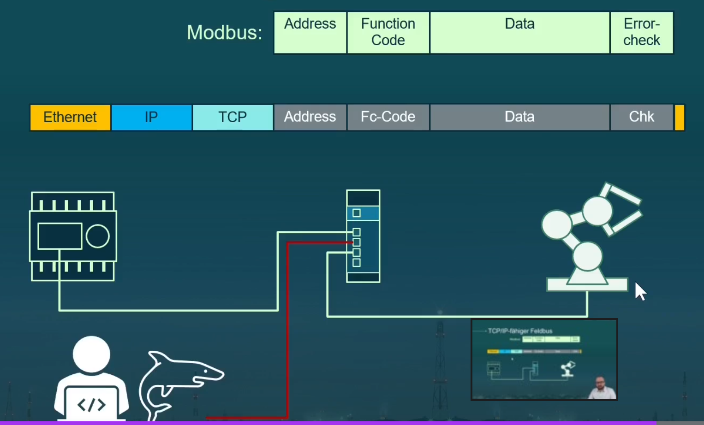
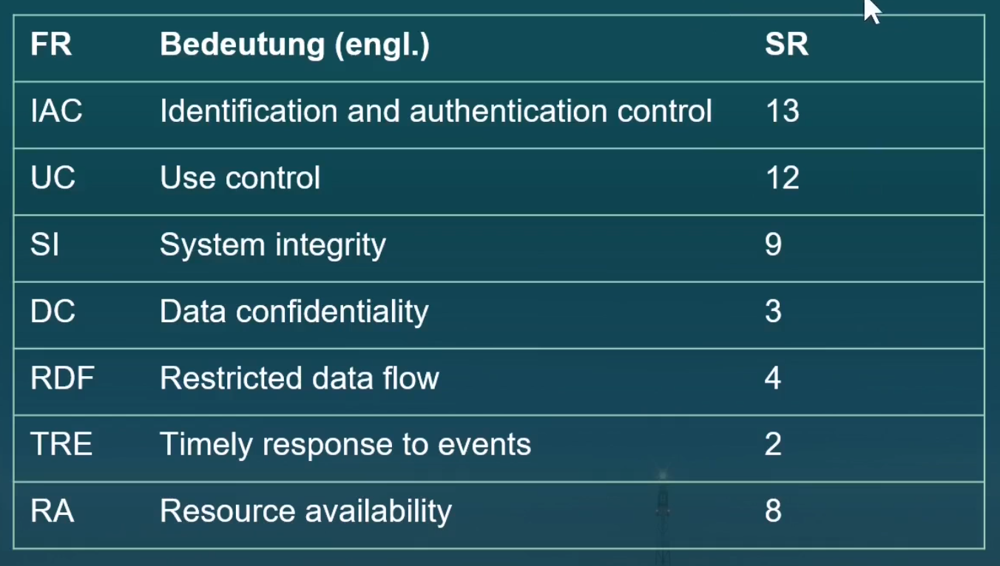
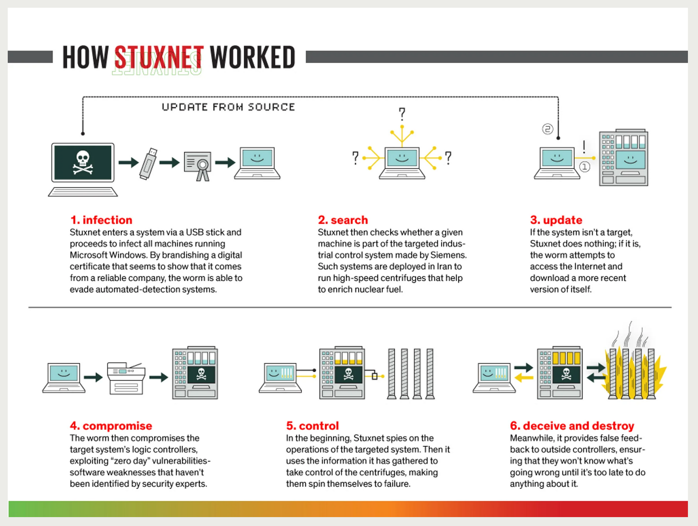
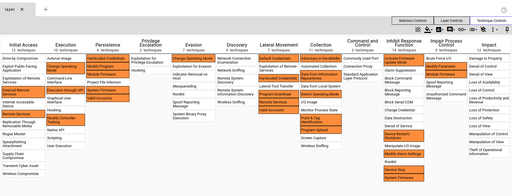

> :bulb: Notes on "Industrial Cyber Security Basics"


# Industrial Cyber Security Basics

## OT Security

**Operational Technology (OT)** sind in der industriellen Automatisierung und Steuerung (z. B. in Produktionsanlagen, Energieversorgung, Verkehrsinfrastruktur) im Einsatz. Sie unterscheiden sich von klassischen IT-Systemen durch ihre direkte Verbindung mit physischen Prozessen und Maschinen.

Zentrale Aspekte:
1. **Verfügbarkeit vor Vertraulichkeit**:
   - In OT-Systemen steht die **Verfügbarkeit** an erster Stelle, da Unterbrechungen den Betrieb physischer Systeme beeinträchtigen können.
   - *Beispiel*: Ein Produktionsstopp in einer Fabrik kann enorme wirtschaftliche Schäden verursachen.

2. **Sicherheitsziele erweitern**:
   Neben den klassischen IT-Sicherheitszielen (Vertraulichkeit, Integrität, Verfügbarkeit) kommen bei OT folgende hinzu:
   - **Sicherheit von Menschen und Umwelt**: Physische Gefahren, wie Explosionen oder chemische Lecks, müssen verhindert werden.
   - **Prozessintegrität**: Sicherstellung, dass industrielle Prozesse wie geplant ablaufen.

3. **Segmentierung und Isolation**:
   - OT-Systeme sollten möglichst von IT-Netzwerken isoliert werden, um das Risiko eines Übergriffs (z. B. durch Malware) zu minimieren.
   - Einsatz von **Zonen** und **Konduiten** basierend auf Standards wie der **IEC 62443**.

4. **Schwachstellen und Lebenszyklen**:
   - OT-Systeme haben oft eine längere Lebensdauer als IT-Systeme, sodass ältere, nicht gepatchte Software oder Hardware anfällig bleiben kann.
   - Sicherheit muss daher über den gesamten Lebenszyklus des Systems gewährleistet sein.

5. **Physische Sicherheit**:
   - Da OT-Systeme oft direkt mit der physischen Infrastruktur verbunden sind, spielt der Schutz vor physischem Zugriff eine wichtige Rolle.

6. **Incident Response in OT**:
   - Im Falle eines Sicherheitsvorfalls in OT-Systemen müssen die Prozesse zur Vorfallsbehandlung auf die spezifischen Bedingungen der OT abgestimmt sein.
   - Die Priorität liegt darauf, den Betrieb schnellstmöglich wiederherzustellen.


| **IT Security**                     | **OT Security**                     |
|-------------------------------------|-------------------------------------|
| Fokus auf **Daten** (Vertraulichkeit, Integrität) | Fokus auf **Prozesse** (Verfügbarkeit, Sicherheit) |
| Regelmäßige **Updates und Patches** | Updates schwierig wegen **Betriebsunterbrechungen** |
| Schnelllebige Technologien          | **Langzeitbetrieb** von Anlagen     |
| Hauptgefahr: **Datenverlust**       | Hauptgefahr: **Anlagenausfall**, **physische Schäden** |


## Grundlagen IT und OT

### Safety vs. Security

Safety
- Funktionale Sicherheit
- Betriebssicherheit
- Schützt Umgebung vor dem Sytem

Security
- Informationssicherheit
- Angriffssicherheit
- Schützt das System vor der Umgebung

### IT vs. OT
#### OT Operational Technology
Hardware und Software zur (echtzeitfähigen) Erfassung/Regelung/Steuerung eines (industriellen) Prozesses
- SPS
- HMI
- Servocontroller
- Greifroboter
- Visionsystems
- Webserver


Einsatzdauer der Hardware
IT: 3-5 Jahre
OT: bis 20 Jahre

Verfügbarkeit und Performance
IT: Ausfälle tolerierbar, weiche Echtzeit
OT: Keine Ausfälle, harte Echtzeit

Updates und Patches:
IT: regelmässig und automatisiert
OT: Nie...selten

Security Tools (AV, FW, Backup)
IT: etabliert
OT: selten

Security Bewusstsein
IT: gut
OT: eher schlecht, wachsend


### Schutzziele IT vs. OT
- Confidentiality
- Integrity
- Availability

IT Systeme
Prio: C -> I -> A

OT Systeme:
Prio: A -> I -> C


### Datenverkehr im Netzwerk


### Verkapselte Feldbusprotokolle


### Normen und Richtlinien
IT
- ISO 27000
- IT Grundschutz (BSI)

OT
- IEC 62443
- ICS-Security Kompendium (BSI)

Rollen IEC 62443-3-3


Level des Angreifers
- SiL 1-4 (Safety)
    - Technologie
    - Funds
    - Skills
    - Motiv


Security Levels
SL-T: Target Level (gefordert)
SL-C: Capable Level (theoretisch erreichbar)
SL-A: Achieved Level (effektiv, durch Audit ermittelt)

Systemanforderungen IEC 62443




## Offense

### OSINT

#### Google Dorks

[Goolge Dorks Cheatsheet](https://gist.github.com/sundowndev/283efaddbcf896ab405488330d1bbc06)

```
openplc intext:"password"
beckhoff cx intext:"default password"
siemens S7 intext:"default password"
siemens wincc intext:"default password"
SCADA intext:"default password"
```

#### Default Credentials
[SCADA Passwords](https://github.com/scadastrangelove/SCADAPASS/blob/master/scadapass.csv)

#### Shodan IO
[Explore Industrial Control Systems](https://www.shodan.io/search?query=port%3A102+Siemens)
[Shodan Images](https://images.shodan.io/?query=screenshot.label%3A%22ics%22)


### Primär- und Folgeangriffe
Primärangriff auf IT
OT Security geht davon aus, dass der Primärangriff bereits erfolgreich war und befasst sich mit den Folgeangriffen auf die OT Systems.


### MITRE ICS ATT&CK Framework

[ICS Matrix](https://attack.mitre.org/matrices/ics/)


### Angriffsanalyse auf Wasseraufbereitungsanlage Florida
[A Hacker Tried to Poison a Florida City's Water Supply](https://www.wired.com/story/oldsmar-florida-water-utility-hack/)


### Analyse der Triton/Trisis/Hatman-Malware
[HatMan—Safety System Targeted Malware](https://www.cisa.gov/sites/default/files/documents/MAR-17-352-01%20HatMan%20-%20Safety%20System%20Targeted%20Malware%20%28Update%20B%29.pdf)

[How Does Triton Attack Triconex Industrial Safety Systems?](https://blogs.cisco.com/security/how-does-triton-attack-triconex-industrial-safety-systems)


### Analyse der Stuxnet-Malware
[The Real Story of Stuxnet](https://spectrum.ieee.org/the-real-story-of-stuxnet)



### Angriff Methtode 1
#### Dynamische Systeme


| **Systemtyp**   | **Potentialgröße**  | **Flussgröße**        | **Verbraucher** | **Energiespeicher (Potential)** | **Energiespeicher (Fluss)** |
|------------------|--------------------|-----------------------|-----------------|---------------------------------|-----------------------------|
| **Elektrisch**   | Spannung           | Strom                 | Widerstand      | Kondensator                     | Spule                       |
| **Translation**  | Kraft              | Geschwindigkeit       | Dämpfer         | Feder                           | Masse                       |
| **Rotation**     | Drehmoment         | Winkelgeschwindigkeit | Reibung         | Torsionsfeder                   | Trägheitsmoment             |
| **Fluid**        | Druck              | Volumenstrom          | Drossel         | Kompressionsblase               | Flüssigkeitsmasse           |
| **Thermisch**    | Temperatur         | Wärmestrom            | Wärmeleiter     | Wärmekapazität                  | —                           |

Erklärungen:
- Potentialgröße: Beschreibt das "Potenzial", das eine Bewegung oder einen Fluss antreibt.
- Flussgröße: Beschreibt den tatsächlichen Fluss der Energie oder Materie.
- Verbraucher: Elemente, die Energie verbrauchen oder umwandeln.
- Energiespeicher (Potential): Speichert Energie basierend auf der Potentialgröße.
- Energiespeicher (Fluss): Speichert Energie basierend auf der Flussgröße (wenn zutreffend).


#### HAZOP Leitworte
HAZOP (Hazard and Operability Study) ist eine systematische Methode zur Identifikation von Gefährdungen und Betriebsproblemen in Prozessen. 
Die Leitworte helfen dabei, mögliche Abweichungen von den Design- oder Prozessbedingungen zu identifizieren.

[HAZOP: Hazard and Operability](https://safetyculture.com/topics/hazop/)

| **Leitwort**    | **Erläuterung**                                | **Beispiele für Abweichungen**            |
|------------------|------------------------------------------------|-------------------------------------------|
| **Kein/Keine**   | Es findet keine oder eine unvollständige Funktion statt. | Kein Durchfluss, keine Reaktion, kein Signal. |
| **Mehr**         | Eine Funktion oder Größe ist höher als vorgesehen. | Erhöhter Druck, zu hohe Temperatur, zu großer Durchfluss. |
| **Weniger**      | Eine Funktion oder Größe ist niedriger als vorgesehen. | Verminderter Durchfluss, zu niedrige Temperatur, unvollständige Reaktion. |
| **Teilweise**    | Eine Funktion wird nur teilweise ausgeführt.   | Nur ein Teil des Produkts erreicht die nächste Stufe, unvollständige Reinigung. |
| **Frühzeitig**   | Eine Funktion tritt früher als vorgesehen ein. | Frühzeitiger Beginn einer Reaktion, frühzeitiger Druckanstieg. |
| **Spät**         | Eine Funktion tritt später als vorgesehen ein. | Verzögerte Reaktion, verzögerter Start eines Prozesses. |
| **Umgekehrt**    | Eine Funktion oder Strömung läuft in entgegengesetzter Richtung. | Rückfluss, Umkehr des Stromflusses. |
| **Anders als**   | Abweichungen von den erwarteten Bedingungen, nicht spezifizierte Änderung. | Falsche Konzentration, ungeeignetes Material, falsches Produkt. |
| **Zusätzlich**   | Es tritt etwas auf, das nicht vorgesehen ist.  | Unerwünschte Nebenprodukte, zusätzliche Wärmeentwicklung. |
| **Zusätzlich zu**| Ein zusätzlicher Prozess oder Zustand, der nicht vorgesehen war. | Zwei Reaktionen gleichzeitig, zusätzliche Lasten. |
| **Kombiniert**   | Kombination von mehreren Abweichungen.         | Erhöhter Druck und Temperatur, Kombination verschiedener Produkte. |


### Angriff Methode 2

Betrachtung der Anwendugsfälle und Ableitung der Missbrauchsfälle.

Szenarien


Sensormanipulation


## Defense

### Security by Design


### Defense in Depth

### Verteidigungstrategie mit ICS ATT&CK Framework

```
sudo netdiscover -r 192.168.56.0/24

sudo nmap 192.168.56.100 ... -Pn -p 1-65535 -T5

```

### ...





