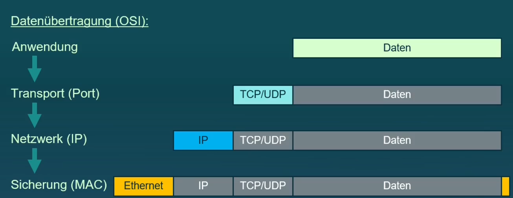
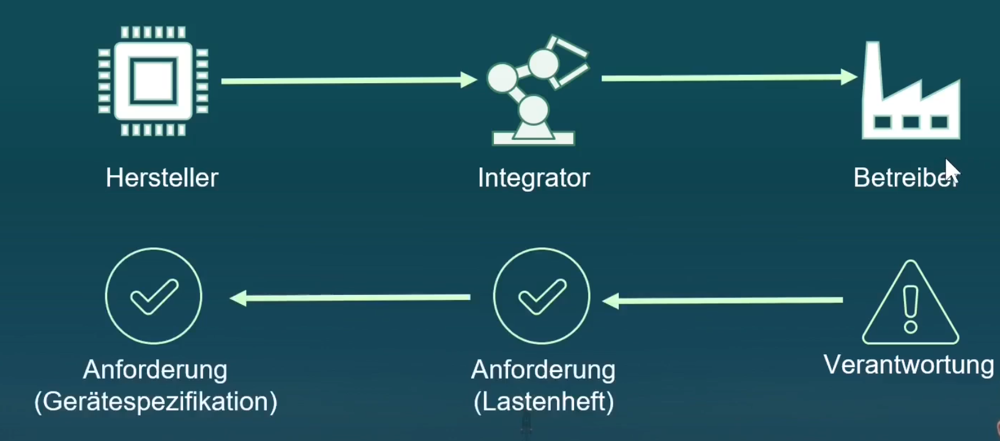
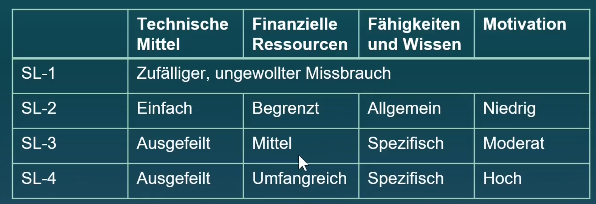
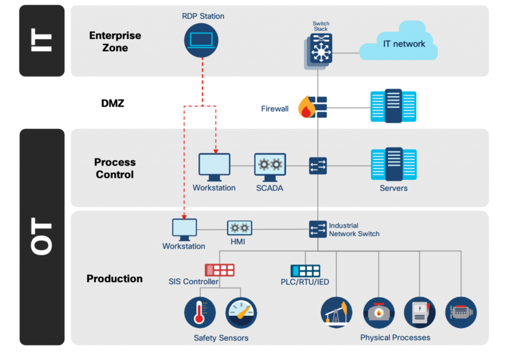
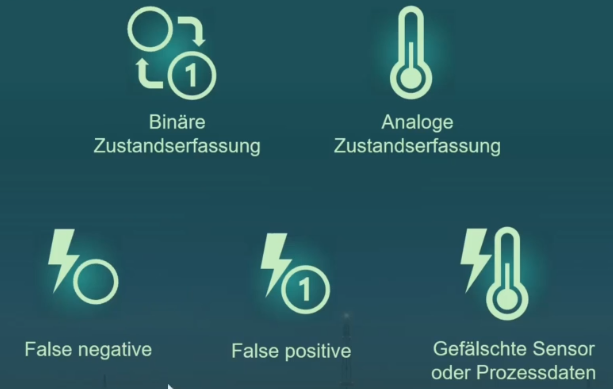

> :bulb: Notes on "Industrial Cyber Security Basics"


# Industrial Cyber Security Basics

## Grundlagen IT und OT

### Safety vs. Security

Safety
- Funktionale Sicherheit
- Betriebssicherheit
- Schützt Umgebung vor dem Sytem

Security
- Informationssicherheit
- Angriffssicherheit
- Schützt das System vor der Umgebung

### IT vs. OT
#### OT Operational Technology
Hardware und Software zur (echtzeitfähigen) Erfassung/Regelung/Steuerung eines (industriellen) Prozesses
- SPS
- HMI
- Servocontroller
- Greifroboter
- Visionsystems
- Webserver


Einsatzdauer der Hardware
IT: 3-5 Jahre
OT: bis 20 Jahre

Verfügbarkeit und Performance
IT: Ausfälle tolerierbar, weiche Echtzeit
OT: Keine Ausfälle, harte Echtzeit

Updates und Patches:
IT: regelmässig und automatisiert
OT: Nie...selten

Security Tools (AV, FW, Backup)
IT: etabliert
OT: selten

Security Bewusstsein
IT: gut
OT: eher schlecht, wachsend


### Schutzziele IT vs. OT
- Confidentiality
- Integrity
- Availability

IT Systeme
Prio: C -> I -> A

OT Systeme:
Prio: A -> I -> C


### Datenverkehr im Netzwerk


### Verkapselte Feldbusprotokolle


### Normen und Richtlinien
IT
- ISO 27000
- IT Grundschutz (BSI)

OT
- IEC 62443
- ICS-Security Kompendium (BSI)

Rollen IEC 62443-3-3


Level des Angreifers
- SiL 1-4 (Safety)
    - Technologie
    - Funds
    - Skills
    - Motiv



Security Levels
SL-T: Target Level (gefordert)
SL-C: Capable Level (theoretisch erreichbar)
SL-A: Achieved Level (effektiv, durch Audit ermittelt)

Systemanforderungen IEC 62443


## Offense

### OSINT

#### Google Dorks

[Goolge Dorks Cheatsheet](https://gist.github.com/sundowndev/283efaddbcf896ab405488330d1bbc06)

```
openplc intext:"password"
beckhoff cx intext:"default password"
siemens S7 intext:"default password"
siemens wincc intext:"default password"
SCADA intext:"default password"
```

#### Default Credentials
[SCADA Passwords](https://github.com/scadastrangelove/SCADAPASS/blob/master/scadapass.csv)

#### Shodan IO
[Explore Industrial Control Systems](https://www.shodan.io/search?query=port%3A102+Siemens)
[Shodan Images](https://images.shodan.io/?query=screenshot.label%3A%22ics%22)


### Primär- und Folgeangriffe
Primärangriff auf IT
OT Security geht davon aus, dass der Primärangriff bereits erfolgreich war und befasst sich mit den Folgeangriffen auf die OT Systems.


### MITRE ICS ATT&CK Framework

[ICS Matrix](https://attack.mitre.org/matrices/ics/)


### Angriffsanalyse auf Wasseraufbereitungsanlage Florida
[A Hacker Tried to Poison a Florida City's Water Supply](https://www.wired.com/story/oldsmar-florida-water-utility-hack/)


### Analyse der Triton/Trisis/Hatman-Malware
[HatMan—Safety System Targeted Malware](https://www.cisa.gov/sites/default/files/documents/MAR-17-352-01%20HatMan%20-%20Safety%20System%20Targeted%20Malware%20%28Update%20B%29.pdf)

[How Does Triton Attack Triconex Industrial Safety Systems?](https://blogs.cisco.com/security/how-does-triton-attack-triconex-industrial-safety-systems)




### Analyse der Stuxnet-Malware

### Angriff Methtode 1

### Angriff Methode 2


## Defense

### Security by Design


### Defense in Depth

### Verteidigungstrategie mit ICS ATT&CK Framework

```
sudo netdiscover -r 192.168.56.0/24

sudo nmap 192.168.56.100 ... -Pn -p 1-65535 -T5

```

### ...





