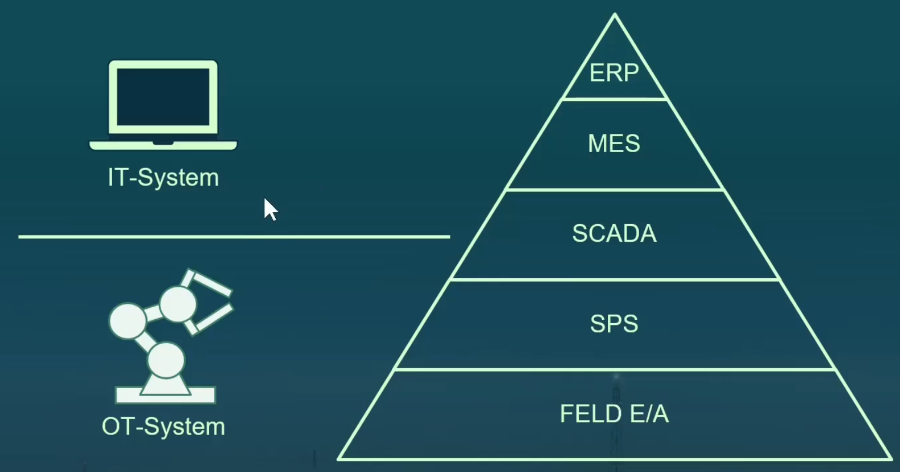
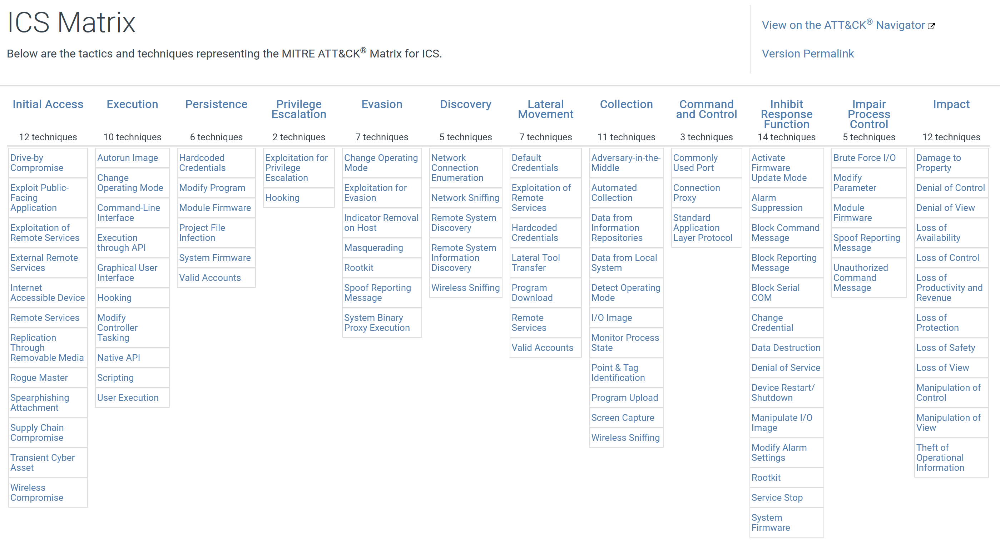
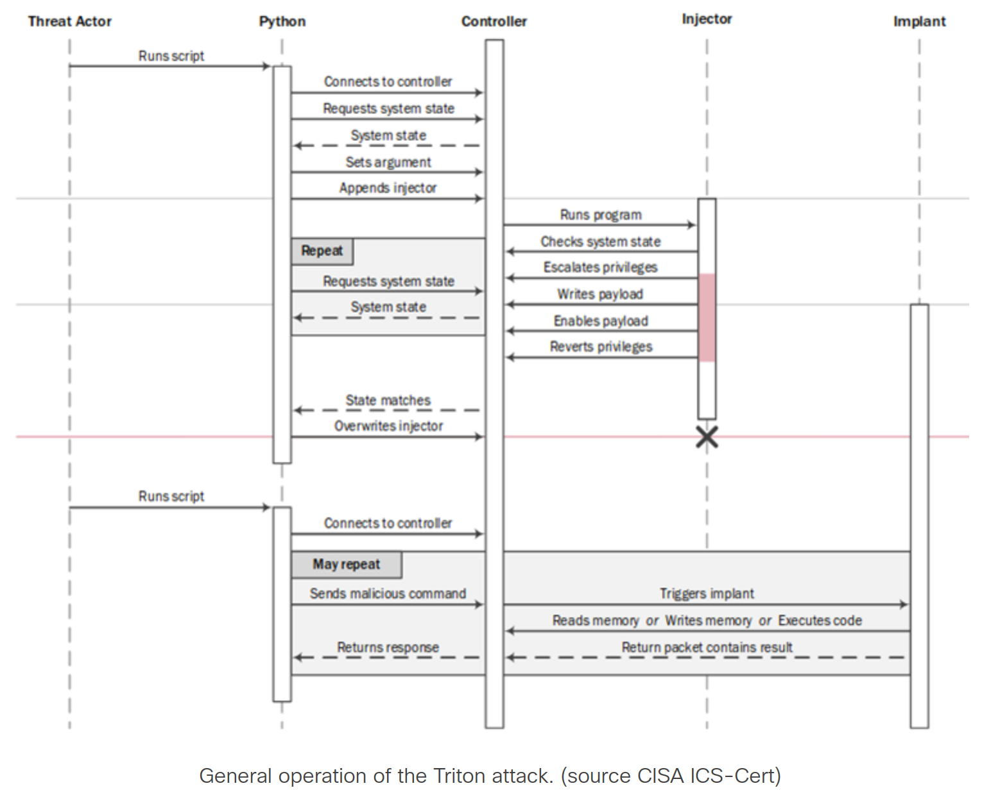
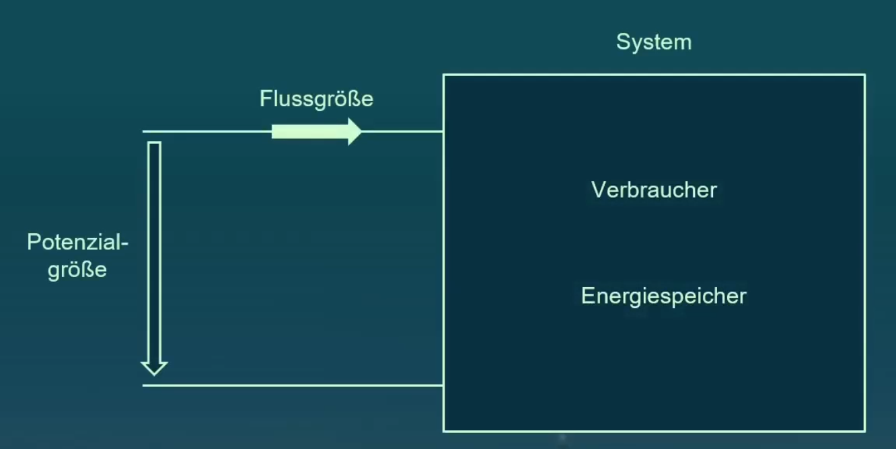
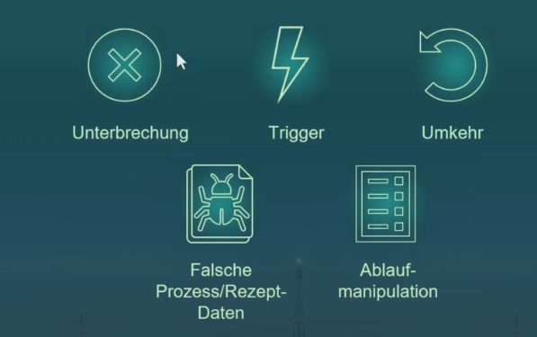

> :bulb: Notes on "Industrial Cyber Security Basics"

# Industrial Cyber Security Basics

## Introduction

### Automatisierungspyramide

### OT Netzwerk

Logisch:

Physikalisch: Sämtliche Kommunikation über das gleiche TCP/IP Netzwerk

### Internet of Things
- IoT
- IIoT
- LoRaWan (Long Range WAN)

### Shodan IO
Explore Industrial Control Systems
https://www.shodan.io/search?query=port%3A102+Siemens

Images
https://images.shodan.io/?query=screenshot.label%3A%22ics%22

### ...

