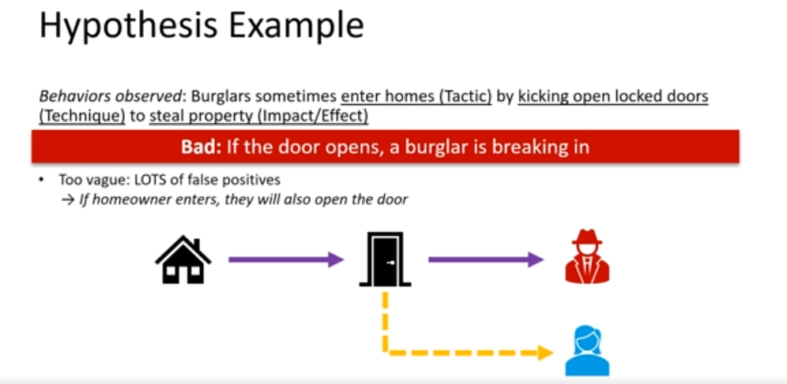

> :bulb: Notes on "Building Deep Learning Models with TensorFlow"

https://mad.mad20.io/CourseDetail/19

# Threat Hunting Fundamentals

## Introduction

Threat hunting
- proactive detection and investigation of malicious activity

Dection engineering
- designing and implementing analytics to discover malicious activity

Threat Hunting Overview

## Detection Approaches

### Key Terms: Precision and Recall
- Precision
    - Ration of true positives to total results
    - Good precision --> very few false positives

- Recall
    - Ration of true positives to total relevant (malicious) events
    - Good recall --> very few false negatives

- Improving one of these often makes the other one worse

### Traditional Detection Approaches

- Signature-based
    - explicitly define malicious behavior
    - good precision
    - detects only what you signature for
    - large signature libraries, hard to manage
    - modern attacks are typically dynamic, signatures are quickly out-of-date
- Allow-List
    - inverse of signature-base detection
    - only approved actions are allowed
    - can be very effective
    - in practice so many exceptions must be made, that adversaries can operate within the allowed
    - developing and maintaining is costly and difficult
- Anomaly-based
    - statistical baseline of "normal"
    - define "normal" as goog, "abnormal" as bad
    - can detect previously unknown attacks
    - usefull where benign behavior follow patterns
    - baseline typically isn't stable: people and network patterns often change
    - requires additional work to investigate anomalies
    - begnin activity is often "abnormal" due to unexpected spikes in network traffic or unusual but benign ativities

### TTP-Based Detection

#### IOCs vs TTPs

IOCs
- known to be malicious
- no advantage for initial victims before IOSs are discovered and shared
- can easily be changed

TTPs
- limited by functionality of the underlying technology targeted
- expensive to develop and maintain an interface

#### Pyramid of Pain

## Prioritization

## Methodology Overview

# Develop Hypotheses & Abstract Analytics

## Developing Hypotheses

## Hypotheses Considerations

## Finding Low-Variance Behaviors

## Researching Low-Variance Behaviors

## Investigating Low-Variance Bahaviors

## Refining Hypotheses

## Creating Abstract Analytics

## Leveraging External Resources for Analytics

# Determine Data Requirements

## Balancing Data Requirements

## Diving into Data Sources

## Leveraging External Resources for Data Requirements

# Identifying and Mitigating Data Collection Gaps

## Identifying Gaps

## Time, Terrain and Behavior Considerations

## Developing a Sensor Strategy

## Using Alternative Data Sources and Analytics

## Communicating with Network Managers

## Validating Configuration

# Implementing and Testing Analytics

## Implementing Analytics

## Validating Analytics

## Improving Performance, Precision, Recall

## Expanding Time, Terrain, Behavior

## Exploring the Three Dimensions

## Updating Analytics

