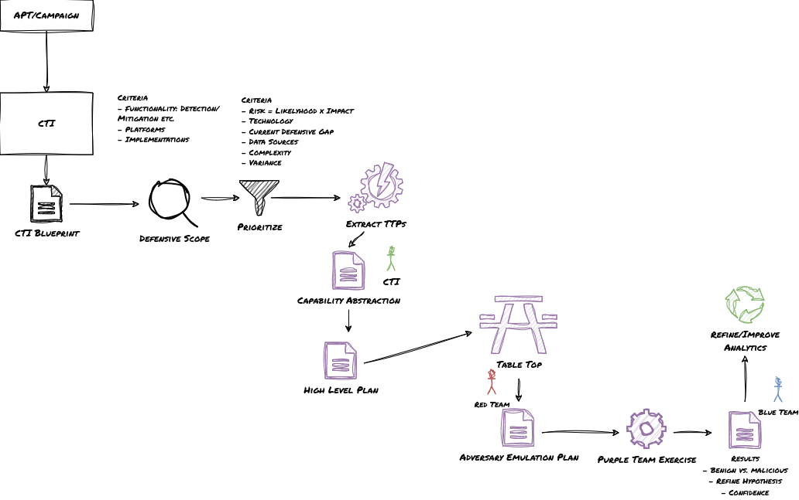

> :bulb: Purple Teaming Exercise"

# Methodology

## PT Flow

https://github.com/gitrsi/cyberops.zone/blob/main/resources/Purple%20Teaming%20Exercise/material/PT_Exercise.drawio

## Links

| What | URL | Description |
| ----------- | ----------- | ----------- |
| ThreatHound | https://github.com/MazX0p/ThreatHound | Threat Hunting |
| Vectr | https://vectr.io | Purple Teaming |
| Zircolite | https://github.com/wagga40/Zircolite | SIGMA-based detection, Gap Analysis |
| Sigma Rule Converter | https://sigconverter.io/ | Splunk, QRadar, Opensearch etc. |
| xxx | https |  |
| xxx | https |  |
| xxx | https |  |
| xxx | https |  |
| xxx | https |  |
| xxx | https |  |
| xxx | https |  |
| xxx | https |  |
| xxx | https |  |
| xxx | https |  |
| xxx | https |  |
| xxx | https |  |
| xxx | https |  |
| xxx | https |  |

## Resources

| What | URL | Description |
| ----------- | ----------- | ----------- |
| ThreatHound | https://github.com/MazX0p/ThreatHound | Threat Hunting |
| Vectr | https://vectr.io | Purple Teaming |
| Zircolite | https://github.com/wagga40/Zircolite | SIGMA-based detection, Gap Analysis |
| Sigma Rule Converter | https://sigconverter.io/ | Splunk, QRadar, Opensearch etc. |
| xxx | https |  |
| xxx | https |  |
| xxx | https |  |
| xxx | https |  |
| xxx | https |  |
| xxx | https |  |
| xxx | https |  |
| xxx | https |  |
| xxx | https |  |
| xxx | https |  |
| xxx | https |  |
| xxx | https |  |
| xxx | https |  |
| xxx | https |  |

